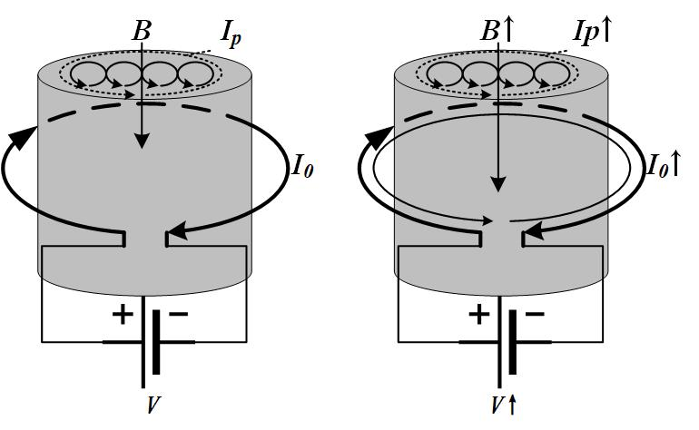

# 电感与磁极化

先说明,模拟和数字IC里,是**没有电感**的.因此本节中不包括电感的设计.

在微波/射频电路中,由于涉及到电磁波,需要考虑电感的设计,本文暂时不做讨论.

在IC里你咋绕线圈....

## 回顾

在[真空中的静电场和静磁场](1_StaticEM.html)和[电容](2_Cap.html)中我们讲过:
* 点电荷之间的库仑力,元电流之间的安培力;
* [静电场环路定理](1_StaticEM.html):$\oint E\cdot dl=0$,电场的无旋性;
* [静电场高斯定理](2_Cap.html):$\oint E\cdot dS=q/\epsilon$,电场的有源性;
* [静磁场安培环路定理](1_StaticEM.html):$\oint_{l}H\cdot dl=I$,磁场的有旋性;
* [静磁场磁通连续定理](1_StaticEM.html):$\oint B\cdot dS=0$,磁场的无源性.
* [电流连续性定理](1_StaticEM.html):$\oint_{S}\vec{J}\cdot dS=-\frac{d}{dt}\int\rho dV$,电荷守恒定律.
* [本构方程1-导体的欧姆定律](3_Res.html):$J=\sigma E$
* [本构方程2-电介质的极化](2_Cap.html):$D=\epsilon_{0}\epsilon_{r}E$

## 电磁感应定律
后来,法拉第一次实验中发现了电磁感应定律:

磁场中的一个闭合导体回路由于某种原因引起穿过导体回路的磁通量发生变化时，回路中就产生了感应电动势，且感应电动势的大小正比于磁通对时间的变化率:

$$\mathscr{E}_{ind}=-\frac{d\Phi}{dt}$$

$$\oint E_{ind}\cdot dl=-\int_{S}\frac{\partial B}{\partial t}dS$$

微分形式是

$$\nabla\times E_{ind}=-\frac{\partial B}{\partial t}$$

注意,这里我们说时导体形成的回路,那么当导体的导电能力下降,替换成**绝缘体形成的回路时,感应电动势仍然不变**,即使没有绝缘体,任意一个回路,仍然会感应出电动势,也就是感应出电场.

电磁感应定律的本质是**变化的磁通量产生了感应电动势(也就是感应电场),与介质无关**.

现在假设有一个很圆很圆的线圈,两端加上电压.

在[静电场一节](1_StaticEM.html)中,我们计算过单匝线圈内部的磁通量.

$$\Phi=\frac{\mu_{0}kI}{4}$$

因此N匝线圈线圈两端的感应电动势**大小**为:

$$U=\frac{Nd\Phi}{dt}=N\frac{\mu_{0}k}{4}\frac{dI}{dt}=L\frac{dI}{dt}$$

其中$$L=N\frac{\mu_{0}k}{4}$$体现了线圈随电流变化的感应电动势能力.$L$只与线圈的匝数,半径,介质的磁导率有关.

## 分子电流与磁极化
我们知道元电流可以产生磁场(毕奥-萨伐尔定律),而事实上,物质中的电子在不停地做着自旋和绕原子旋转的运动.有没有很像日-地关系!!!物理真他妈美.WOC.

那还有一种东西可以形成磁场,比个如,磁性材料! 磁性材料按化学成分分，常见的有两大类：**金属磁性材料**和**铁氧体**．**铁氧体**是以**氧化铁**为主要成分的磁性氧化物．这家伙就是磁铁呀,指南针呀兄弟们,四大发明呀兄弟们~

安培就思考它们之间是不是有联系?于是他就认为,在原子、分子等物质微粒内部，存在着一种环形电流——分子电流，分子电流使每个物质微粒都成为微小的磁体，它的两侧相当于两个磁极.

这种电子除了自旋和绕核旋转形成分子环形电流,在外磁场作用下会受到安培力,并发生**进动**,该进动形成的环形电流产生的磁场与外磁场方向相反,削弱了磁场的作用(你可以伸开左女朋友试试,再伸出来右女朋友试试,别忘了高中物理知识,只有安培力需要用左爪,其他都用右爪).这种现象叫做**磁极化**,简称为磁化.在任何材料中,除了进动产生的环形电流$I_{1}$,材料自身还有分子电流$I_{2}$,二者之矢量和统称为$I_{p}$.根据泡利不相容原理,同一层的电子的自旋方向一定不同,因此:
* 如果材料原子外的电子是成对出现的,固有分子电流$I_{2}$的和为0.此时磁化作用由进动的环形电流$I_{1}$主导;该材料主要体现**抗磁性**. 总场强$H<H_{0}$,如铜,铋,硫,氢,银等;
* 如果材料原子外的电子是不成对的,固有分子电流$I_{2}$一般大于进动的环形电流$I_{1}$,因此可能体现与外磁场方向相同,此时材料主要体现**顺磁性**. 总场强$H>H_{0}$,如锰,铬,铂,氧,氮等;
* 如果材料原子外的电子是不成对的,固有分子电流$I_{2}$远远大于进动的环形电流$I_{1}$时,材料呈现**铁磁性**. 总场强$H>>H_{0}$,如铁,钴,镍等.

把顺磁性物质和抗磁性物质称为**弱**磁性物质，把铁磁性物质称为**强**磁性物质．**通常所说的磁性材料是指强磁性物质．**

设在导体交界面上的外界环形电流$I_{0}$,产生的磁感应强度为$B_{0}$;在$B_{0}$的作用下,材料磁化产生的磁化环形电流为$I_{p}$.现假设**二者方向相反**.该环形电流产生的磁感应强度和外部磁感应强度的矢量和记为$\vec{B}=\vec{B_{0}}+\vec{B_{p}}$.

**设磁介质是均匀的**,继续用安培环路定理:

$$\oint B\cdot dl=\mu_{0}(I_{0}+I_{p})$$

$I_{p}$的大小与$B_{0}$正相关,因此$B$与$B_{0}$为线性关系,设$B=\mu_{r}B_{0}$,其中$\mu_{r}$的值仅与材料本身有关。$\mu_{r}$反映了实际磁场强度相对于真空介质中的磁场强度的大小,因此叫做**相对磁导率**,且真空中$\mu_{r}=1$。

可以计算得到
$$I_{p}=\oint (1-\frac{1}{\mu_{r}})\frac{B}{\mu_{0}}\cdot dl$$

**在$0<\mu_{r}<1$时,$\mu_{r}$越大,则介质内实际磁场强度越大,材料越不易被磁化.**
这就是磁化电流.将上式代入到安培环路定理中,可以得到
$$
\oint{\frac{B}{\mu_{0}\mu_{r}}\cdot dl}=I_{0}
$$

> **S是闭合回路l包围的曲面,该曲面是不闭合的**.

这里的$I_{0}$**是介质中的传导电流**. 可以看出,与真空介质相比,式中仅多了一项$\mu_{r}$.
这里定义了磁场强度$H=B/\mu_{0}\mu_{r}$,因此

$$\oint{H\cdot dl}=I_{0}=\int_{S} J_{c}\cdot dS$$

$H$**表示了穿过曲面的传导电流**.$B=\mu_{0}\mu_{r}H=\mu_{0}H+\mu_{0}M$,这个方程是材料(磁介质)的**本构方程**.
微分形式为
$$\nabla\times H=J_{c}$$

## 位移电流

然而麦克斯韦在实验中发现,即使穿过该曲面上的电流和为0时,当**曲面上的电场强度随时间变化**时,仍然有产生了磁感应强度,这种交变的电场就像是一个虚拟的电流对该曲面进行充电产生的,因此叫做**位移电流**.注意,虽然叫做位移电流,但实际上是不存在的电流,仅仅用于表述$J_{D}=\partial D/\partial t$. 传导电流$J_{c}$与位移电流$J_{D}$共同对磁场做出了贡献.

$$\oint{H\cdot dl}=I_{0}=\int_{S} \left(J_{c}+\frac{\partial D}{\partial t}\right)\cdot dS$$

微分形式为

$$\nabla\times H=J_{c}+\frac{\partial D}{\partial t}$$

至此,**交变的磁场可以产生电场(感应电动势),交变的电场(位移电流)可以产生磁场,这是电磁波的理论基础,更是电磁波为什么能在真空中传播的原因**.

## 电感的特性
1. I-V特性
当线圈内部存在磁介质时,介质中的磁化会增大磁感应强度(与真空介质相比H不变,但B增大了),因此,增大了感应电动势.
下图中左图显示了当电流不变时,虽然磁感应强度比真空介质的大,但仍无感应电动势.右图显示了感应电动势的产生条件时线圈中的电流发生变化.
线圈的感应电动势是来自自身电流变化,这种现象叫做**自感**. 当线圈中的感应电动势来自于其他线圈电流的变化,叫做**互感**. 
电感器的I-V特性方程为
$$u=L\frac{di}{dt}$$
其中$L=N\frac{\mu_{0}\mu_{r}k}{4}$体现了线圈随电流变化的感应电动势能力.$L$只与线圈的匝数,半径,介质的磁导率有关.

2. 电感与磁场能
在电流变化的过程中,电源为电感**充磁**;在**放磁**过程中,电感能量消耗在回路中.
充磁时,设经过电感的电流不断增大,电感两端产生的感应电动势为$\mathscr{E}=\int_{S}{\frac{\partial B}{\partial t}\cdot dS}$,因此此过程积累的能量为
$$E=\int\mathscr{E}Idt=\int{B\cdot HdV}$$
定义**磁场的能量密度**为单位体积内的能量:$B\cdot H$
**即使没有产生传导电流,只要真空中一定空间内产生了感应电动势,就是外界对其充磁才产生了的电势能.**

3. 感抗与相移
当流过电感的电流为$i=Ke^{j(\omega t+\phi)}$时,则$u=L\cdot j\omega Ke^{j(\omega t + \phi)}=j\omega Li$,
因此,电容对交流信号的抵抗能力,也就是**容抗**,大小为
$$Z={j\omega L}$$
由于$u=e^{j90^{o}}\omega Li$,因此$u$ **的相位超前$i$的相位90°**.
由于电感的以上特性,常用于**直流信号耦合(DC-DC,变压器)**,构建**延时和相移电路**,**滤除纹波噪声**等.
由于加入磁介质后,感应电动势明显增大,因此,在变压器(或者说DC-DC)电路中,**根据初级和次级线圈的匝数比值不同**,就可以在次级线圈中产生不同的感应电动势.这就是变压电路的原理.
> 欧拉公式:$e^{aj}=\cos a+j\sin a$
## 电感的能量

线圈中的电流$I$发生变化,产生了感应电动势$\mathscr{E}$,产生的能量为

$$E_{m}=\int{\mathscr{E}Idt}=\int{LI\frac{dI}{dt}dt}=\frac{1}{2}LI^{2}$$

## 电感与趋肤效应

交流电通过导体时,**导体产生的磁场会以安培力(/洛伦兹力)的形式作用于导体中的载流子,使载流子发生横向运动**.这导致导体各个横向部分的电流密度不均匀,导体表面电流密度大(减少了截面积，增大了损耗),这种现象称为**趋肤效应**.交流电的频率越高,趋肤效应越显著,频率高到一定程度,可以认为电流完全从导体表面流过. 在射频电路中,必须考虑趋肤效应.

> 实际应用：空心导线代替实心导线，节约材料；在高频电路中使用多股相互绝缘细导线编织成束来削弱趋肤效应。

## 小结

到目前位置,我们已介绍过电容的原理(介质的极化增大了储存电荷的能力);电感的原理(磁介质的磁化增大了线圈感应电流的能力).

* 点电荷之间的库仑力,元电流之间的安培力;
* [电磁感应定律](1_StaticEM.html):$\oint E\cdot dl=-\int_{S}\frac{\partial B}{\partial t}dS$,电场的无旋性;
* [电场高斯定理](2_Cap.html):$\oint D\cdot dS=q$,电场的有源性;
* [磁场安培环路定理](4_Ind.html):$\oint_{l}H\cdot dl=\int_{S} \left(J_{c}+\frac{\partial D}{\partial t}\right)\cdot dS$,磁场的有旋性;
* [磁场磁通连续定理](1_StaticEM.html):$\oint B\cdot dS=0$,磁场的无源性.
* [电流连续性定理](1_StaticEM.html):$\oint_{S}\vec{J}\cdot dS=-\frac{d}{dt}\int\rho dV$,电荷守恒定律.
* [本构方程1-导体的欧姆定律](3_Res.html):$J=\sigma E$
* [本构方程2-电介质的极化](2_Cap.html):$D=\epsilon_{0}\epsilon_{r}E$
* [本构方程3-磁介质的磁化](4_Ind.html):$B=\mu_{0}\mu_{r}H$

这就是4个麦克斯韦方程组,1个电流连续性定理,以及3个材料的本征方程.