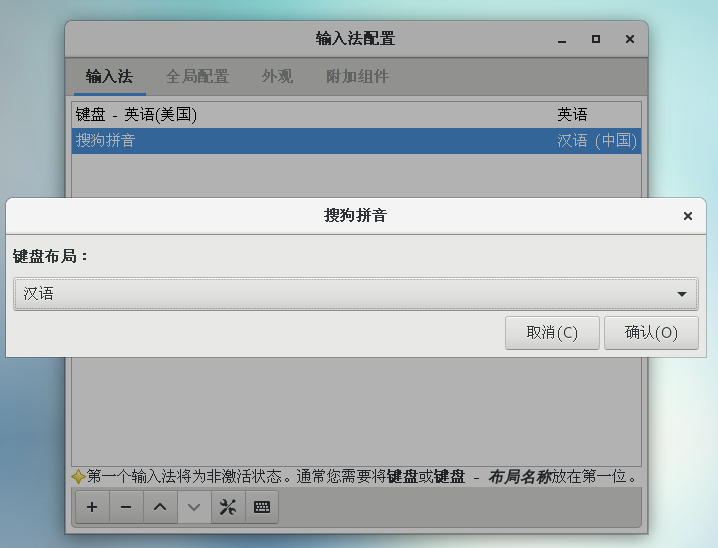
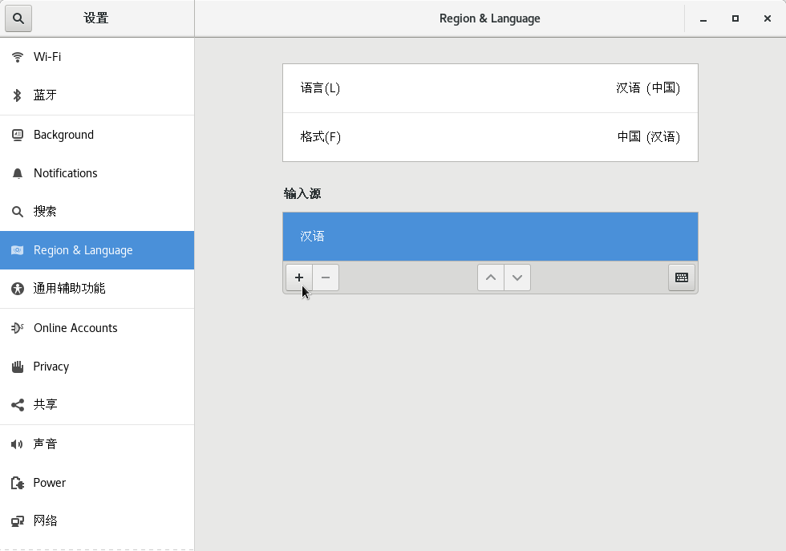
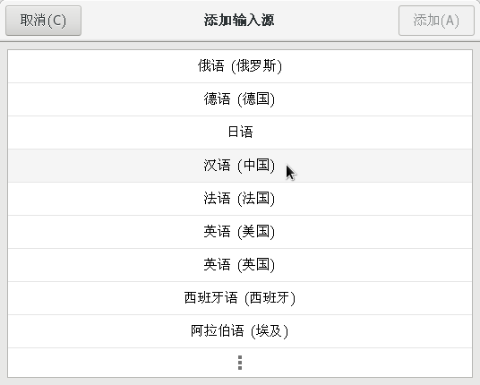

# CentOS 使用基础

## 切换用户
任意界面右键打开终端
`su`:切换到root,root对应的根目录为`/`,可以`cd /`
`su [username]`:切换到普通用户,对应的`home`目录为`~`,可以`cd ~`

`/`表示根目录
`~`表示当前用户的home目录
`.`表示当前目录

## 帮助和手册
帮助: `[命令] --help`查看某命令的帮助菜单.

用法: `[命令] --usage`查看某命令的使用说明.

手册: `man [命令]`查看命令的手册, 如`man rpm`可以查看rpm的命令手册.

## 软件包的管理

查询软件信息
* 查询某软件包的信息: `rpm -qa | grep -i [软件关键词]`
* 查询系统中已经安装的软件: `rpm -qa`
* 查询一个已经安装的文件du于哪个软件包；`rpm -qf 文件名的绝对路径`
* 查询已安装软件包都安装到何处；`rpm -ql 软件名`
* 查询一个已安装软件包的信息:`rpm -qi 软件名`
* 查看一下已安装软件的配置文件； `rpm -qc 软件名`
* 查看一个已经安装软件的文档安装位置：`rpm -qd 软件名`
* 查看一下已安装软件所依赖的软件包及文件；`rpm -qR 软件名 `

安装软件
* 安装`yum install [软件名]`
* 使用本地源安装 `yum install [软件名] 本地包文件` or `rpm -ivh [本地包文件]`

卸载软件
* 卸载软件: `sudo yum remove [软件名]`
* 删除已安装的软件(卸载依赖包): `sudo rpm -e -- [软件名]`
* 删除软件(不卸载依赖包): `sudo rpm -e --nodeps [软件名]`

查找软件可以去 [Here](http://rpmfind.net) 和 [here](去[这里](https://pkgs.org/).

## 善用搜索功能

`find [-H] [-L] [-P] [-Olevel] [-D help|tree|search|stat|rates|opt|exec] [path...] [expression]`


## 为文件夹创建快捷方式

1. 在合适地方`/opt/idata`建立一个可执行打开`/mnt/WinDiskG/Charleechan/Desktop/EDA工具安装包`文件夹的命令文件`godata.sh`.

```bash
#!/bin/sh
nautilus /mnt/WinDiskG/Charleechan/Desktop/EDA工具安装包
```
并放一个合适的图标文件.

将该`godata.sh`文件添加可执行权限:`chmod +x godata.sh`

2. 在桌面打开终端,输入`vim godata.desktop`,添加以下代码,

```ini
[Desktop Entry]
Encoding=UTF-8
Version=1.0
Name=GoData
Comment=Goto_data
Exec=/opt/idata/godata.sh
Icon=/opt/idata/godata.PNG
Terminal=false
StartupNotify=true
Type=Application
Categories=Applications
```

## vim 常用快捷键


## 清屏

clear : 终端屏幕向下翻一页，较为常用。
reset : 清空终端屏幕所有信息。

## 解压文件

根据压缩文件的后缀名,使用不同的解压命令解压.
* .tar 用 tar xvf 解压
* .gz 用 gzip -d或者gunzip 解压
* .tar.gz和.tgz 用 tar xzf 解压
* .bz2 用 bzip2 -d或者用bunzip2 解压
* .tar.bz2用tar –xjf 解压
* .Z 用 uncompress 解压
* .tar.Z 用tar xZf 解压
* .rar 用 unrar e解压
* .zip 用 unzip 解压

其中7z文件需要安装`p7zip`.

```bash
yum install p7zip
# .7z解压, x 表示解压缩, -r 递归解压缩, -o./, 注意-o和./之间无空格
7za x test.7z -o./
```

rar文件需要编译安装`rar`.
```
wget https://www.rarlab.com/rar/rarlinux-x64-6.0.1b1.tar.gz
tar -zxvf rarlinux-x64-6.0.1b1.tar.gz 
cd rar
make
```
运行rar 命令，如果出现该错误`rar: error while loading shared libraries: libstdc++.so.6: cannot open shared object file: No such file or directory`, 则执行该命令：`cp rar_static /usr/local/bin/rar`

分卷解压

* 分卷`.tar`文件： `find ./ -print -name 'Base_IC06.18.000*.tar' -exec tar xvf {} \; `
* 分卷`.z01,.z02,.zip`文件: 
   ```bash
   # 合并文件
   cat weblogic-linux.* > all.zip
   # 修复已损坏的压缩文件
   zip -F all.zip
   # 正常解压
   unzip all.zip
   ```


## 使用截图工具

* 在命令行中查`man gnome-screenshot`，设置自己最常用的截图选项，这里我根据个人习惯，使用`gnome-screenshot -abp`进行框选截图(带光标).使用`gnome-screenshot -wbp`进行窗口截图带光标。
* 打开如下选项：Applications(应用)-系统工具-Settings(设置)-设备-Keyboard(键盘)；
* 下拉到最后，点+号新增快捷键，输入快捷键名称，上述命令，和快捷键。

## 安装VS Code

需要下载安装libXss.so,执行`yum install libXScrnSaver`或者去[这里](https://centos.pkgs.org/7/centos-x86_64/libXScrnSaver-1.2.2-6.1.el7.x86_64.rpm.html)下载,更改执行权限,`chmod +x libXScrnSaver-1.2.2-6.1.el7.x86_64.rpm`,然后安装`rpm -ivh libXScrnSaver-1.2.2-6.1.el7.x86_64.rpm `, 如果提示需要其他的依赖，则增加--nodeps选项:`rpm -ivh --nodeps libXScrnSaver-1.2.2-6.1.el7.x86_64.rpm`.


1. 访问[Visual Studio Code官网](https://code.visualstudio.com/docs?dv=linux64),会自动下载一个`code-stable-x64-1614898391.tar.gz`文件.

2. 解压文件:`tar xzf code-stable-x64-1614898391.tar.gz `.

3. 移动到附加软件的目录:`sudo mv VSCode-linux-x64 /opt/vscode`.

4. 添加可运行权限: `sudo chmod +x /opt/vscode/code`.

5. 复制`sudo cp /opt/vscode/resources/app/resources/linux/code.png /usr/share/icons/`.

6. 创建快捷方式到左上角的**应用程序**菜单中: `sudo vim /usr/share/applications/VSCode.desktop`

```
[Desktop Entry]
Name=Visual Studio Code
Comment=Multi-platform code editor for Linux
Exec=/opt/vscode/code --no-sandbox
Icon=/usr/share/icons/code.png
Type=Application
StartupNotify=true
Categories=TextEditor;Development;Utility;
MimeType=text/plain;
```


7. 运行VS Code: `/opt/vscode/code --no-sandbox`,也许会出错,报`/usr/lib64/libstdc++.so.6: version 'CXXABI_1.3.9' not found`,以及`usr/lib64/libstdc++.so.6: version 'GLIBCXX_3.4.21' not found`的错,原因是GCC编译器版本低,或者已安装过高版本GCC编译器但未链接.

    解决办法如下:
    
    * 查看libstdc++.so.6的软连接信息: 切换到`/usr/lib64`目录,`ls -l libstdc++.so*`,发现现在`libstdc++.so.6`连接到`libstdc++.so.6.0.19`.
    * 查看libstdc++.so.6包含哪些动态库: `strings /usr/lib64/libstdc++.so.6 | grep GLIBC`, `strings /usr/lib64/libstdc++.so.6|grep CXXABI`,发现的确没有`CXXABI_1.3.9`和`GLIBCXX_3.4.21`.
    * 方法一: 更新GCC编译器
      * 确定当前GCC版本,`gcc --version`,发现是`gcc (GCC) 4.8.5 20150623 (Red Hat 4.8.5-44)`.
      * 在[这里](https://gcc.gnu.org/onlinedocs/libstdc++/manual/abi.html)查询到,`GCC 5.1.0: GLIBCXX_3.4.21, CXXABI_1.3.9`,因此要安装`GCC 5.1.0`之后的版本.
      * 下载`wget http://ftp.tsukuba.wide.ad.jp/software/gcc/releases/gcc-5.2.0/gcc-5.2.0.tar.bz2`,解压`tar -xvf gcc-5.2.0.tar.bz2`
      * 进入解压目录: `cd gcc-5.2.0`, 下载编译gcc所需的依赖文件和库 `./contrib/download_prerequisites`
      * 建立输出目录，用于存放编译时所有产生的中间文件,`mkdir gcc-temp`,进入输出目录,`cd gcc-temp`
      * 执行configure配置,`../configure --enable-checking=release --enable-languages=c,c++ --disable-multilib`
      * 编译gcc，指定编译使用的线程数为8，编译耗时较长，可能需要几个小时,`make -j8`,这里为了避免影响系统的稳定性，
      * 执行"make install"和替换系统默认版本的gcc
      * 查找本机已有的libstdc++.so文件:`find / -name "libstdc++.so*"`,找到新安装的`libstdc++.so`所在位置,并切换到该位置.
    * 方法二: 
      * 在[这里](https://gcc.gnu.org/onlinedocs/libstdc++/manual/abi.html)查询到,`GCC 5.1.0: GLIBCXX_3.4.21, CXXABI_1.3.9`,还查询到`GCC 5.1.0: libstdc++.so.6.0.21`,因此要安装6.0.21及之后的版本.
      * 在网上找到了一个[libstdc.so_.6.0.26.zip](https://www.lanzous.com/i8lnene),使用`unzip libstdc.so_.6.0.26.zip`将其解压. 或者直接[点我下载](./res/libstdc++.so.6.0.26),
    * 把下载或安装GCC得到的`libstdc++.so.6.*.*`拷贝到`/usr/lib64`目录: `sudo cp ./libstdc++.so.6.0.26 /usr/lib64/libstdc++.so.6.0.26`
    * 备份原来的`libstdc++.so.6`符号链接: `sudo cp /usr/lib64/libstdc++.so.6 /usr/lib64/libstdc++.so.6.bak`
    * 删除原来的符号连接: `sudo rm -rf /usr/lib64/libstdc++.so.6`
    * 新建新符号连接: `sudo ln -s /usr/lib64/libstdc++.so.6.0.26 /usr/lib64/libstdc++.so.6`
    * 查看当前libstdc++.so.6中包含哪些动态库: `strings /usr/lib64/libstdc++.so.6 | grep GLIBC`, `strings /usr/lib64/libstdc++.so.6|grep CXXABI`.

8. 执行文件关联
* `cd /usr/share/applications`,`su [你的用户名]`
* 执行文件关联： `xdg-mime default VSCode.desktop text/markdown`.
* 查询文件关联: ` xdg-mime query default text/markdown`.

## 安装搜狗输入法

搜狗和谷歌输入法等使用的是fcitx框架，需要安装fcitx! **不可直接卸载自带的ibus 输入法.**
* 单独卸载ibus软件, 不卸载依赖包: `rpm -e --nodeps ibus`

* 安装epel库源 `yum -y install epel-release`
* 安装fcitx `yum -y install fcitx fcitx-pinyin fcitx-configtool`

* 设置fcitx为自启动项：打开 `应用程序`>`附件`>`优化`>`开机启动程序`>添加fcitx为自启动项
  * 在 /etc/profile.d 中增加一个配置脚本命名为 `fcitx.sh `: `vim /etc/profile.d/fcitx.sh`

     ```bash
     export GTK_IM_MODULE=fcitx
     export QT_IM_MODULE=fcitx
     export XMODIFIERS=@im=fcitx
     ```
  * 修改重启或关机时 systemd 等待 fcitx 进程的时长, 避免自启动后开关机时间过长, 需要修改fcitx配置文件: `vim /etc/systemd/system.conf `, 将其中的 `#DefaultTimeoutStopSec=90s `这一行前面的 `# `去掉，然后将其赋值改为` 10s `保存.

* 安装搜狗输入法依赖软件 : `yum install qtwebkit -y`

* 在火狐浏览器中,下载搜狗输入法. `http://cdn2.ime.sogou.com/dl/index/1524572264/sogoupinyin_2.2.0.0108_amd64.deb?st=jpTlz-vO-Of4mW1f10EBCg&e=1570252581&fn=sogoupinyin_2.2.0.0108_amd64.deb`

* 安装dpkg包：`yum -y install dpkg`

* 安装alien包: `yum -y install alien`

* deb -> rpm包转换: `sudo alien -r --scripts sogoupinyin_2.2.0.0108_amd64.deb`, 直到转换完成`sogoupinyin-2.2.0.0108-2.x86_64.rpm generated`

* rpm包安装 : `sudo rpm -ivh --force sogoupinyin-2.2.0.0108-2.x86_64.rpm`

* 搜狗拼音的库,创建软链接：

  ```
  sudo ln -s /usr/lib/x86_64-linux-gnu/fcitx/fcitx-sogoupinyin.so /usr/lib64/fcitx/fcitx-sogoupinyin.so
  sudo ln -s /usr/lib/x86_64-linux-gnu/fcitx/fcitx-punc-ng.so /usr/lib64/fcitx/fcitx-punc-ng.so
  ```

* 重启系统。输入`fcitx-configtool`启动，添加键盘时取消勾选，输入`sogou`过滤，看到`Sogou Pinyin`输入法，点击添加进去.

设置其键盘布局为 汉语.


并在系统设置中设置默认的键盘




然后按`SHIFT`键切换输入法，测试中文输出即可。


## 安装苹方字体

首先将[平方字体文件](./res/PingFangSC.zip)拷贝到Linux机器上。

```
# centos 安装fontconfig 工具包
yum install -y fontconfig mkfontscale
# ubuntu上
# sudo apt-get -y install fontconfig xfonts-utils

# 查看已经安装的中文字体
fc-list :lang=zh 

# 安装微软雅黑字体
# 1. 把MSYH.TTF复制到/usr/share/fonts/目录下，使用如下命令：
cd /root/
cp MSYH.TTF /usr/share/fonts/
# 2. 然后建立字体索引信息，更新字体缓存，使用如下命令：
cd /usr/share/fonts/
mkfontscale
mkfontdir
fc-cache

# 查看是否已安装成功
fc-list :lang=zh
```

然后打开 应用程序>附件>优化>字体, 修改窗口标题、界面、文档、等宽字体等，然后`reboot`即可。

## 执行某程序时报错

例如,提示报错缺少 `libXp.so.6`,去[这里](https://pkgs.org/)搜索`libXp.so.6`,可以发现其位于`libXp`库,于是

```bash
# 安装32位libXp
yum install libXp.i686
# 安装64位libXp
yum install libXp
```

## 安装WPS

1.  安装WPS必须字体

首先[下载字体](./res/wps_symbol_fonts.tar.gz),解压

```bash
mkdir -p /usr/share/fonts/wps_symbol_fonts
cp  -r ./wps_symbol_fonts/* /usr/share/fonts/wps_symbol_fonts/
# 权限设置操作如下：
cd /usr/share/fonts/
chmod 755 wps_symbol_fonts
cd /usr/share/fonts/wps_symbol_fonts
chmod 644 *  

# 接着生存缓存配置信息，具体操作如下：

cd /usr/share/fonts/wps_symbol_fonts
mkfontdir
mkfontscale
fc-cache 
```

2. 使用Firefox浏览器去[WPS官网](https://linux.wps.cn/)点击下载，选择 `64位RPM格式`中的 `For x64`.

3. 找到下载的安装包,安装之: `rpm -ivh wps-office-11.1.0.10161-1.x86_64.rpm`.

4. 在终端输入`wps`可以启动`WPS`.


