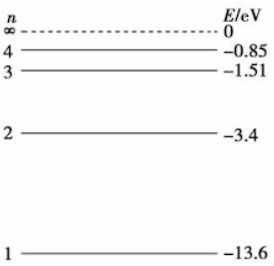
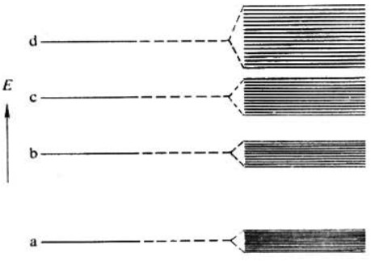

# 电容与电极化

## 回顾
在[真空中的静电场和静磁场](StaticEM.html)中我们讲过:
* 点电荷之间的库仑力,元电流之间的安培力;
* 静电场环路定理:电场的无旋性;
* 静电场高斯定理:电场的有源性;
* 静磁场安培环路定理:磁场的有旋性;
* 静磁场磁通连续定理:磁场的无源性.

## 原子核与电子的关系靠束缚力维持

单个原子外的电子在条件一定的情况下只能取到某些特定的能量，才能形成稳定的结构,这个能量的大小就是**能级**.下图展示了氢原子H的电子能级.电子吸收一定的能量后,在能级之间跳动,叫做**跃迁**.电子只能在能级之间跃迁,而不能跑到能级之外(因为不稳定).

当体系中有很多个原子的时候，由于原子间的相互作用，原子的能级会发生移动。原本相同的一条能级变成了一组差别很小的能级，这就是**能带**，也就是**允带**。由于能带内不同能级的能量差别非常小，所以很多时候在能带内可以忽略间隔，认为能量是连续的。下图展示了能级与能带的关系.

与能级之间存在间隔一样,能带与能带相互之间也存在较大的能量差别,这个能量的间隔就是禁带.

当原子处于基态的时候，它的所有电子从最低能级开始依次向上填充。对于半导体，电子刚好填充到某一个能带满了，下一个能带全空。这些被填满的能带称为**满带**，满带中能量最高的一条称为**价带**。

由于电流的产生需要载流子发生定向运动，而价带中电子已经占据了所有可能的能级，绝大多数电子相邻位置上的态都已经被占据了，无法移动，所以**价带中的电子可以认为是不导电的**。

* 对于半导体，能量最高的一个价带，到能量更高的下一个能带之间有一个禁带，但是这个禁带的宽度（能量）不是很大，所以有一些电子有机会跃迁到下一个能带。由于这个能带几乎是空的，所以电子们跃迁到这个能带之后就可以自由地奔跑，这个能带就是**导带**。
* 对于绝缘体，这个禁带宽度太大，基本上不可能有电子跃迁过去。
* 对于金属，根本没有禁带，导带和价带直接重合了，既然最高的能带本身就不满那不需要跃迁就可以导电了。

下图展示了金属、半导体和绝缘体的禁带.

纯净的半导体（**本征半导体**）的导电能力是很差的，因为需要很高的温度才能让足够多的载流子跃迁到导带。一般使用半导体的时候都会进行掺杂，通过掺入杂质来引入新的能级。
对于硅来说，掺杂硼可以在禁带中里价带很近的位置上引入一组全空的能级，价带电子可以很容易地跃迁到这个能级上，电子跃迁之后在价带留下的空穴就可以导电了，这就是**P型半导体**。空穴导电时，电子运动发生在价带；
掺杂磷，可以在禁带中里导带很近的位置上引入一组全满的能级，这个能级上的电子可以很容易地跃迁到导带上，成为导带电子导电，这就是**N型半导体**。电子导电时，电子运动发生在导带。

> 我们常说的电阻，一般是指导体或半导体的电阻，因为绝缘体的电阻很大，经常视为无穷大。如果把绝缘材料放在电池两端连接,会发生什么情况呢?

## 电容的本质与电极化

为了zhuangB,给绝缘材料换个名字,叫做电介质.

随着电池与绝缘材料加上电气连接,电池负极发射电子,正极吸收电子,电子在材料两端分别被聚集和被吸收,材料表面形成电荷积累,这种电荷积累一方面导致内部电场强度从0开始逐渐增大,原子外层的电子$e$和原子核在电场下发生很小的方向性偏移,这就是电极化.但电场力仍不足以使电子挣脱P原子的束缚,仍然没有电流;另一方面电荷积累导致来自电池负极的电子的加速度减小;随着电荷进一步积累,直到电池负极发出的电子的加速度为0,如无吸引,电子将不再从电池负极向外部运动(也就是说,导线和金属电极板内部电场为0,因此,金属电极板上电势等于电池电极的电势);最终结果是,**绝缘材料两端形成电荷积累,内部形成电场**.因此这个过程叫做**充电**的过程. 

如果此时断开电源连接,使用导线将绝缘材料两端直接连接,导线内部形成场强,由于电子可以在导线内自由移动,于是绝缘材料两端的正负电荷相互吸引,直到两端电势差为0,电场强度为0,自由电荷不再移动.最终结果是**绝缘材料两端电荷通过导线结合在一起,两端均为电中性**.

### 几个问题
现在我们想分析以下问题,充电完成之后,电场是静电场,那么此时:

1. 极板之间真空(无介质材料)时,极板间场强是怎样的?充电时场强又是怎样的?
2. 材料两端积累的电荷量是相等的吗?
3. 在材料内部,场强是怎样分布的?

### 答案
1. 如图所示,在封闭曲面`S2`内,根据静电场的高斯定理
   $$\oint{\vec{E}\cdot d\vec{S}}=\frac{q}{\epsilon_{0}}$$
   由于电极板内部场强为0,因此在极板之间的任意处,均满足
   $$E\cdot S=\frac{q}{\epsilon_{0}}$$
   于是极板内部场强为匀强电场.进一步地,有
   $$\frac{\epsilon_{0}S}{d}=\frac{q}{U}$$
   左侧仅与极板的几何形状和位置有关,表示单位电压下能容纳电荷的能力,这就是电容:
   $$C=\frac{\epsilon_{0}S}{d}$$

   充放电时在$dt$时间内极板上电荷量发生变化,而内部电场仍为匀强电场,所以对于任意时刻,均有

   $$C=\frac{dq}{dU}$$
   

2. 如图所示,在封闭曲面`S1`内,根据静电场的高斯定理
   $$\oint{\vec{E}\cdot d\vec{S}}=\frac{q}{\epsilon_{0}}$$
   由于电极板内部场强为0,且电介质是电中性的,其总电荷量为0; 因此材料两端电荷量之和为0,因此材料两端积累的电荷量相等.

3. **在电场下材料发生电极化,只会导致材料表面产生电荷,而材料内部仍呈电中性**. 
   在封闭曲面`S2`内,设在金属极板上的面电荷密度为$\sigma_{0}$,产生的电场为$E_{0}$;在$E_{0}$的作用下,材料电极化在表面产生的极化电荷面密度为$\sigma_{p}$,二者符号相反,因此**极化电荷产生的电场$\vec{E}_P$的方向与外电场$\vec{E}_{0}$方向相反**.内电场和外电场的矢量和记为$\vec{E}=\vec{E_{0}}+\vec{E_{p}}$.
   **设介质是均匀的**,继续用静电场的高斯定理:
   $$
   \begin{aligned}
   \oint{\vec{E}\cdot d\vec{S}}&=\frac{\int{(\sigma_{0}+\sigma_{p})\cdot dS}}{\epsilon_{0}}\\
   E&=\frac{(\sigma_{0}+\sigma_{p})}{\epsilon_{0}}
   \end{aligned}
   $$
   其中$\sigma_{0}=\epsilon_{0}E$为自由电荷的面密度.
   设**介质是各向同性的**,$\sigma_{p}$的大小与$E_{0}$正相关,因此$E$与$E_{0}$为线性关系,设$E=\frac{E_{0}}{\epsilon_{r}}$,其中$\epsilon_{r}>1$仅与材料本身有关。$\epsilon_{r}$反映了实际场强相对于真空介质中的场强的大小,因此叫做**相对介电常数**,且真空中$\epsilon_{r}=1$。
   
   可以计算得到
   $$\sigma_{p}=\sigma_{0}\left(\frac{1-\epsilon_{r}}{\epsilon_{r}}\right)=\epsilon_{0}(1-\epsilon_{r})E$$

   **$\epsilon_{r}$越大,则介质内实际场强越小,材料越容易被电极化.**

   这就是极化电荷的面密度.将上式代入到高斯定理中,可以得到
   $$
   \begin{aligned}
   \oint{(\epsilon_{0}E-\sigma_{p})\cdot dS}&=q\\
   \oint{\epsilon_{0}\epsilon_{r}E}&=q
   \end{aligned}
   $$
   这里的$q$**是自由电荷**. 可以看出,与真空介质相比,式中仅多了一项$\epsilon_{r}$.

   定义
   
   $$D=\epsilon_{0}E-\sigma_{p}=\epsilon_{0}\epsilon_{r}E$$
   
   $D$**表示了界面上的自由面电荷密度**.这个方程是绝缘材料(电介质)的**本构方程**.

   $$\oint D\cdot dS=\oint\rho dV$$

   微分形式为

   $$\nabla\cdot D=\rho$$
   
   此时在介质中有

   $$\epsilon_{0}\epsilon_{r}E\cdot S=q$$
   
   电介质形成电极板的电容能力(**储存自由电荷的能力**)为
   $$C=\frac{\epsilon_{0}\epsilon_{r}S}{d}$$

   **通过设计电介质的材料,电极板的间距以及电极板的面积可以设计电容的大小**.

## 电容的特性
1. I-V特性:隔直通交
电容的特性方程为:
$$C=\frac{q}{u}$$
其中$C=\frac{\epsilon_{0}\epsilon_{r}S}{d}$.
电流是指单位时间内通过某界面的电荷量.
$$i=\frac{dq}{dt}$$
因此流过电容的电流与两端电压的关系为:
$$i=C\frac{du}{dt}$$
这就是其I-V特性.**电容的电流是两端电压的微分**.
* 当两端电压不变时,电容的电流为0. 因此直流电压信号不可以通过电容器.
* 当两端电压变化频率越快,通过电容的电流越大.
这就是电容的**隔直通交**特性.

2. 电容与电场能
在充电(电荷积累)过程中,电压源为电容充能;在放电(电荷耗散)过程中,电容能量消耗在回路中.
充电时,以电源负极为0电势参考点,则正电荷从电源正极流向电容中,一定时间$dt$内积累的正电荷量为$q = \int_{S}{D\cdot dS}$,电容的正负极板上的电压差为$u=\int{E\cdot dl}$,因此此过程积累的能量为
$$E=qu=\int{D\cdot EdV}$$
定义**电场的能量密度**为单位体积内的能量:$D\cdot E$
> 虽然负电荷在负极板上积累,但积累前后电势均为0,因此没有电势能的增加.
**即使没有导体和金属板,只要真空中一定空间内产生了电势差,就是外界对其充电才产生了的电势能.**

3. 容抗与相移
在复数空间中,设$x=a+bj$,由于实部和虚部是独立的向量,则有$da/dt = Re(dx/dt)$. 因此,为了以后表述方便,使用复指数表示任意正弦信号. 例如:
任意正弦信号$u=K\cos{(\omega t + \phi)}=Re(Ke^{j(\omega t + \phi)})$,以后就用$u=Ke^{j(\omega t+\phi)}$表示.
当电容两端信号为$u=Ke^{j(\omega t+\phi)}$时,则$i=C\cdot j\omega Ke^{j(\omega t + \phi)}=j\omega Cu$,
因此,电容对交流信号的抵抗能力,也就是**容抗**,大小为
$$Z=\frac{1}{j\omega C}$$
由于$i=e^{j90^{o}}\omega Cu$,因此$i$ **的相位超前$u$的相位90°**.
由于电容的以上特性,常用于**交流信号耦合**,构建**延时和相移电路**,**滤除纹波噪声**等.
> 欧拉公式:$e^{aj}=\cos a+j\sin a$

## IC中电容的设计

IC设计中,1个Poly层,3个金属层的工艺简记为`1P3M`,其结构如下:基本元件的IO尽量在底层,相邻的金属层走线应两两垂直,避免产生寄生电容,从而有效避免串扰.

集成电路中,电容很难做到很大.通常IC中的电容只有`fF`量级($10^{-15}F$).理由如下:
* 增大`S`会大大增加芯片面积,成本受不了;
* 减小`d`会导致相同电压下,`E`会很大,会直接将电介质击穿,使电容失效;

因此,只能通过**选用更高介电常数的介质**作为电容的介质.

常见材料的相对介电常数为$Si$(11.8),$SiO_2$(3.9),$TEOS$(4.0),$Si_{3}N_{4}$(6~7).

* 硅的介电常数大,因此反偏的PN结形成的耗尽区电容叫做结电容,该电容较大;但结电容一方面受电压大小的影响而变化,另一方面还有寄生效应,因此**几乎不会使用**.
* 氮化硅的介电常数大,但容易形成针孔,降低电容可靠性;与Si材料之间的热膨胀系数相差较大,产生的应力也会影响器件寿命和可靠性.可以在氮化硅的上下添加一个氧化层,形成三个电容的串联.以避免热膨胀引起器件失效.

设计电容时,**大多数还是使用平板电容,通过增大S和减小d的方法,同时注意避免击穿**。

常见的设计方法为:

* 使用双层多晶硅形成平板电容: 栅氧化层作为介质.应主要考虑接触孔的摆放:接触孔要尽可能多且均匀分布,介质与上极板的接触做成叉指状,介质与下极板的接触做成环状,这样可以保证电容充放电时电流均匀,且减少寄生电阻的带来的延迟.

* 多晶硅和N+区形成平板电容:当**工艺中只提供单层多晶硅层**时,采用此方法,栅氧化层作为介质.
* 多晶硅和衬底P区形成MOS电容:当反型时,MOS电容值与普通平板电容相同,仅与S,d有关.当耗尽时,MOS电容是氧化层电容(平板电容)和耗尽层电容的串联,此时电容值是极板电压的函数.而反型时,虽然电容为定值,但交流信号进入反型工作区时,不可避免地会经过耗尽状态,电容仍然不稳定.
* 金属层与多晶硅形成平板电容:介质层质量相对较差,且会对布线造成一定的不方便.

> 练习题:分析并联电容的等效电容,串联电容的等效电容.