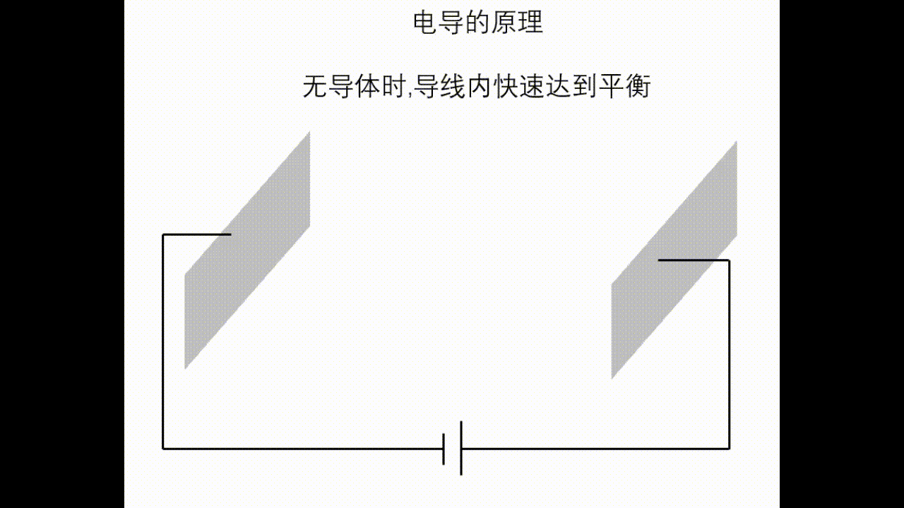
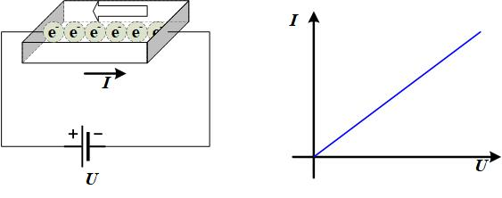
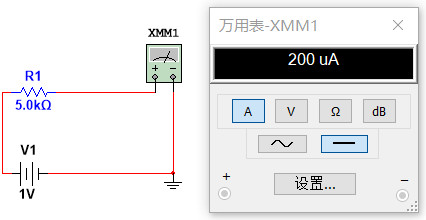

# 电阻的原理与设计

在上节我们讨论了[电容](2_Cap.html)的原理,特性和设计方法,把绝缘材料放在平行的金属极板中,即可形成电容器.那么,如果把金属导体材料放在两个电极中,会发生什么情况呢?

## 电导的本质

现在假设有一块已经掺入P原子的长方体硅晶体,电池与材料无电气连接时,材料内的自由电荷随机均匀分布,无定向移动,因此无电流; 
随着电池与材料加上电气连接,电池负极发射电子,正极吸收电子,电子在材料两端分别被聚集和被吸收,材料表面形成电荷积累,这种电荷积累一方面导致内部电场强度从0开始逐渐增大,终于在$E=E_{0}$时,P原子外层的电子$e$获得能量($E_{0}e$),就可以挣脱P原子的束缚,在电场作用下发生定向移动,形成电流,这种运动叫做**漂移运动**,载流子的平均漂移速度$v$与电场强度成正比
$$v=\mu E$$
系数$\mu$叫做迁移率,它表示了单位电场下载流子的平均漂移速度;另一方面电荷积累导致来自电池负极的电子的加速度减小;随着电荷进一步积累,直到电池负极发出的电子的加速度为0,如无吸引,电子将不再从电池负极向材料运动;但此时材料内部电子在内部电场作用下向电池正极方向移动,导致材料表面电荷量减小,从而将相同电荷量的电子从电池负极吸引过来.**单位时间内,从电池负极流入材料表面的电荷量等于材料表面流入到材料另一面的电荷量.** 

**常见的半导体材料中，原子核对导带电子的束缚力小于价带电子，散射效应也是在价带更明显，所以空穴迁移率小于电子。**

此时电流的大小为
$$I=dq/dt=neSv=neS\mu E=neS\mu U/d=\sigma SU/d$$

其中S是材料的横截面积,d为材料的长度,n为材料中载流子的浓度,e为元电荷量,$\mu$为载流子迁移率,U为材料两端的电压.系数$\sigma$反映了材料本身的导电能力,叫做**电导率**.**电阻率是电导率的导数.**

$$\sigma=ne\mu,G=\frac{I}{U}=\sigma\frac{S}{d}$$

$$\rho=\frac{1}{\sigma},R=\frac{U}{I}=\rho\frac{d}{S}$$

**这就是欧姆定律**.

用面电流密度$\vec{J}=dI/dS$表示:

$$\vec{J}=\sigma\vec{E}$$

这就是欧姆定律的微分形式,也是电阻的**本构方程**. 

> 本构方程是指描述了材料的属性特性或参数之间的定量关系的数学方程,它描述了材料对外部激励的响应情况.

> Constitutive equation or model is a mathematical formulation which establishes a quantitative relation between two parameters and hence characterizes the material properties. It describes how the material responds to external stimuli.

**电阻率/电导率与材料类型,载流子浓度以及温度有关.**

常用材料的电阻率如下表所示.

|材料|电阻率($\Omega\cdot \text{cm},25 ℃$)|
|:-:|:-:|
|铜Cu|$1.7\times10^{-6}$|
|金Au|$2.4\times10^{-6}$|
|铝Al|$2.7\times10^{-6}$|
|N型硅($N_{d}=10^{18}cm^{-3}$)|0.25|
|N型硅($N_{d}=10^{15}cm^{-3}$)|48|
|本征硅(超级纯))|$2.5\times10^{5}$|
|$\mathrm{SiO}_{2}$|$10^{14}$|

## 电阻的特性
1. I-V特性
事实上,在实际生活中,我们更常在器件两端加上电压,观测其电流值,作出其I-V曲线,叫做输出特性曲线.
* 室温下,`n`,`e`和$\mu$均几乎不变,因此输出特性曲线时一条直线.
* 电压一定时,当温度上升时,更多的电子吸收热量跃迁到导带,导致载流子浓度增大,从而电导率上升,电阻下降.

2. 电阻的功耗
电场能量是什么呢?答曰:电势能. 电荷置于电场中,就具有了电势能.
导体导电的过程中,导体中电子的**电势能转化为动能**,然后被**散射消耗掉**,或者转化成**光能**(钨丝灯泡)、**热能**(保险丝遇到大电流时温度升高将自己烧断,从而切断电路,保障用电安全),这个过程消耗了电势能.这种能量损耗统称为**热传导损耗**.
在电子从导体一端运动到另一端的过程中,电势变化量为导体两端电压$u$,一定时间$\Delta t$内通过导体的电荷量为$\Delta q = i\Delta t$,因此此过程消耗的能量为
$$\Delta E=u\Delta q=ui\Delta t$$
定义功耗为单位时间内消耗的能量,则电阻的功耗为:
$$P_{R}=ui$$
接下来为了更直观地体会电阻特性,在`Multisim 14 Education`上做仿真实验.

## 电阻的设计

人们希望可以把元件的体积不断减小,这样就可以在有限的空间内集成极其复杂的电路,这种高度集成化的电路就是集成电路,英文时Intergrated Circuit,也就是IC. 通常我们说的芯片`Chip`不止包含集成电路(IC),还有分立器件(MEMS,传感器,光电子器件等). 但通常是指IC.

那么在微小的电子电路(微电子电路)中,我们如何自己设计一个电阻呢?

如果材料的长度与宽度相等,材料的顶视图是一个方块(Box),此时其电阻称为方块电阻,记作$R_{\Box}$。方块电阻只与材料种类、温度、材料厚度有关.在设计时,如果方块电阻为$R_{\Box}=200\Omega$,要设计出$1\mathrm{k\Omega}$的电阻,只需拼接5个方块,即可将5个方块电阻串联.

由于微电子电路中半导体的掺杂不十分均匀,因此无法直接使用公式计算方块电阻大小.在特定工艺下,一般工艺厂商(Foundry)会给定方块电阻.例如,下面是不同材料的方块电阻值.

|材料层|方块电阻($\Omega/\Box,25 ℃$)|温度系数|电压系数|
|:-:|:-:|:-:|:-:|
|N阱|1000|5.74E-3|8.24E-3|
|N+掺杂|65|1.32E-3|3.76E-4|
|P+掺杂|170|-|-|
|多晶硅1|19|5E-4|4.1E-6|
|多晶硅2-低阻|55|1.42E-4|1.66E-4|
|多晶硅2-高阻|1900|-3.32E-3|-2E-4|
|金属铝|0.08|-|-|

其中:
* N阱: 单晶硅经过掺杂杂质原子形成的电阻.设计阱电阻需要注意:
  > 阱电阻的长度是两接触孔之间的长度;
  > 由于加工工艺中阱区是第一道工艺,后续工艺中的高温会使阱区向外扩散,制造出的实际阱电阻的宽度往往超过设计宽度的20%,因此需要在设计宽度上加以修正;
  > 方块电阻是根据成品实验测得,无需加以修正,直接使用即可.
* N+掺杂: 单晶硅经过掺入较重浓度的杂质原子,浓度明显大于N阱;
* P+掺杂: 单晶硅经过掺入较重浓度的杂质原子;
* 多晶硅1,2: 在绝缘的多晶硅材料中掺入少量杂质原子,其电导率急剧上升,接近于金属.常用于代替金属制作[MOS管](MOS.html)的栅极.多晶硅的温度系数和电压系数较小,阻值随电压和温度变化较小.**多晶硅2高阻电阻需要增加一个额外的光刻板,高阻多晶注入板,增加制造成本.**多晶硅不会扩散,因此电阻的设计宽度无需修正.
* 金属Al: 一般不使用金属制作电阻,但其阻值不能忽略,因为导线电阻会产生压降,并有可能产生[寄生电容](Cap.html).

工艺存在误差,导致实际制造出的电阻阻值$R'$与设计值$R$不完全一致,叫做失配.二者的相对误差$\frac{R'-R}{R}$叫做失配程度(失配误差).由于工艺带来的误差方向和大小均不确定,因此在设计时也无能为力.

**总结**:
1. **大电阻优选多晶硅2高阻、可选阱电阻.小电阻优选多晶1、多晶2低阻、N+掺杂等.**
2. **高精度的RC振荡器需要振荡器频率随电压和温度变化尽量小,因此使用电压系数和温度系数为正的电阻、配合系数为负的电阻(多晶硅2高阻),抵消温度和电压对RC振荡器频率的影响**.
3. **电阻的宽度$L$越大,受到加工带来的误差$\Delta L$的影响$\Delta L/L$越小**.
4. 较大数值的电阻常分为较短的电阻单位,放在一条线上,比蛇形电阻优越,后者在拐角处电阻较大.
5. 但工艺对各个电气层均有最大尺寸和最小尺寸的限制,如果一条直线摆放到了最大尺寸,还不满足设计阻值的要求,这是才可以使用金属导线将电阻按蛇形串联起来; 或者直接使用蛇形电阻.

6. 有源电阻:将MOS管的栅源或栅漏短接,形成工作在饱和区的导通电阻,可以大大节省面积,但阻值会受到电压波动的影响,严重时甚至导致电路功能失效,精度要求较高的电路中,一定要慎用有源电阻.有关有源电阻的更多信息,在[MOS管](MOS.html)一节中介绍.

> 练习题:分析并联电阻的电压关系,串联电阻的电流关系.