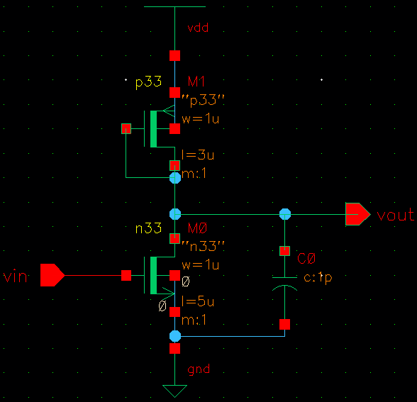
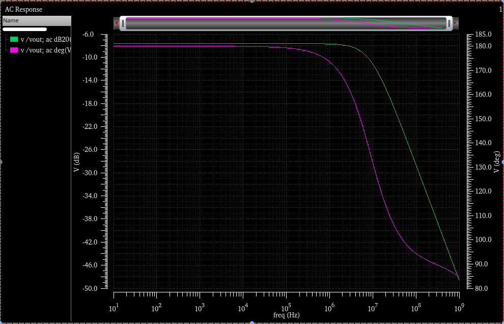
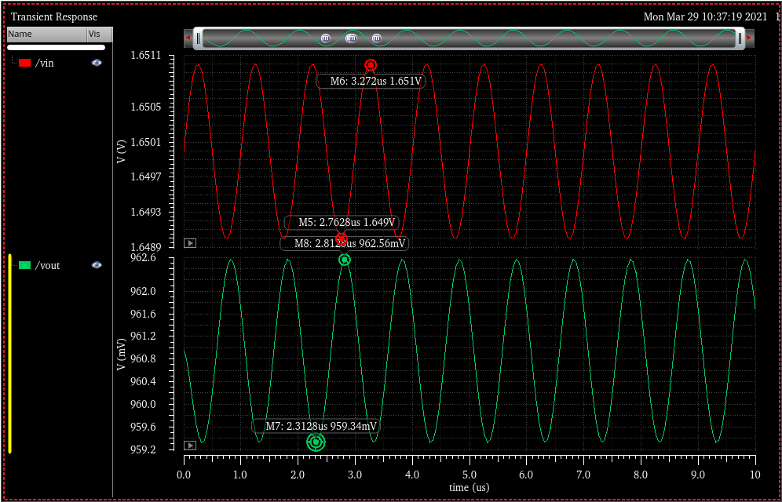
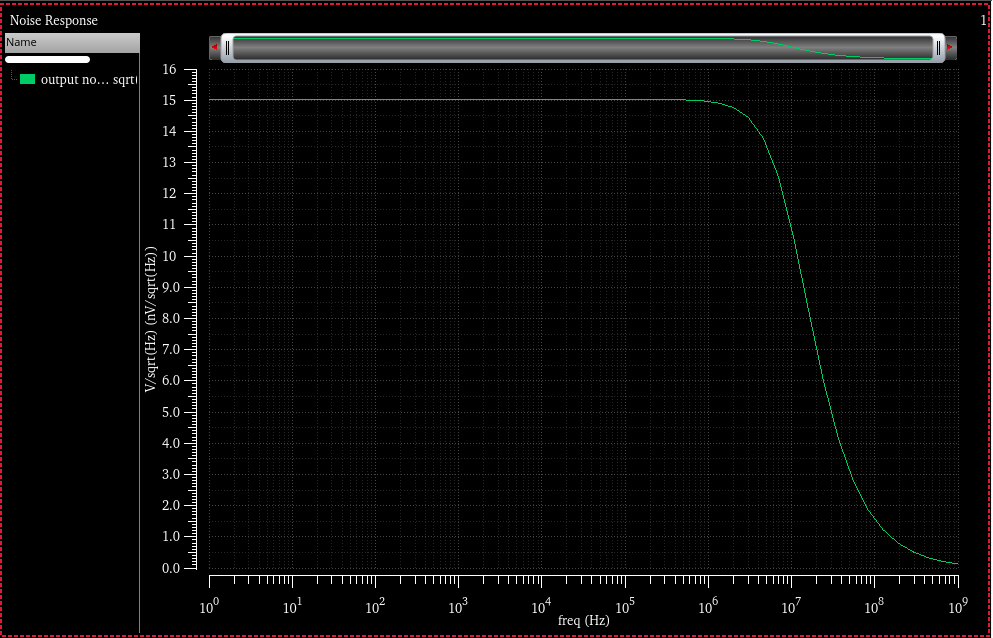

# 实例2_放大器的仿真

## 交流小信号仿真

本实例以简单放大器的交流小信号仿真为例，重点分析放大器的增益、相位与频率之间的关系。

1. 原理图设计
    * 基于上次的`ADE_ex1`库,新建一个`Cell View`，命名为`amp`;
    * 按快捷键`i`,调用`n33`,按`q`设置其宽长比为`1u/5u`,调用`p33`,宽长比设置为`1u/0.3u`.
    * 从`analogLib`中调用理想电容,设置电容值为`1pF`,按下图完成电气连接。
    

    > 分析：PMOS的栅漏短接,于是 $V_{SD}>V_{SG}-|V_{Tp}|$ , PMOS工作在放大区(饱和区),形成的导通电阻很小,交流小信号的电阻很小。这种电阻叫做 **有源电阻** 。
2. 仿真设计
    * `Launch` >` ADE L`启动仿真器.
    * 设置激励(`Setup`>`Stimuli`): 选择`vin`的激励项,`Function`选择为`sin`,`Type`选择为`voltage`,并设置直流偏置(`DC voltage`)为1.65V,交流幅值(`AC magnitude`)为`1V`, 交流相位(`AC Phase`)输入`0`。
    * 设置模型库和工艺角;
    * 设置仿真选项(`Analyses`>`Choose`):选择`ac`交流小信号仿真,`start`和`stop`分别输入频率扫描的起始(`10`)和终止频率(`1G`),扫描类型(`Sweep Type`)为自动(`Automatic`)。
    * 开始仿真(`Stimulation`>`Netlist and Run`).
    * 查看结果: `Results`>`Direct Plot`>`Main Form`,在弹出的对话框中选择`dB20`和`Phase`,然后单击原理图中`vout`的连线,可以看到如下如果.
    

## 瞬态仿真
在给定的输入激励下，在设定的时间范围内计算电路时域瞬态响应。

* 设置激励: 在上述原理图的基础上,在`ADE L`仿真器中,设置`vin`为正弦电压信号,直流偏置(`DC Voltage`)为1.65V，幅度(`Amplitude`)为1mV,频率(`Frequency`)为1M.
* 设置仿真选项(`Analyses`>`Choose`): 仿真类型为`trans`,设置仿真的终止时间`Stop Time`为`10u`,仿真精度默认方案`Accuracy Default`中选择最高精度`conservative`。
   > 高精度`conservative`用于数模混合,ADC仿真等；适中精度`moderate`适合对一般模拟电路进行仿真; 宽松精度`liberal`则适合仿真数字电路或变化速度较低的模拟电路.
* 设置输出(`Outputs`>`To be Plotted`>`Select On Schematic`)在原理图中单击输入和输出的Net；
* 开始仿真: `Stimulation`>`NetList and Run`,在弹出的波形图中点击工具栏的`Split All Strips`按钮,可以将两个波形图分开.在波形图中按`M`添加`Maker`标记,可以查看某个点的值.

* 分析：输入信号的峰峰值为2mV,输出信号的峰峰值为3mV.

> 注意,在仿真精度中,可以选择`Option`设置自定义的精度.

## 直流仿真

* 直流工作点的设计: 选择仿真类型(`Analyses`>`Choose`)为`dc`，然后选中`Save DC Operating Point`保存电路的直流工作点。然后`Stimulation`>`Netlist and Run`开始仿真. 仿真完成后
   * `Results`>`Print`>`DC Node Voltages`点击原理图中的输出节点,测量其输出的直流电压. 
   * `Results`>`Print`>`DC Operating Point`点击原理图中的PMOS,可以看到其直流工作状态参数.
   * `Results`>`Annotate`>`DC Node Voltages`在图中标注出直流电压。
* 直流特性扫描仿真: 在`dc`对话框中选择`Save DC Operating Point`保存电路的直流工作点。选择`Temperature`设置起始和终止温度为-40和125. `Outputs`>`To Be Plotted`>`Select On Schematic`单击放大器的输出.然后`Stimulation`>`Netlist and Run`开始仿真. 可以看到电压信号随着温度上升几乎线性增大。

## 噪声仿真

* 修改原理图: 将输入vin端口删除,从`analogLib`中调用`port`，设置直流偏置电压为1.65V；
* 设置仿真选项: (`Analyses`>`Choose`): 仿真类型为`noise`,扫描变量选择频率，起始和终止频率分别为1和1G，`Output Noise`中选择`voltage`，`positive ouput node`在原理图中点输出Net,`negative`则选择为`gnd`; `Input Noise`选择为`port`.
* 开始仿真: `Stimulation`>`NetList and Run`.
* 查看结果: `Results`>`Direct Plot`>`Main Form`,在弹出的对话框中选择`Output noise`,`V/sqrt(Hz)`,`Magnitude`，然后点击`Plot`。可以看到噪声曲线.

> 低频时主要是$1/f$噪声,高频时主要是晶体管热噪声.
