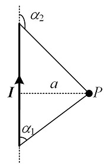

# 静电场与静磁场

## 一些定义

静电场： 研究空间内**所有电荷(电子(及空穴)、离子等)保持静止**,也就是**没有电流**.

恒流场： 研究空间内**所有位置的电流恒定**,也就是**电流不随时间变化**.

耦合：意思就是相互作用,可以是力的形式,电的形式.

介质：用来传输信息的物质. 例如声音要依靠介质进行传播;而光在真空中就可以传播,也就是说,光的传播不需要介质.

## 库仑定律:电荷产生电场

### 库仑力
两个**静止**点电荷$q_{1}$和$q_{2}$之间的相互作用力叫做**库仑力**,也叫静电力:

$$F=k\frac{q_{1}q_{2}}{r^2}\tag{1}$$

库仑力的特点:
* 等大反向.
* 同性相斥,异性相吸.
* $k=\frac{1}{4\pi \epsilon_{0}}$,其中$\epsilon_{0}$为真空介电常数,这里先不对此常数进行解释.
* 叠加原理：根据力的叠加原理,位于$\vec{r}$处的某电荷$q_{0}$收到的库伦合力是所有其他电荷对其作用的库仑力之和.

$$F=\frac{1}{4\pi\epsilon_{0}}q_{0}\sum^{N}_{i=1}{\frac{q_{i}}{|\vec{r}-\vec{r_{i}}|^{3}}(\vec{r}-\vec{r_{i}})}$$

然而事实上,实际生活中我们很少遇到点电荷,更多的是带电体,因此根据叠加原理:

$$F=\frac{q_{0}}{4\pi\epsilon_{0}}\oint_{V}{\frac{\rho}{|\vec{r}-\vec{r'}|^{3}}(\vec{r}-\vec{r'})}dV'$$

其中,$\rho dV$为某$dV$空间内的电荷量,因此$\rho=dq/dV$为**体电荷密度**.

进一步地,容易得到两个带电体1和2之间

$$F_{12}=\frac{1}{4\pi\epsilon_{0}}\oint_{V_{1}}\oint_{V_{2}}{\frac{\rho_{1}\rho_{2}}{|\vec{r_2}-\vec{r_1}|^{3}}(\vec{r_2}-\vec{r_1})}dV_{1}dV_{2}=-F_{21}$$

### 电场强度

如果在空间内某一点放置一个测试电荷$q_{0}$,若其收到的库仑合力为$F$,由于$F$与$q_{0}$的比值与$q_{0}$无关,因此定义**单位正电荷在位置$r$处所受到的力为电场强度**：$E=F/q_{0}$.

电场强度是有方向的矢量,因此如果将各点电场的方向在图中绘制出来,就形成了电场线.

* **高斯定理**：通过某闭合曲面S的电通量等于该曲面S内部的电荷量之和除以$\epsilon_{0}$.
$$\oint_{S}E\cdot dS = \frac{1}{\epsilon_0}\sum_{S内}q$$
> 静电场中,如果电场强度的在闭合曲面上的积分不为0,表示内部有电荷(电荷源),因此说电场是有源场.

* **环路定理**：电场强度某闭合回路l的环量均为0.
$$\oint_{l}E\cdot dl = 0$$

  > 静电场中,电场强度的在闭合环路上的积分一定为0,表示电场不可能一直沿着闭合环路,也就是**静电场中不可能有闭合的电场线**,因此叫做无旋场.

### 电势

如果试探电荷$q$在电场$E$中从位置1处移动到位置2处,此过程电场力对试探电荷$q$做功$Eql$,则电荷的电势能增大$Eql$.
电势能的增加量与试探电荷q的比值与q无关,定义位置1与位置2之间的电势差为

$$U_{21}=\int E\cdot dl$$

因此有

$$E=-\nabla U$$

* 电场线的方向总是由高电势指向低电势.

## 毕奥-萨伐尔定律:元电流产生磁场

如果$n$个电子$e^{-}$的向同一方向发生微小移动$d\vec{l}$,则电流大小为$I=neSv$,$S$为穿过的截面积,$v$为电荷移动的速度。这个电流叫做元电流。

原点处的元电流$Id\vec{l}$在$\vec{r}$处的**磁感应强度**为
$$\vec{B}=\int d\vec{B}=\int{\frac{\mu_{0}}{4\pi}\frac{Id\vec{l}\times\vec{r}}{r^{3}}}$$

* 练习题:求P点的磁感应强度.

   > 答案: $B=\frac{\mu_{0}I}{4\pi a}(\cos\alpha_{1}-\cos\alpha_{2})$,导线延长线上磁感应强度为0;当导线无限长时,$B=\frac{\mu_{0}I}{2\pi a}$.

### 安培力
某点处的元电流$Id\vec{l}$受到此点磁场的力为
$$d\vec{F}=Id\vec{l}\times\vec{B}$$

### 磁通量

在$\vec{r}$处穿过曲面$dS$的磁感线的数量为磁通量:

$$d\Phi=\vec{B}\cdot dS$$

例如,在一个电流环内部平面上距离圆心$r=a$处的磁感应强度为:

显然,
$$\cos\theta=\frac{a^{2}+R^{2}-r^{2}}{2aR}$$

于是

$$r^{2}=a^{2}+R^{2}-2aR\cos\theta$$

又由于$dl=Rd\theta$,
$$d\vec{l}\times\vec{r}=dl\cdot r\frac{R^{2}+r^{2}-a^{2}}{2Rr}=\frac{R^{2}+r^{2}-a^{2}}{2}d\theta$$

于是
$${B}=\frac{\mu_{0}I}{4\pi}\int^{2\pi}_{0}\frac{R^{2}+r^{2}-a^{2}}{2r^{3}}d\theta$$

线圈中的磁通量为:

$$
\begin{aligned}
\Phi&=\int BdS\\
&=\frac{\mu_{0}I}{4\pi}\int^{R}_{0} 2\pi a\left(\int^{2\pi}_{0}\frac{R^{2}+r^{2}-a^{2}}{2r^{3}}d\theta\right)da\\
&=\frac{\mu_{0}I}{4}\int^{2\pi}_{0}\int^{R}_{0}a\frac{R^{2}+r^{2}-a^{2}}{r^{3}}dad\theta\\
&=\frac{\mu_{0}kI}{4}
\end{aligned}
$$

其中$k=\int^{2\pi}_{0}\int^{R}_{0}a\frac{R^{2}+r^{2}-a^{2}}{r^{3}}dad\theta$只与圆形线圈的半径有关.

* **安培环路定理**:在真空中，磁感应强度$B$沿任意回路的线积分，等于该回路所限定的曲面上穿过的总电流乘以磁导率。这表明磁场是有旋场。定义$H=B/\mu_{0}$,二者的关系在[电感](4_Ind.html)进一步描述.这里$\mu_{0}$是真空磁导率.
  $$
  \begin{aligned}
  \oint_{l}B\cdot dl&=\mu_{0}I\\
  \oint_{l}H\cdot dl&=I
  \end{aligned}
  $$
* **磁通连续定理**: 磁感应线通常是闭合的。因此,对于磁场中的任何闭合曲面S,穿入的磁感应线数恒等于穿出的磁感应线数,即穿出闭合曲面S的净磁通量为零。
  $$\oint_{S}B\cdot dS=0$$

## 小结

本节主要讲了:
* 点电荷之间的库仑力,元电流之间的安培力;
* 静电场环路定理:电场的无旋性;
* 静电场高斯定理:电场的有源性;
* 静磁场安培环路定理:磁场的有旋性;
* 静磁场磁通连续定理:磁场的无源性.

## 引申:电流连续性方程

**电荷守恒定律**:单位时间内流出闭合曲面的电荷量等于该曲面内电荷量的减少量.即:

$$I=-\frac{dq}{dt}$$

用面电流密度$\vec{J}=dI/dS$表示:

$$\oint_{S}\vec{J}\cdot dS=-\frac{d}{dt}\int\rho dV$$

其微分形式为

$$\nabla\cdot\vec{J}+\frac{\partial\rho}{\partial t}=0$$
