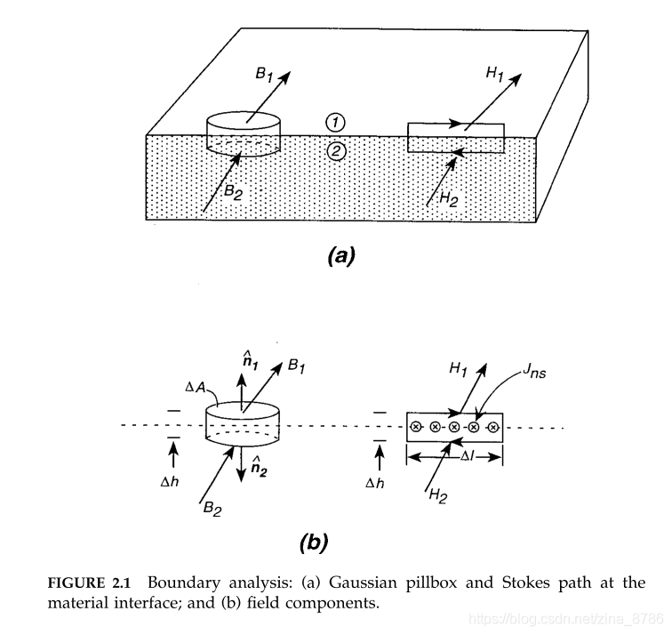

# 经典电磁学理论基础

* 点电荷之间的库仑力:$F=Eq$;
* 元电流之间的安培力(移动电荷受到洛伦兹力):$F=IBL$,$F=qvB$;

## 麦克斯韦方程组

* [电磁感应定律](1_StaticEM.html):
  $$\oint E\cdot dl=-\int_{S}\frac{\partial B}{\partial t}dS,\nabla\times E=-\frac{\partial B}{\partial t}$$
  无交变磁场时,右侧为0,体现了静电场的无旋性;
* [电场高斯定理](2_Cap.html):
  $$\oint D\cdot dS=q,\nabla\cdot D=\rho_{V}$$
  $q$是自由电荷,$\rho_{V}$为自由电荷体密度,体现了电场的有源性;
* [磁场安培环路定理](4_Ind.html):
  $$\oint_{l}H\cdot dl=\int_{S} \left(J_{c}+\frac{\partial D}{\partial t}\right)\cdot dS,\nabla\times H=J_{c}+\frac{\partial D}{\partial t}$$
  当电流恒定时,位移电流项为0,即界面上积累的自由电荷密度不变. 磁场的有旋性;
* [磁场磁通连续定理](1_StaticEM.html):
  $$\oint B\cdot dS=0,\nabla\cdot B=0$$
  磁场的无源性.

## 电流连续性定理
* [电流连续性定理](1_StaticEM.html):
  $$\oint_{S}\vec{J_{c}}\cdot dS=-\frac{d}{dt}\int\rho dV,\nabla\cdot J_{c}=-\frac{\partial\rho_{V}}{\partial t}$$
  由电荷守恒定律得出.

## 材料的本构方程
* [本构方程1-导体的欧姆定律](3_Res.html):
  $$J_{c}=\sigma E$$
  它决定了导体的I-V特性为$I=GU$.
* [本构方程2-电介质的极化](2_Cap.html):
  $$D=\epsilon_{0}\epsilon_{r}E$$
  它决定了电容器的I-V特性为$i=C\frac{du}{dt}$.
* [本构方程3-磁介质的磁化](4_Ind.html):
  $$B=\mu_{0}\mu_{r}H$$
  它决定了电感器的I-V特性为$u=L\frac{di}{dt}$.

这就是4个麦克斯韦方程组,1个电流连续性定理,以及3个材料的本征方程.

接下来我们讨论一下,在介质的交界面上,静电场和静磁场是怎样变化的?

## 静电场和静磁场的边界条件
静电场: 研究空间内**所有电荷(电子(及空穴)、离子等)保持静止**,也就是**没有电流**.因此电势不随时间变化.
静磁场: 研究空间内**所有位置的磁感应强度恒定**,因此电流保持恒定.
恒流场: 研究空间内**所有位置的电流恒定**,也就是**电流不随时间变化**.如果介质的位置和结构不变,则电势分布也不随时间变化.

静电场与恒流场的区别是**有没有恒定电流**.

> 由于边界中，介质的性质发生了突变，故微分形式的麦克斯韦方程组不适用了，可**以用麦克斯韦方程组的积分形式进行推导**。

### 静电场的边界条件

(1) 界面两侧相邻两点的电位连续: $U_{1}＝U_{2}$;

(2) H的切向分量在界面处不连续，其数量等于界面处的**自由**表面电流密度
$$H_{1t}−H_{2t}=J_{ns}$$

(3) B的垂直分量在界面B上连续
$$B_{1n}=B_{2n}$$

(4) 静电磁场中**磁场感应强度不随时间变化**时,E的切向分量在整个界面上是连续的
$$E_{1t}=E_{2t}$$

(5) D的垂直分量在界面处不连续，其数量等于界面处的**自由**表面电荷密度
$$D_{1 n}-D_{2 n}=\rho_{s}$$

### 恒流场(静磁场)的边界条件

稳定电流场的边界条件,就是稳定电流场建立之后,在两种不同电阻率介质界面处的电场分布特征。

(1) 界面两侧相邻两点的电位连续: $U_{1}＝U_{2}$;

(2) 界面上电流密度的法线分量连续：$J_{1n}＝J_{2n}$,电流密度的切线分量不连续；

> **电流恒定**(电场必然恒定)时,则边界上电荷密度不随时间变化(否则电场不恒定),$\frac{\partial \rho_{V}}{\partial t}=0$,根据电流连续性方程有$\nabla \cdot J_{c} = 0$.因此传导电流$J_{c}$在边界上法向分量也连续:
$$J_{1n}=J_{2n}$$

(3) 对于电场强度的边界条件,由于$E＝ρJ$,故可直接得出电场强度的法向分量不连续;而电场强度的切线分量连续：$E_{1t}＝E_{2t}$。

(4) B的垂直分量在界面B上连续
$$B_{1n}=B_{2n}$$

(5) D的垂直分量在界面处不连续，其数量等于界面处的**自由**表面电荷密度
$$D_{1 n}-D_{2 n}=\rho_{s}$$

(6) H的切向分量在界面处不连续，其数量等于界面处的**自由**表面电流密度
$$H_{1t}−H_{2t}=J_{ns}$$

注意,边界条件不要死记硬背,麦克斯韦方程组也不要死记硬背!要理解,才可以! 经典电磁学需要**微积分**的知识. 电动力学需要**场论初步**知识.