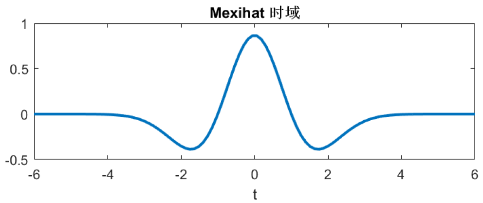
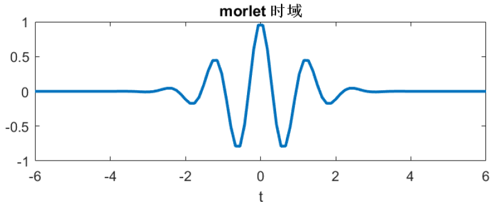
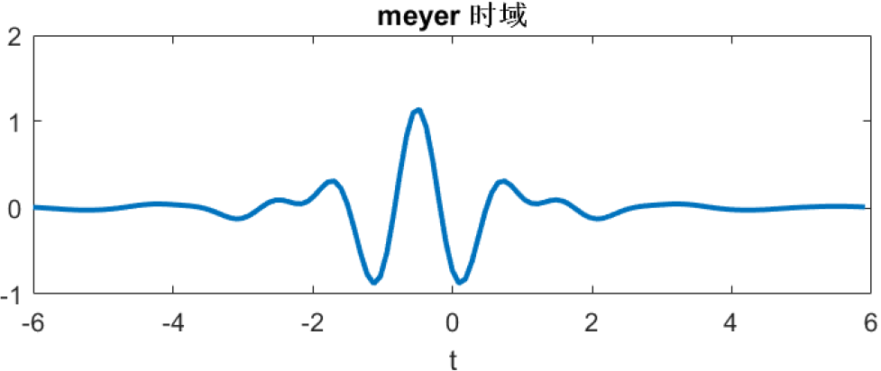

# 小波变换(四): 常用小波特点及二维小波变换

## 系列文章列表

前面三篇我们系统学习了小波变换的基础理论和Haar滤波的方法。那么本文是《小波变换》系列的第4篇，主要介绍常用小波特点及二维小波变换.

1. [小波变换(一): 为什么需要小波?](wavelet1.html)
2. [小波变换(二): 小波基函数,母小波和父小波](wavelet2.html)
3. [小波变换(三): 从实例代码看Haar小波分解和重构](wavelet3.html)
4. [小波变换(四): 常用小波特点及二维小波变换](wavelet4.html)
5. [小波变换(五): 小波，傅里叶与卷积的关系](wavelet5.html)

## 常用的小波基函数

||母小波|正交性|父小波(尺度函数)|图解|
|:-:|:-:|:-:|:-:|:-:|
|Haar|$\varphi(t)=\begin{cases}1 &0 \leq t < 1\\0 &\text{otherwise}\end{cases}$|有|$\psi(t)=\begin{cases}1 &0 \leq t < 0.5\\-1 &0.5\leq t<1\\0 &\text{otherwise}\end{cases}$||
|db4|无|无|无|无|
|Mexh墨西哥帽|$\varphi(t)=(1-t^{2})e^{t^2/2}$|无|无||
|Morlet|$\varphi(t)=Ce^{t^2/2}\cos{(5t)}$|无|无||
|Meyer|无|无|无||

## 二维小波变换

二维哈尔小波变换是将一个由8*8元素组成的图像块的矩阵，进行小波变换时，对矩阵中的每一行进行行变换，然后对行变换后的矩阵每一列进行列变换，最终得到小波系数矩阵。

接下来你可能想看：
[小波变换(五): 小波，傅里叶与卷积的关系](wavelet5.html)

---
## 参考内容
1. [形象易懂讲解算法I-小波变换](https://zhuanlan.zhihu.com/p/22450818)
2. [《The Wavelet Tutorial》小波教程 中文翻译（上）](https://zhuanlan.zhihu.com/p/250511382)
3. [python实现小波变换的一个简单例子](https://my.oschina.net/propagator/blog/3060377)
4. [小波变换和motion信号处理（一）](http://www.eepw.com.cn/article/201612/327996.htm)
4. [小波变换和motion信号处理：第二篇](http://www.eepw.com.cn/article/247254.htm)

