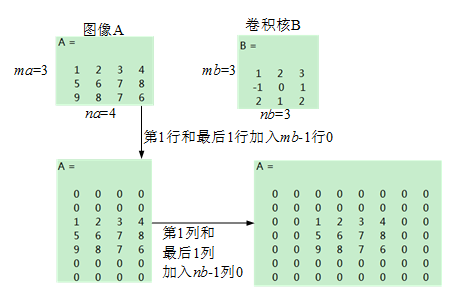

# 理解卷积

## 卷积的内涵
先给公式，$f$函数和$h$函数的卷积：
$$(f*h)(t)=\int^{t}_{-\infty}f(\tau)h(t-\tau)d\tau \tag{1}$$

什么意思呢？对于任意的输入信号$x(t)$,都可以表示为

$$
x(t)=\sum_{t_{k}\in R}x(t_k)\delta(t-t_{k})
$$

即，任意输入信号均可分解为冲激函数$\delta(t)$的线性组合。输入信号为单位冲激函数(幅值为1)时，把对应的输出(响应结果)定义为$h(t)$。也就是说，$h(t)$是系统对单位冲激函数$\delta$的响应。注意，这个响应函数$h(t)$是系统决定的，每个系统都有自己的$h(t)$函数，因此$h(t)$也叫系统函数:

$$
h(t)=\frac{y(t)}{x(t)}
$$

如下图所示，如果系统的输入在$t=0$时刻的幅值为$f(0)$，那么系统对它的响应就是$f(0)h(t)$。

也就是说，该输入对应的系统输出为：

$$
y(t)=f(0)h(t),
$$

事实上，而实践中，输入一般是连续的信号。例如，在$t=1$时刻，系统的输入为$f(1)$，则该输入相应的输出为$f(1)h(t-1),\text{here}\;t>1$。因此，如果在任一时刻$\tau$，系统中的输入为$f(\tau)$，那么该输入对应的输出为$f(\tau)h(t-\tau)$。而$t$时刻时的输出，不只是当前时刻$t$的输入的作用，还包括之前的所有时刻$\tau$的输入带来的作用。因此，系统在$t$时刻的输出，是$t$时刻之前所有时刻的输入信号作用的求和。即

$$
y(t)=\sum_{\tau=-\infty}^{\tau<t} f(\tau)h(t-\tau)\tag{2}
$$

写成积分的形式，即可得到式(1)。

因此，式(1)的含义是：系统$t$时刻的输出，是该时刻之前的所有输入$f(t)$引起的响应累积作用的结果。

### 图解法求卷积

把$h$换成$g$，重写卷积公式：

$$y(t)=(f*g)(t)=\int^{t}_{-\infty}f(\tau)g(t-\tau)d\tau \tag{3}$$

已知$f(t)$和$g(t)$的表达式以及函数图像，怎么求得二者的卷积结果呢?

为了理解方便，设$f(t)$和$g(t)$都是方框函数，

$$
f(t)=\begin{cases}1\quad&t\leq|a|\\0&\text{Others}\end{cases}
$$

$$
g(t)=\begin{cases}0.5\quad&0\leq t\leq b\\0&\text{Others}\end{cases}
$$

如下图所示。考察公式(3)，求$y(t)$，就是求$t$时刻之前，所有$\tau$时刻$f(\tau)$与$g(t-\tau)$乘积的和。

为了求$f(\tau)$与$g(t-\tau)$的乘积并积分，需要首先分别画出$f(\tau)$，$g(t-\tau)$关于$\tau$的图像。$f(\tau)-\tau$的图像直接根据表达式可以画出，如下图紫色矩形框所示。$g(t-\tau)$关于$\tau$的图像则需要对函数$g(\tau)-\tau$图像依次做反褶(沿$\tau=0$做镜像)，然后右移$t$，并计算在不同$t$下，两个函数曲线所围的面积(如果f(0)=2呢，就不是面积了。这里为了举例方便，设置了$f(0)=1$，应该是$f*g$)。

当$t<0$时，需要对反褶的$g$图像左移$|t|$，然后计算两个函数曲线所围的面积。

* 当$t<-a$时，相当于对反褶的$g$图像左移$|t|(|t|>a)$，两曲线无重叠区域，因此$y(t)=0$；
* 当$t=-a$，相当于对反褶的$g$图像左移$a$，反褶的$g$图像右侧与$f(t)$左侧刚好重叠。
* 当$-a<t<0$，相当于对反褶的$g$图像左移$|t|(|t|<a)$，二者重叠区域变大。
* 当$0<t<a$，相当于对反褶的$g$图像右移$|t|(|t|<a)$，二者重叠区域进一步变大。
* 当$t=a$，相当于对反褶的$g$图像右移$a$，二者重叠区域达到极大值。
* 当$a<t<b-a$，相当于对反褶的$g$图像右移$|t|(a<|t|<b-a)$，反褶的$g$图像将$f(t)$整体包围，二者重叠区域保持极大值。
* 当$t=b-a$，相当于对反褶的$g$图像右移$b-a$，反褶的$g$图像左侧与$f(t)$左侧重叠。
* 当$b-a<t<a+b$，相当于对反褶的$g$图像右移$|t|$，反褶的$g$图像左侧进入$f(t)$图像中，二者重叠区域随$t$的右移而减小。
* 当$t=a+b$，相当于对反褶的$g$图像右移$|t|=a+b$，反褶的$g$图像左侧与$f(t)$图像右侧重叠，二者重叠面积变为0。
* 当$t>a+b$，相当于对反褶的$g$图像右移$|t|>a+b$，反褶的$g$图像左侧与$f(t)$图像右侧分别且随着$t$增大而渐行渐远，二者重叠面积保持为0。

> 在此过程中，随着$t$从$-\infty$逐渐增大到$0$再到$+\infty$，反褶的$g$图像其实从左侧无穷远处紧贴着$t$逐渐向右滑动到反褶图像原本位置，再到右侧无穷远处。反褶的$g$图像就像一个滑动的窗口，因此该方法也常称作滑窗法。

### 卷积的计算机算法
计算卷积的算法是"不进位乘法"，如下图所示(计算机编程的算法，与上述图解法一样的)：

## 二维卷积
与一维卷积的滑窗类似，二维卷积也用滑窗进行计算。广泛用在图像处理领域。

以下内容转自[CSDN博客](https://blog.csdn.net/appleyuchi/article/details/78597516)

算法：对矩阵A,B进行卷积：`conv2(A,B)`，其中A为图像矩阵，B为卷积核。
1. 对矩阵A补零。如图。

2. 将卷积核B分别沿行方向和列方向进行反褶(相当于沿中心旋转180°)。如图。

3. 滑动滑窗，将卷积核的中心位于图像矩阵的每个元素，求滑窗内两矩阵**点积(按元素乘)**之和。如图。

在图像处理中，卷积常用于对图像模糊处理，边缘检测，产生轧花效果等。

在深度学习中，卷积在卷积网络中发挥作用。