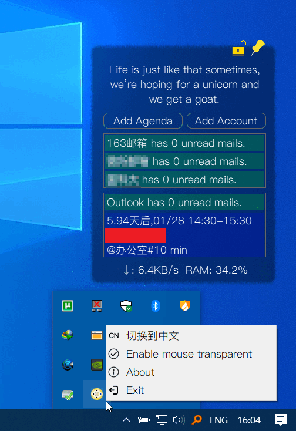

# Inlook - Your personal assistant

中文版|[English version](https://github.com/charleechan/Inlook)

## Introduction
Inlook是为在桌面上直观地提醒用户收到未读邮件和日程安排而开发的软件。本发布版仅限Windows 10. 开发者可基于此项目自由开发其他平台的版本。

## [User Guide](https://charleechan.github.io/Github_Gitbook_Cnblogs/inlook.html)

使用截图

## Release

* [Click Me To Download The Release Version](https://pan.baidu.com/s/1gzzFjWwLh1hMKob9biTz0g) (a1b2)
* 1.0.0.2 Fix some bugs.
* 1.0.0.1 Add support for Chinese, fix some bugs.
* 1.0.0.0 Initial release

## Features

* 新邮件到达时自动弹窗提醒.
* 列出从昨天到未来6天的日程.
* 支持解锁、锁定窗口大小和位置.
* 窗口放在桌面最底层,不影响游戏和工作.
* 网速和占用RAM监控.
* 支持鼠标穿透,提高工作效率.
* 智能缩放,根据邮箱数目和日程项数自动规划窗口大小.
* **支持中文界面!**

## Change log
* 2020.12.29 初始版本发布
* 2021.01.15 增加对中文界面的支持.
* 2021.01.19 增加用户登录账户验证功能, 修复Bug: 第二次网络中断后连接造成崩溃

## Declaration of interest

[GNU General Public License v3.0]

## Usage

* 添加你的邮箱账户可以实现**新邮件提醒**, 你需要提前获取你的邮箱的IMAP的服务器信息，部分邮箱如**163，QQ邮箱登录时需要授权码而不是密码**。

* 在本软件和手机自带的日历中添加同一个`Exchange`账户(我自己测试的是Outlook),可以实现**日程多端自动同步, 日程提醒**。

* 任何时候可以直接在托盘修改语言,无需重启软件.

* 自1.0.0.1发布版之后,去除了快捷方式的**开机启动**,如有需要,请自行生成指向**start.bat**的快捷方式,并拖放到`C:\Users\[username]\AppData\Roaming\Microsoft\Windows\Start Menu\Programs\Startup`目录.

## 其他

1. 自己为了自己用写的软件，代码全部开源，你可以下载后直接修改作为自己喜欢的版本；

2. 因使用本软件产生的问题，后果自负；

3. 本软件中用到了`PyQt`,`exchangelib`,需自觉遵守开源协议，禁止商用；

4. 自己的Win10上用的很好,可能不自动适配你的电脑屏幕，请自行修改，也希望能帮我改，可以一块合作。

5. 后续可能会添加`Launcher`面板，可以放几个小工具。

6. 支持请发热心和好评，欢迎一起Debug.

7. 为了一些人的使用方便，添加了**桌面快捷方式**,如果需要去除，请到系统文件夹内删除快捷方式即可。
