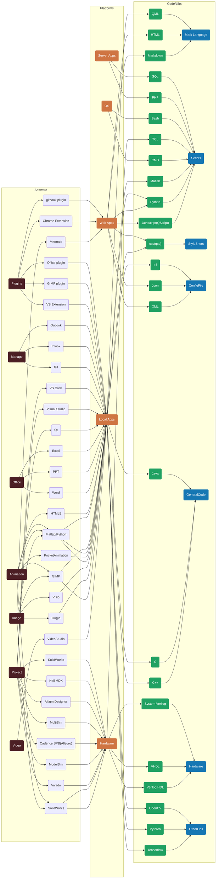

```mermaid
graph LR
classDef A2 fill:#20A162,stroke:#000000,color:#ffffff,stroke-width:0px;
classDef A4 fill:#4C1F24,stroke:#000000,color:#ffffff,stroke-width:0px;
classDef A3 fill:#CF7543,stroke:#000000,color:#ffffff,stroke-width:0px;
classDef A1 fill:#1677B3,stroke:#000000,color:#ffffff,stroke-width:0px;
subgraph Code/Libs
B1(Mark Language )
  C1(Markdown )
  C2(HTML )
  C3(QML )
B2(Scripts )
  C4("Javascript(QScript) ")
  C5(Python )
  C6(Matlab )
  C7(CMD )
  C8(TCL )
  C9(Bash )
  C10(PHP )
  C11(SQL )
B3(StyleSheet )
  C12("css(qss) ")
B4(ConfigFile )
  C13(XML )
  C14(Json )
  C15(Ini )
B5(GeneralCode )
  C16(C++ )
  C17(C )
  C18(Java )
B6(Hardware )
  C19(Verilog HDL )
  C20(VHDL )
  C21(System Verilog )
B7(OtherLibs )
  C22(Tensorflow )
  C23(Pytorch )
  C24(OpenCV )
end

subgraph Platforms
D1(Hardware )
D2(OS )
D3(Web Apps )
D4(Local Apps )
D5(Server Apps )
end


subgraph Software
F2(Image )
  G2(GIMP )
  G3(Origin )
  G4(Mermaid )
  G5(Visio )
  G6(Matlab/Python )
F3(Animation )
  G7(PocketAnimation )
  G10(SolidWorks )
  G11(HTML5 )
F4(Video )
  G12(VideoStudio )
F5(Office )
  G13(Word )
  G14(PPT )
  G15(Excel )
F6(Project )
  G16(Vivado )
  G17(ModelSim )
  G18("Cadence SPB(Allegro) ")
  G19(MultiSim )
  G20(Altium Designer )
  G21(Keil MDK )
  G22(SolidWorks )
  G23(Qt )
  G24(Visual Studio )
  G25(VS Code )
F7(Manage )
  G26(Git )
  G27(Inlook )
  G28(Outlook )
F8(Plugins )
  G29(Chrome Extension )
  G30(VS Extension )
  G31(gitbook plugin )
  G32(GIMP plugin )
  G33(Office plugin )
end


D3 --> C5
D4 --> C12

D3 --> C1  --> B1
D3 --> C2  --> B1
D4 --> C3  --> B1
D3 --> C4  --> B2
D4 --> C5  --> B2
               
D4 --> C6  --> B2
D2 --> C7  --> B2
D1 --> C8  --> B2
D2 --> C9  --> B2
D5 --> C10 --> B2
D5 --> C11 --> B2
D3 --> C12 --> B3
               
D3 --> C13 --> B4
D3 --> C14 --> B4
D4 --> C15 --> B4
D4 --> C16 --> B5
D4 --> C17 --> B5
D4 --> C18 --> B5
D1 --> C19 --> B6
D1 --> C20 --> B6
D1 --> C21 --> B6
D4 --> C22 --> B7
D4 --> C23 --> B7
D4 --> C24 --> B7


F4--> G12  --> D4
F2--> G2   --> D4
F2--> G3   --> D4
F2--> G4   --> D3
F2--> G5   --> D4
F2--> G6   --> D4
F2--> G10  --> D1
F3--> G7   --> D4
F3--> G6   --> D4
F3--> G2   --> D4
F3--> G10  --> D1
F3--> G6   --> D4
F3--> G11  --> D4

F5--> G13  --> D4
F5--> G14  --> D4
F5--> G15  --> D4
F6--> G16  --> D1
F6--> G17  --> D1
F6--> G18  --> D1
F6--> G19  --> D1
F6--> G20  --> D1
F6--> G21  --> D1
F6--> G22  --> D1
F6--> G23  --> D4
F6--> G24  --> D4
F6--> G25  --> D4
F7--> G26  --> D4
F7--> G27  --> D4
F7--> G28  --> D4
F8--> G29  --> D3
F8--> G30  --> D4
F8--> G31  --> D3
F8--> G32  --> D4
F8--> G33  --> D4

class B1,B2,B3,B4,B5,B6,B7 A1
class C1,C2,C3,C4,C5,C6,C7,C8,C9,C10,C11,C12 A2
class C13,C14,C15,C16,C17,C18,C19,C20,C21,C22,C23,C24 A2
class D1,D2,D3,D4,D5 A3
class F2,F3,F4,F5,F6,F7,F8 A4
```

知识体系架构
