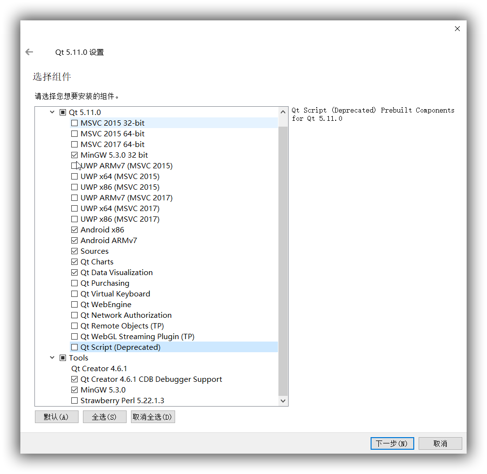

# Qt Quick开发教程1:安卓开发环境的配置

Qt Widget已发展成熟，但不适合在移动设备(Android 手机、平板)上使用。Qt Quick使用QML的开发方式。

现在对Android开发环境进行配置[^1]。

## 所需文件:

* Java SE Development Kit (JDK) version 6, or later. You can also use OpenJDK on Linux.
* Gradle for building application packages for Android devices (APK). Gradle is delivered with Qt 5.9, and later. Because Gradle scripts are not delivered with Android SDK Tools since version 26.0.0, they are delivered with Qt 5.9 and 5.6.3.
  **Note: Using Ant to build APKs is no longer supported.**。
* A tool chain for building applications for Android devices provided by the Android NDK from Google.
* Android SDK Tools
  - Platform tools
  - Build tools
  - At least one SDK platform
* Android Debug Bridge (ADB) driver on the Windows platform to enable USB debugging. The default USB driver on Windows does not allow debugging.
  - After installing the driver, try running a few basic adb commands to check it.


这里使用的分别是：
* qt-opensource-windows-x86-5.11.0.exe
* jdk-8u171-windows-x64.exe;
* gradle-4.4-all.zip;
* android-ndk-r17-windows-x86_64.zip
* android-sdk_r24.4.1-windows.zip
* adb driver.
## Qt的安装

## 安装JDK和JRE
配置一下环境变量:
* JAVA_HOME  值： C:\Program Files\Java\jdk1.8.0_171
* CLASSPATH   值：.;%JAVA_HOME%\lib\dt.jar;%JAVA_HOME%\lib\tools.jar;
安装完成后，在命令行中输入`java -version`和`javac -version`，可以查看安装的版本。如果不显示版本号，则未安装完成，可能是环境变量未设置好。
## 安装Gradle[^2]
* 下载好gradle-4.4-all.zip，然后解压到D:/Programs/Gradle目录。
* 配置环境变量`PATH`，添加目录`D:/Programs/Gradle`。
* 在命令行中输入`gradle -v`查看版本号，以验证安装完成。
## 安装NDK
直接解压到`D:\Program\Android_NDK`即可。
## 安装Android sdk
* 将android-sdk_r24.4.1-windows.zip直接解压到`D:\Program\Android_SDK`即可。
* 配置一下环境变量:
  - ANDROID_HOME  值： D:\Program\Android_SDK\android-sdk-windows
* 双击`SDK Manager.exe`，Option里选择HTTP代理地址为`mirrors.neusoft.edu.cn`，端口为`80`，勾选"Force HTTPS"选项，然后安装你需要的SDK Tools,SDK Platform-tools,SDK platform及Android *.*.*(API 2*),安装Android Support Repository，Google Repository和Google USB Driver，Emulator等。
  - 如果双击时一闪而过，请将android-sdk_r24.4.1-windows.zip再重新解压到该目录，冲突文件进行覆盖。
  - 现在的Android SDK Tools版本为24.4.1，不要更新，以免Qt不兼容。
## 安装ADB driver
该驱动用于调试，安装后方可以连接手机进行调试。
安装后在命令行运行`adb　version`进行检查。

## 配置Qt
* 打开Qt creator，工具>>选项>>设备；
  - 添加Android SDK路径；
  - 添加Android NDK路径；
  - 添加JDK路径。
* 工具>>选项>>构建与运行

## 测试环境
* 新建工程`：Qt Quick Application - Empty`>>`Build system`选择`qmake`，选择构建套件(Kits)，这里将Desktop和Android都勾选。
* 将main.qml更改为：
```xml
import QtQuick 2.9
import QtQuick.Window 2.2

Window {
    visible: true
    width: 640
    height: 480
    title: qsTr("Hello World")

    Text {
        anchors.centerIn: parent
        text: qsTr("Hello Android")
    }

    MouseArea {
        anchors.fill: parent
        onClicked: Qt.quit()
    }
}
```
* 左下角按钮先选择在Desktop上构建；试运行。
* 连接手机打开调试，选择在Android上构建；运行。
  - 如果出现要下载gradle-3.4-bin.zip的情况，将其复制到C:\Users\CharleeChan\.gradle\wrapper\dists\gradle-3.4-bin\aeufj4znodijbvwfbsq3044r0。
  - 如果你的手机是Android 9版本，可以按以下设置。

[^1]: [https://doc.qt.io/qtcreator/creator-developing-android.html](https://doc.qt.io/qtcreator/creator-developing-android.html)
[^2]: [https://gradle.org/install/](https://gradle.org/install/)
