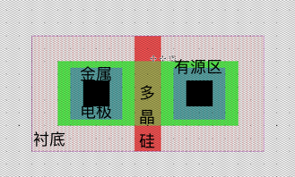
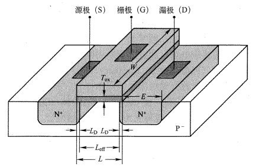
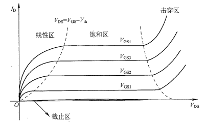
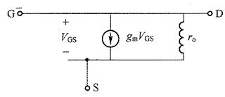
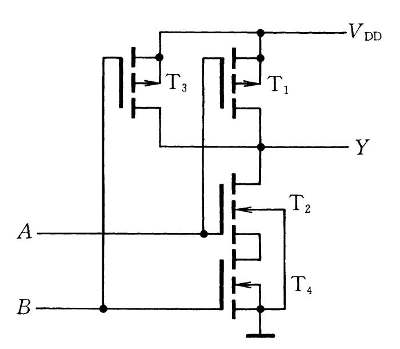
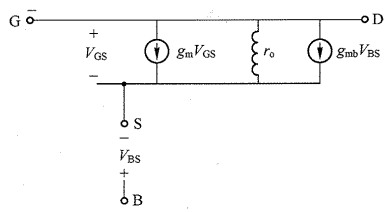
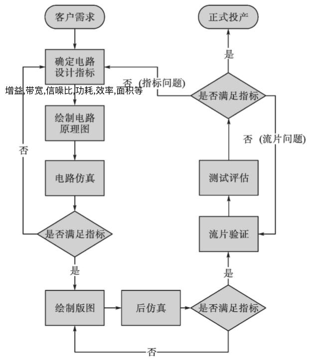

# 半导体器件2-MOS管

## MOS管原理
既然半导体材料这么有意思,又能整流,又能放大,那科学家就提了,能不能做开关呢?

于是就有人做出来啦！来看看这个小开关!

平面工艺-版图

剖面图

立体图

1. 把一个P型的半导体材料作为地基(叫做衬底),连接的电极叫做基极(Bulk,主体);
2. 在上面铺一层厚厚的$SiO_{2}$材料(这玩意儿自然界很多,土里到处都是,记住是绝缘的就可以了),叫做场氧化层, 
3. 在某一个小区域把厚厚的$SiO_{2}$削薄,叫做刻蚀,形成很薄的$SiO_{2}$薄膜.
4. 在该区域的两侧大量注入N型原子(磷原子等),形成N型区域(记为扩散区),这个过程就是掺杂的过程; 
5. 然后使用淀积的方法长一层多晶硅材料(Poly-Silicon,以多个硅原子核(晶核)为中心,向不同方向生长的硅晶体),并掺入杂质原子使其能在常温下导电,形成类似金属的功能.把多晶硅的电极叫做栅极(gate ,门的意思,中文翻译做栅栏门,阀门); 
6. 这种**金属**(Poly)-氧化物(Oxide)-半导体(Semiconductor)结构,简记为MOS. 你可能有疑问,这尼玛分明,就是多晶硅,你非要说时金属? 其实**多晶硅可以通过重掺杂(浓度高)来改变其导电能力,从而调整MOS开关的阈值电压,而金属不方便调阈值电压**.
7. 截止区：当$V_\text{GB(S)}\ge0$,N区多子(主要是N区多子和极少数的衬底中少子)受到电场的勾引,向上移动与P型半导体的多子空穴结合,在表面留下了形成一层耗尽层(仍没有多余的电子用于导电).NMOS两个N区被P型衬底隔开,在$D$和$S$之间加电压也不会电流。
8. 线性区：$V_\text{GB(S)}$继续增大, 耗尽层变厚,直到靠近表面的电子越来越多,当多于空穴时,在表面形成电子层,叫做反型层,与两个N区连成一片,这片反型层的区域叫做**沟道**.它可以导电,此时的$V_\text{GB(S)}$电压叫做 **阈值电压**,记做$V_{th}$.N区和沟道区等能够在衬底表面导电的区域,叫做Active区,国内叫做**有源区**. 既然能导电了,那么我在两片N区两端加上电势差$V_{DS}$,就可以有电流通过. 其实,在$V_\text{GB(S)}$略低于阈值时,也有较小电流通过,叫做**亚阈值区**.此时MOS管进入线性区. 
   * **沟道长度L** 是集成电路工艺的制程标准.**沟道宽度W** 在模拟集成电路设计中至关重要.
   * 导通时沟道中为电子的,叫做Ｎ型沟道,MOS管叫做NMOS. 反之,导通时为空穴的,叫做PMOS管.
   * 把两片N区物理上没有任何区别; 但为了区分,设定源极(source,电源)作为载流子的来源,漏极(drain,排出,泄漏)是载流子的电极.因此,**NMOS的低电位端为源极,PMOS的高电位端为源极**.
   > 注意,MOS管的阈值电压与PN结的阈值电压原理上不同. MOS管时反型层生成时的电压,PN结是内电场被抵消时的电压.
9. 饱和区: $V_\text{DS}$进一步增大时,S极和D极之间形成电场,导致$V_{GS}>V_{GD}$,所以D端沟道会变窄.直到$V_{DS}=V_{GS}-V_{th}$刚好D端沟道消失,这种情况叫做预夹断.此时的电压叫做**过驱动电压**,记做$V_{DS,sat}$.漏极电位进一步上升时,漏极的反型层消失,出现夹断区(其实夹断区长度远小于沟道长度,可能只有几个nm).$V_{DS}-V_{DS,sat}$全部落在夹断区,电子沿着沟道运动时向漏极运动,到达夹断区时,会在较强的电场作用下直接漂移向漏极.此时在保持$V_{GS} $为恒定值的前提下增大$V_{DS}$,沟道电流几乎不变(S端的沟道厚度没有变).此时MOS管进入饱和区.如果保持$V_{DS}$恒定,增大$V_{GS}$，则反型层(沟道)变厚,相当于增大了**导体**的横截面积,DS之间的电流也随之增大,从而达到放大信号的目的.**MOS管放大的本质是$V_{GS}$改变了沟道电阻,产生了电流,因此是压控电流源(VCCS)**. 但注意：过度增大$V_{GS}$会使MOS管的栅氧化层击穿.

10. 击穿区: 当$V_{DS}$过大时,D端电压会远高于衬底电压,漏端的PN结会反向击穿.$V_{DS}电流会很大.

## MOS管总结
* 截止区($V_\text{GB(S)}\le V_{th}$): $I_{DS}=0$.
* 亚阈值区: $I_{D}=I_{0}\exp\frac{V_{GS}}{ξ V_{T}}$,ξ为非理想因子,$V_{T}=kT/e$为热电压.
* 线性区($V_\text{GB(S)} > V_{th}$,$0< V_{DS} < V_{GS}-V_{th} $): 
$$I_{D}=\mu_n \frac{\epsilon_{0}\epsilon_{ox}}{t_{ox}}\bullet \frac{W}{L}\left[ (V_{GS}-V_{th})V_{DS}-\frac{1}{2}V_{DS}^{2}\right]$$
其中$\mu_{n}$为N型半导体载流子(电子)的迁移率,$C_{ox}=\epsilon_{0}\epsilon_{ox}/t_{ox}$为单位面积的栅氧化层电容.
* 饱和区(放大)($V_\text{GB(S)}\ge V_{th}$,$V_{DS} \ge V_{GS}-V_{th} $): 
$$I_{D}=\mu _n\frac{\epsilon_{0}\epsilon_{ox}}{2t_{ox}}\bullet \frac{W}{L} (V_{GS}-V_{th})^{2}$$

   

   
MOS管的输出特性曲线

> BJT的输出特性曲线中,放大区受$i_{b}$控制,三个区域分别是截止区,饱和区,放大区;
> MOS的输出特性曲线中,放大区受$V_{GS}$控制,三个区域分别是截止区,线性区,和饱和放大区.

**在模拟CMOS集成电路设计中,我们只关注MOS的饱和区.在CMOS数字电路设计中,一般工作在线性区.**

* MOS管的大信号模型(**交流信号的幅度很大**):
   

   
NMOS管的直流工作点

* MOS管的小信号模型(**交流信号的幅度很小**):
   

   
NMOS管的基本小信号模型

* 沟道长度调制效应.
   事实上,考虑沟道长度受到$V_{DS}$影响,对公式做出修正.
   $$I_{D}=\mu _n\frac{\epsilon_{0}\epsilon_{ox}}{2t_{ox}}\bullet \frac{W}{L} (V_{GS}-V_{th})^{2}(1+\lambda V_{DS})$$
   此时,MOS管的导通电阻不为0.
   $$r_{o}=\frac{\partial V_{DS}}{\partial I_{D}}=\frac{1}{\partial I_{D}/\partial V_{DS}}=\frac{2}{\mu_{n}C_{ox}\frac{W}{L}(V_{GS}-V_{th})^{2}\lambda}\approx \frac{1}{\lambda I_{D}}$$
   对于长沟道,沟道长度调制系数$\lambda$的值很小.
   此时NMOS管的小信号模型变成了下图.
   

   
考虑沟长调制后NMOS管的小信号模型

* 体效应
   <mark>在CMOS集成电路中,所有的PMOS管的基极接$V_{DD}$,所有NMOS管的基极接GND.</mark>
   之前都假设了$V_{S}=V_{B}$, 衬底和源极相连.然而,大多数情况下该情况不成立.例如,最常见的电路二输入与非门中,T2管的S极电压与T1管的D极电压相等,由于导通电阻的存在,其电压不为0. **在传输门中,这种情况更为常见.**
   

   
二输入与非门

   当$V_{S}>V_{B}=0$时,沟道导通时$V_{GS}=V_{th0}$,此时的$V_{G}$为
   $$V_{th}=V_{th0}+\gamma(\sqrt{2|\phi_{F}+V_{SB}|}-\sqrt{2|\phi_{F}|})$$
    其中$V_{th0}$是$V_{B}=V_{S}$时的阈值电压; $\gamma$为体效应系数,典型值$(0.3\sim0.4)\sqrt{\text{V}}$, $\phi_{F}$是反型层的表面电势.
    $V_{S}>V_{B}=0$时,漏极电流$I_{D}$也受到该$V_{SB}$的影响,$V_{S}$越大,D和S之间压差越小,电流也越小.
   

   
考虑沟长调制、体效应后NMOS管的低频小信号模型

* 高频下的小信号模型
   信号频率较高时,除了D、S之间导通,其电容很小,各极之间的电容不能忽略.
   

   
完整的小信号模型

* 短沟道效应: 随着工艺能力提升,沟道变短:
   * 垂直电场更大,沟道内载流子更贴近表面,迁移速度下降.
   * 水平电场也更大,载流子速度达到饱和.
   * 高场强之下,热载流子 **加速-碰撞电离-更多的载流子**.

> 事实上, 在制造过程中, 源极和漏极横向扩散$L_{D}$，导致有效的沟道长度$L_\text{eff} = L-2L_{D}$,小于设计的沟道长度$L$.因此需要仿真.

   

