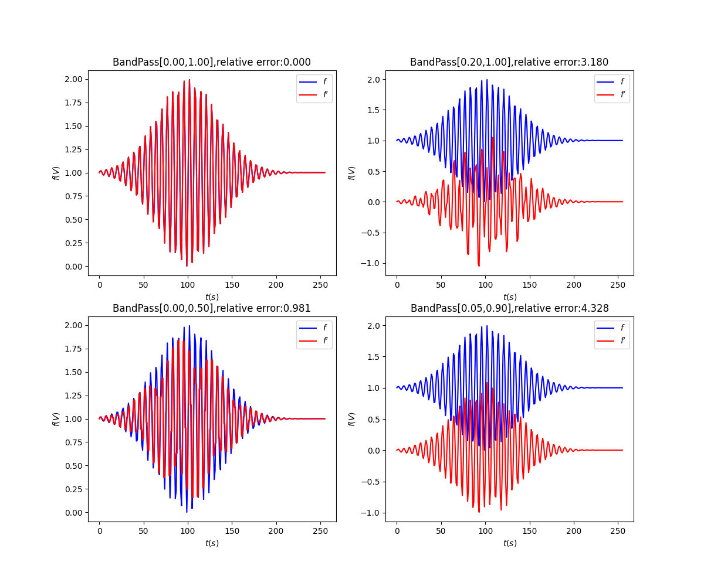

# 小波变换(三): 从实例代码看Haar小波分解和重构

## 系列文章列表

本文是《小波变换》系列的第3篇，主要介绍Haar小波的分解与重构,并给出Python代码实例.

1. [小波变换(一): 为什么需要小波?](wavelet1.html)
2. [小波变换(二): 小波基函数,母小波和父小波](wavelet2.html)
3. [小波变换(三): 从实例代码看Haar小波分解和重构](wavelet3.html)
4. [小波变换(四): 常用小波特点及二维小波变换](wavelet4.html)
5. [小波变换(五): 小波，傅里叶与卷积的关系](wavelet5.html)

## 小波分解与重构

上一节，我们介绍了父小波和母小波的概念。以及如何将$f(t)$表示为父小波和母小波的组合，这就是**小波分解**。

我们把信号

$$
f(t) = \sum_{k\in Z} b_{k}\varphi(2^{j}t-k),\text{here}\;c_{k}\in R\tag{1}
$$

进行了小波分解，得到：

$$
f(t) =\sum_{j=1}^{\infty}\sum_{k\in Z}c_{j,k}\psi[2^{j-1}(t-k)] + \sum_{k\in Z}d_{k}\varphi(t-k)\tag{2}
$$

那么在去除$V_{j}$中的分量之后，需要将小波分量重新表示成式(1)的形式。这就是小波重构。

<mark>**小波重构是已知(2)中的$c_{j,k}$和$d_{k}$，求(1)中$b_{k}$的过程。**</mark> [由上节中](wavelet2.html)式(8)可知

$$\psi[2^{j-1}(t-k)] = \varphi[2^{j}(t-k)]-\varphi[2^{j}(t-k)-1]$$

代入(2)式后即可重构出小波。

可能看得绕了，没关系，看个例子放松下~

## Haar小波实例

### 怎样计算得到小波分量值?

继续以Haar小波为例，图(a)中$\varphi(t)$作为母小波，图(b)中$\psi(t)$作为父小波。
<div align="center"></div>

根据上面式(2)，我们先用向量表示出$\psi[2^{j}(t-k)]$和$\varphi(t-k)$这些基函数。

首先，如果用$V_{j=1}$去近似原始的时域信号，暂时不考虑母小波平移变换得到的基函数，则基函数有且仅有母小波$\varphi$和父小波$\psi(t)$，基函数数目为$N=2^{j}=2$，两个基函数可以表示为如下形式：

$$
N=2,H=\frac{1}{\sqrt{2}}\left[\begin{matrix}1 & 1\\1 & -1\end{matrix}\right]
$$

其中，矩阵$H$的两个行向量分别表示母小波$\varphi$和父小波$\psi(t)$。

进一步地，如果使用$V_{j=2}$去近似原始的时域信号，同样不考虑母小波平移变换得到的基函数，则基函数除了母小波$\varphi$和父小波$\psi(t)$，还有对父小波的缩放产生的基函数，基函数数目为$N=2^{j}=4$，4个基函数可以表示为如下形式：

$$
N=4,H=\left[\begin{matrix}\frac{1}{2} & \frac{1}{2} & \frac{1}{2} & \frac{1}{2}\\\frac{1}{2} & \frac{1}{2} & -\frac{1}{2} & -\frac{1}{2}\\\frac{1}{\sqrt{2}} & -\frac{1}{\sqrt{2}} & 0 & 0\\0 & 0 & \frac{1}{\sqrt{2}} & -\frac{1}{\sqrt{2}}\end{matrix}\right]
$$

进一步的，有

$$
N=8,H=\left[\begin{matrix}\frac{1}{2\sqrt{2}} & \frac{1}{2\sqrt{2}} & \frac{1}{2\sqrt{2}} & \frac{1}{2\sqrt{2}} & \frac{1}{2\sqrt{2}} & \frac{1}{2\sqrt{2}} & \frac{1}{2\sqrt{2}} & \frac{1}{2\sqrt{2}}\\\frac{1}{2\sqrt{2}} & \frac{1}{2\sqrt{2}} & \frac{1}{2\sqrt{2}} & \frac{1}{2\sqrt{2}} & -\frac{1}{2\sqrt{2}} & -\frac{1}{2\sqrt{2}} & -\frac{1}{2\sqrt{2}} & -\frac{1}{2\sqrt{2}}\\\frac{1}{2} & \frac{1}{2} & -\frac{1}{2} & -\frac{1}{2} & 0 & 0 & 0 & 0\\0 & 0 & 0 & 0 & \frac{1}{2} & \frac{1}{2} & -\frac{1}{2} & -\frac{1}{2}\\\frac{1}{\sqrt{2}} & -\frac{1}{\sqrt{2}} & 0 & 0 & 0 & 0 & 0 & 0\\0 & 0 & \frac{1}{\sqrt{2}} & -\frac{1}{\sqrt{2}} & 0 & 0 & 0 & 0\\0 & 0 & 0 & 0 & \frac{1}{\sqrt{2}} & -\frac{1}{\sqrt{2}} & 0 & 0\\0 & 0 & 0 & 0 & 0 & 0 & \frac{1}{\sqrt{2}} & -\frac{1}{\sqrt{2}}\end{matrix}\right]
$$

上述矩阵叫做哈尔变换矩阵。在每个矩阵中：

* 任取两个行向量来进行内积的运算，所得到的内积皆为零，表示相互正交。

* 每个行向量的模长为1，表示能量归一化。

因此，把信号$f(t)$写成一个列向量$\vec{x}$，则式(2)中各基函数的分量值

$$
\vec{c}=H\vec{x}
$$

理论上讲，我们直接用最复杂的基进行分解，能够一次性地得到各小波基函数上的分量。但是再复杂的基都没有信号长度长呀~

于是，聪明的人类想到了一种办法，**用最简单的基，多次分解!** 

注意到，对于最简单的Haar基，$H$的行数也就是基函数的个数$N=2$，几乎肯定小于向量$\vec{x}$的行数，也就是信号长度$L$。但考虑到，我们的基函数还不包括**平移**得到的一部分基函数，所以我们可以对$H$中的每个行向量$H_{i}$平移得到平移后的基函数，连同原本$H$中的基函数$H_{i}$，共有$L$个基函数，就覆盖了整个信号的长度，于是有：

$$
\left(\begin{matrix}c_{1}\\c_{2}\\\vdots\\c_{L}\end{matrix}\right)=\begin{matrix}&2*L/2\;\text{cols}&\\L\;\text{rows}&\left\lbrace\overbrace{\left(\begin{matrix}H_{1} & 0 &\cdots &0\\0 &H_{1} &\cdots &0\\\vdots &\vdots &\ddots &\vdots\\0 &0 &\cdots &H_{1}\\H_{2} & 0 &\cdots &0\\0 &H_{2} &\cdots &0\\\vdots &\vdots &\ddots &\vdots\\0 &0 &\cdots &H_{2}\end{matrix}\right)}\right.\end{matrix}\vec{x}\tag{3}
$$

这就得到了信号$f(t)$在各个基函数的分量值。

### Haar小波分解与重构算法

回过头来，再看最简单的Haar变换矩阵$H$，可以看到第一个基函数是母小波，因此使用式(3)实现了对信号的平均，得到了低频分量；第二个基函数是父小波，使用式(3)则相应地获得了高频分量。如果对低频分量中的小波系数进一步使用式(3)进行分解，就可以得到更低频的分量，以及次高频的分量。多次分解之后，我们得到了一个系数向量：

$$
\vec{c}=\left[\cdots\left[\left[\left[V_{0}\right],W_{0}\right],W_{1}\right],\cdots,W_{n}\right]^{T}\tag{4}
$$

看到式(4)，再把式(2)拿过来看看，是不是对上了!

$$
f(t) =\sum_{j=1}^{\infty}\sum_{k\in Z}c_{j,k}\psi[2^{j-1}(t-k)] + \sum_{k\in Z}d_{k}\varphi(t-k)\tag{2}
$$

于是，当当当当，我们的小波变换算法已经成型啦：

1. 采用最简单的Haar基($N=2,H=\frac{1}{\sqrt{2}}\left[\begin{matrix}1 & 1\\1 & -1\end{matrix}\right]$)；
2. 对长度为$L$的信号$x(t)$执行公式(3)，进行小波变换，得到长度为$L$的小波系数向量$\vec{c}$，覆盖写回$x(t)$，设置变量$n=1$；
3. 将$x(t)$中小波系数向量$\vec{c}$分为$2^n$份；
4. 从$x(t)$中最左侧取出长度为$L/2^n$的一小段，执行公式(3)进行小波变换，得到长度为$L/2^n$的小波系数向量$\vec{c}$，覆盖写回$x(t)$原位置(最左侧)；
5. $n=n+1$；
6. $L/2^n$小于$N=2$时停止，否则重复步骤3，步骤4和步骤5；

<mark>那么，再进一步，怎么实现滤波呢?</mark>

7. 如果把最终的小波系数向量$\vec{c}$中绝对值较小的系数删除掉，则去除了低能量的信号，例如噪声。如果把$\vec{c}$尾部的一小段去掉，则去除了高频分量，例如噪声。

<mark>滤波之后怎么重构呢?</mark>

8. 设置$n=1$；

9. 从$x(t)$中最左侧取出长度为$2^n$的第一份，乘以小波逆变换的变换矩阵(就是式(3)中矩阵的转置,还是它自身)，得到长度为$L/2^n$的小波系数向量$\vec{c}$，覆盖写回$x(t)$第一份的位置，也就是原位置；

10. $n=n+1$；
11. $2^n$大于$L$时停止，否则重复步骤9，步骤10；


对应的Python代码为：

```python
import math

class wave:
    def __init__(self):
        M_SQRT1_2 = math.sqrt(0.5)
        self.h1 = [M_SQRT1_2, M_SQRT1_2]
        self.g1 = [M_SQRT1_2, -M_SQRT1_2]
        self.h2 = [M_SQRT1_2, M_SQRT1_2]
        self.g2 = [M_SQRT1_2, -M_SQRT1_2]
        # 小波基函数的个数为2
        self.nc = 2
        self.offset = 0

    def __del__(self):
        return


class Wavelet:
    def __init__(self, n):
        self._haar_centered_Init()
        self._scratch = []
        for i in range(0, n):
            self._scratch.append(0.0)
        return

    def __del__(self):
        return

    def transform_inverse(self, list, stride):
        self._wavelet_transform(list, stride, -1)
        return

    def transform_forward(self, list, stride):
        self._wavelet_transform(list, stride, 1)
        return

    def _haarInit(self):
        self._wave = wave()
        self._wave.offset = 0
        return

    def _haar_centered_Init(self):
        self._wave = wave()
        self._wave.offset = 1
        return

    def _wavelet_transform(self, list, stride, dir):
        n = len(list)
        if (len(self._scratch) < n):
            print("not enough workspace provided")
            exit()
        if (not self._ispower2(n)):
            print("the list size is not a power of 2")
            exit()

        if (n < 2):
            return

        if (dir == 1):  # 正变换
            i = n
            # 不断2分以
            while (i >= 2):
                self._step(list, stride, i, dir)
                i = i >> 1

        if (dir == -1):  # 逆变换
            i = 2
            while (i <= n):
                self._step(list, stride, i, dir)
                i = i << 1
        return

    def _ispower2(self, n):
        power = math.log(n, 2)
        intpow = int(power)
        intn = math.pow(2, intpow)
        if (abs(n - intn) > 1e-6):
            return False
        else:
            return True

    def _step(self, list, stride, n, dir):
        for i in range(0, len(self._scratch)):
            self._scratch[i] = 0.0

        nmod = self._wave.nc * n
        nmod -= self._wave.offset
        n1 = n - 1
        nh = n >> 1

        if (dir == 1):  # 正变换
            ii = 0
            i = 0
            while (i < n):
                h = 0
                g = 0
                ni = i + nmod
                for k in range(0, self._wave.nc):
                    jf = n1 & (ni + k)
                    h += self._wave.h1[k] * list[stride * jf]
                    g += self._wave.g1[k] * list[stride * jf]
                self._scratch[ii] += h
                self._scratch[ii + nh] += g
                i += 2
                ii += 1

        if (dir == -1):  # 逆变换
            ii = 0
            i = 0
            while (i < n):
                ai = list[stride * ii]
                ai1 = list[stride * (ii + nh)]
                ni = i + nmod
                for k in range(0, self._wave.nc):
                    jf = n1 & (ni + k)
                    self._scratch[
                        jf] += self._wave.h2[k] * ai + self._wave.g2[k] * ai1
                i += 2
                ii += 1

        for i in range(0, n):
            list[stride * i] = self._scratch[i]
```

测试代码为：

```python
import numpy as np
import matplotlib.pyplot as plt
import os, inspect
import math


def main():
    currentdir = os.path.dirname(
        os.path.abspath(inspect.getfile(inspect.currentframe())))
    parentdir = os.path.dirname(currentdir)
    os.sys.path.insert(0, parentdir)

    from res.WaveletTrans import Wavelet

    waveletn = 256
    wavelettest = Wavelet(waveletn)
    t = np.linspace(0, 255, 256)
    waveletorigindata = np.sin(t) * np.exp(-((t - 100) / 50)**2) + 1

    filterFlag = 0  # 滤波方式: 1-按能量滤波; 0-按频率滤波
    if (filterFlag):
        # 按能量大小进行滤波，滤掉将能量较小的分量
        # 将小波系数进行降序排列(升序取反)
        plt.figure(figsize=(12, 10))
        for k in range(4):
            waveletdata = np.sin(t) * np.exp(-((t - 100) / 50)**2) + 1
            wavelettest.transform_forward(waveletdata, 1)  # 执行小波变换
            waveletnc = 20 * (2**k)  # 按能量滤波时，保留的分量数
            newdata = sorted(waveletdata,
                             key=lambda ele: abs(ele),
                             reverse=True)
            for i in range(waveletnc, waveletn):  # 将能量较小的分量直接置0，删除啦
                for j in range(0, waveletn):
                    if (abs(newdata[i] - waveletdata[j]) < 1e-6):
                        waveletdata[j] = 0.0
                        break
            wavelettest.transform_inverse(waveletdata, 1)

            waveleterr = 0.0
            for i in range(0, waveletn):
                waveleterr += abs(waveletorigindata[i] - waveletdata[i]) / abs(
                    waveletorigindata[i])
            ax = plt.subplot(2, 2, k + 1)
            plt.plot(waveletorigindata,
                     color='blue',
                     linestyle='-',
                     label='$f$')
            plt.plot(waveletdata, color='red', linestyle='-', label="$f'$")
            ax.set_xlabel('$t(s)$')
            ax.set_ylabel('$f(V)$')
            ax.legend(loc='upper right')
            ax.set_title("waveletnc:{},relative error:{:.3f}".format(
                waveletnc, waveleterr / waveletn))
        plt.show()
    else:
        # 按频率分量进行滤波,带通滤波器，可以滤除高频或(/和)低频分量
        # 这里去除低频分量,实现去除基线
        plt.figure(figsize=(12, 10))
        lFreq = [0, 0.2, 0, 0.05]  # 按频率滤波时，相对低截止频率
        hFreq = [1, 1, 0.5, 0.9]  # 按频率滤波时，相对高截止频率
        for k in range(len(hFreq)):
            waveletdata = np.sin(t) * np.exp(-((t - 100) / 50)**2) + 1
            wavelettest.transform_forward(waveletdata, 1)  # 执行小波变换
            omg = [
                i for i in range(len(waveletdata)) if i < len(waveletdata) *
                lFreq[k] or i > len(waveletdata) * hFreq[k]
            ]
            waveletdata[omg] = 0
            wavelettest.transform_inverse(waveletdata, 1)

            waveleterr = 0.0
            for i in range(0, waveletn):
                waveleterr += abs(waveletorigindata[i] - waveletdata[i]) / abs(
                    waveletorigindata[i])
            ax = plt.subplot(2, 2, k + 1)
            plt.plot(waveletorigindata,
                     color='blue',
                     linestyle='-',
                     label='$f$')
            plt.plot(waveletdata, color='red', linestyle='-', label="$f'$")
            ax.set_xlabel('$t(s)$')
            ax.set_ylabel('$f(V)$')
            ax.legend(loc='upper right')
            ax.set_title(
                "BandPass[{:.2f},{:.2f}],relative error:{:.3f}".format(
                    lFreq[k], hFreq[k], waveleterr / waveletn))
        plt.show()


if __name__ == "__main__":
    main()
```

测试结果:

按能量滤波时：
<div align="center"></div>

按频率滤波时(带通)：
<div align="center"></div>


接下来你可能想看：
[小波变换(四): 常用小波函数及二维小波变换](wavelet4.html)

---
## 参考内容
1. [形象易懂讲解算法I-小波变换](https://zhuanlan.zhihu.com/p/22450818)
2. [《The Wavelet Tutorial》小波教程 中文翻译（上）](https://zhuanlan.zhihu.com/p/250511382)
3. [python实现小波变换的一个简单例子](https://my.oschina.net/propagator/blog/3060377)
4. [小波变换和motion信号处理（一）](http://www.eepw.com.cn/article/201612/327996.htm)
4. [小波变换和motion信号处理：第二篇](http://www.eepw.com.cn/article/247254.htm)

