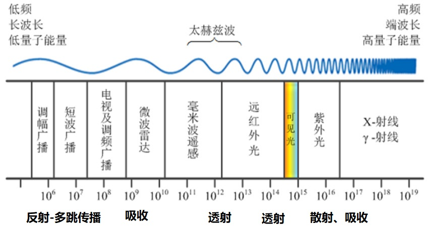

# 电磁波与天线

本文参考了[知乎](https://zhuanlan.zhihu.com/p/164620876).

在电路中,除了电阻,电容,电感等常见的两端器件,其实还有一种器件,这就是天线.我们知道,近到看电视、听收音机、手机接打电话,远到卫星导航、三体中与外星人通讯,都用到了电磁波.甚至更确切地说,电路中的所谓电流、电压信号,也是电磁波.

**交变的磁场可以产生电场(感应电动势),交变的电场(位移电流)可以产生磁场,这是电磁波的理论基础,更是电磁波为什么能在真空中传播的原因(没有导体,也就没有传导电流,但位移电流可以产生磁场啊!).** 

## 场论初步-梯度、旋度、散度
1. 梯度
可以对标量u求梯度:
$$grad\,u=\frac{\partial u}{\partial x}\vec{e_{x}}+\frac{\partial u}{\partial y}\vec{e_{y}}+\frac{\partial u}{\partial z}\vec{e_{z}}$$
其中$\nabla$算子表示这种操作:
$$\nabla=(\frac{\partial }{\partial x}\vec{e_{x}}+\frac{\partial }{\partial y}\vec{e_{y}}+\frac{\partial }{\partial z}\vec{e_{z}})$$
例如:$\vec{E}=-\nabla U$表示电势(标量)$U$的梯度时电场强度(矢量).

2. 散度
矢量场穿过闭合曲面是一个积分特性,定义为散度:
$$
\begin{aligned}
div\,\vec{D}&=\frac{\partial D_{x}}{\partial x}+\frac{\partial D_{y}}{\partial y}+\frac{\partial D_{z}}{\partial z}\\
&=\left(\frac{\partial }{\partial x}\vec{e_{x}}+\frac{\partial }{\partial y}\vec{e_{y}}+\frac{\partial }{\partial z}\vec{e_{z}}\right)\cdot\left(D_{x}\vec{e_{x}}+D_{y}\vec{e_{y}}+D_{z}\vec{e_{z}}\right)\\
&=\nabla\cdot\vec{D}
\end{aligned}
$$
例如: $\nabla\cdot\vec{D}=\rho_{V}$

3. 旋度
矢量场沿场中一闭合路径的曲线积分也是一种积分特性,定义为旋度:

$$
\nabla\times\,H=\left|
\begin{matrix}
\vec{e_{x}} & \vec{e_{y}} & \vec{e_{z}}\\
\frac{\partial}{\partial x} & \frac{\partial}{\partial y} & \frac{\partial}{\partial z}\\
H_{x} & H_{y} & H_{z}
\end{matrix}
\right|
$$

4. 拉普拉斯算子$\nabla^{2}$
对标量先求梯度,再求散度:
$$\nabla\cdot(\nabla u)=\nabla^{2}u$$
由于矢量是坐标系基向量的线性组合$\vec{A}=A_{x}\vec{e_{x}}+A_{y}\vec{e_{y}}+A_{z}\vec{e_{z}}$,因此定义
$$\nabla^{2}\vec{A}=\nabla^{2}A_{x}\vec{e_{x}}+\nabla^{2}A_{y}\vec{e_{y}}+\nabla^{2}A_{y}\vec{e_{y}}$$
易证明
$$\nabla\times(\nabla\times\vec{A})=-\nabla^{2}\vec{A}+\nabla(\nabla\cdot\vec{A})\tag{1}$$

5. 矢量场和标量场的两个公式
对于任何矢量场$\vec{A}$,有
$$\nabla\cdot(\nabla\times\vec{A})=0\tag{2}$$
对于任何标量场$u$,有
$$\nabla\times\nabla u=0\tag{3}$$
你可以用公式(1)~(3)去证明,麦克斯韦方程组的自洽性.

6. 再来一个公式

$$\nabla\cdot(\vec{E}\times \vec{H})=\vec{H}\cdot(\nabla\times\vec{E})-\vec{E}\cdot(\nabla\times\vec{H})\tag{4}$$

## 波动电磁场与辐射电磁场的区别
我们有电信号,那么我们如何将其转换为电磁波呢?您可能会想到一个简单的答案: 使用闭合导体,并借助电磁感应原理,您将能够产生波动的磁场和围绕它的电场,如图1A所示.但是,源周围的这种波动场在传输信号时没有用.这里的电磁场不传播,它只是围绕源波动.这种**全部或绝大部分电磁能量被约束在有限横截面内沿确定方向传输的电磁波叫做导行波**。在天线中,电磁波需要与源分开,并且它们应该传播（图1B）.天线把传输线上传播的导行波，变换成在自由空间中传播的电磁波，或者进行相反的变换。

经过实验发现,在电路中存在电势差的两个点分别拉起一根传输线.**随着传输线张角的增大，辐射电磁波越强。后来又提出了对称振子天线理论，继而发展出了各种各样的天线。**

图中的对称振子结构中,当$l/2=\lambda/4$,也就是两根导体棒的总长度$l$等于波长的一半时,发射出/接收到的电磁波功率最大,因此这种振子叫做**半波振子**.半波振子是天线的基本辐射单元，波长越长，天线半波振子越大。

## 电磁波通过天线发射出去
现在取两根导电棒AC和BD，并在该电路中施加随时间变化的电压信号。

* 当$V>0$,电阻A侧电势高于B侧电势,电阻内部形成电场,根据电场切向连续的边界条件,**不管R两端是否分别和A,B通过导线连接,A、B之间都会形成电场(介质是空气或者真空)**,此时C处的负电荷会向A端游动,D处的正电荷向B端游动.

* 当$V<0$,电阻A侧电势低于B侧电势,电阻内部形成电场,根据电场切向连续的边界条件,**不管R两端是否分别和A,B通过导线连接,A、B之间都会形成电场(介质是空气或者真空)**,此时A处的负电荷会向C端游动,B处的正电荷向D端游动.

随着电压随时间的变化，导体棒BD中的正电荷和AC中的负电荷将往返移动,形成振荡.

也就是说,在导体棒C-A-B-D中,产生了交变的电流. 因此,在AB之间产生了交变的电场.

下面我们分析一下这个交变电场$\vec{E}=E_{x}\vec{e_{x}}$会产生怎样的磁场.

## 电磁波的传播

根据麦克斯韦方程组中电磁感应定律和安培环路定律:
$$\nabla\times E=-\frac{\partial B}{\partial t}\tag{5}$$
$$\nabla\times H=J_{c}+\frac{\partial D}{\partial t}\tag{6}$$

于是有
$$\nabla\times(\nabla\times E)=-\nabla\times(\frac{\partial B}{\partial t})=-\frac{1}{\mu}\frac{\partial}{\partial t}(\nabla\times H)=-\mu\sigma\frac{\partial E}{\partial t}-\frac{1}{\mu\epsilon}\frac{\partial^{2}E}{\partial t^{2}}$$

根据公式(1),有
$$\nabla^{2}E-\mu\sigma\frac{\partial E}{\partial t}-\frac{1}{\mu\epsilon}\frac{\partial^{2}E}{\partial t^{2}}=0$$

同理有
$$\nabla^{2}B-\mu\sigma\frac{\partial B}{\partial t}-\frac{1}{\mu\epsilon}\frac{\partial^{2}B}{\partial t^{2}}=0$$

两个方程完全一致!电磁学啊!麦克斯韦啊!美呀~!

**在真空中,无导体,因此传导电流$J_{c}$为0**.
> 想一下什么情况下有导体~~**当然是遇到天线啦**.

方程变为
$$\nabla^{2}E-\frac{1}{\mu\epsilon}\frac{\partial^{2}E}{\partial t^{2}}=0$$
$$\nabla^{2}B-\frac{1}{\mu\epsilon}\frac{\partial^{2}B}{\partial t^{2}}=0$$

设$\vec{E}=E_{x}\vec{e_{x}}+E_{y}\vec{e_{y}}+E_{z}\vec{e_{z}}$,**在上图的天线中,$\vec{E}=E_{x}\vec{e_{x}}$,其他两个方向分量为0. 事实上,这个天线形成的电磁场可以向任意方向传播.我们选定其中一个方向$\vec{e_{z}}$,来分析在该方向上电磁波的传播.**

动图1

求解上面公式,可得电场$\vec{E}$为:
$$E_{x}(x,t)=E_{x0}e^{j(kz-\omega t)}$$
其中$$k=\omega\sqrt{\mu\epsilon},\omega=2\pi f_{0}$$
其中$f_{0}$是电压源的振荡频率.

* 由公式(5)得到: $\frac{\partial B}{\partial t}=\frac{\partial E_{x}}{\partial y}\vec{e_{z}}-\frac{\partial E_{x}}{\partial z}\vec{e_{y}}$, 于是有$\mu\frac{\partial H_{z}}{\partial t}=\frac{\partial E_{x}}{\partial y}=0$,$\mu\frac{\partial H_{y}}{\partial t}=-\frac{\partial E_{x}}{\partial z}$,$\mu\frac{\partial H_{x}}{\partial t}=0$,因此$\vec{B}$与$\vec{E}$垂直,且只有$\vec{e_{y}}$方向的分量.
* 由公式(6)得到: $\frac{\partial H_{z}}{\partial y}-\frac{\partial H_{y}}{\partial z}=\epsilon \frac{\partial E_{x}}{\partial t}$,于是$-\frac{\partial H_{y}}{\partial z}=\epsilon \frac{\partial E_{x}}{\partial t}$
* 由公式(6)得到: $\frac{\partial H_{z}}{\partial x}-\frac{\partial H_{x}}{\partial z}=0$.
* 由公式(6)得到: $\frac{\partial H_{y}}{\partial x}-\frac{\partial H_{x}}{\partial y}=0$,于是有$\frac{\partial H_{y}}{\partial x}=0$.

由此可以得到$\vec{H}$也沿$\vec{e_{z}}$方向传播,且只有$\vec{e_{y}}$方向的分量.

求得:
$$B_{y}(y,t)=B_{y0}e^{j(kz-\omega t)}$$
其中$$k=\omega\sqrt{\mu\epsilon},\omega=2\pi f_{0}$$
其中$f_{0}$是电压源的振荡频率,也就是电磁波的频率.

定义$\vec{k}=\omega\sqrt{\mu\epsilon}\vec{e_{z}}$, 是电磁波的**传播速度**.

> 事实上,你也可以选定方向$\vec{e_{y}}$,来分析在该方向上电磁波的传播,可以看出相同频率$\omega$的电磁波,在不同介质中的传播速率不同.

电磁波的波长(电磁场在空间坐标系的周期)为$$\lambda=\frac{2\pi}{k}=\frac{\frac{1}{\sqrt{\mu\epsilon}}}{f}$$

对于真空介质而言,将常数$\frac{1}{\sqrt{\mu\epsilon}}$记作$c$,其值为$3\times10^{8}m/s$.

因此真空中电磁波的波长$\lambda = c/f$.

综合分析之后发现,天线产生的电磁波在**任意一个方向**上,都是这样传播的:**$\vec{E}$、$\vec{B}$、$\vec{k}$的方向永远遵守右手坐标系的定则.**

**而整个天线产生的电磁波可以朝四面八方广播,这就是天线的基本工作原理.**

## 电磁波通过天线接收电磁波

天线接收电磁波是一样的原理!如下图所示,但是要注意:**天线的尺寸要特别设计,一般是天线的长度等于半波长时,感应电流最强,这也就是天线的工作频率**.

现在我们计算下,当**动图1**中半波振子的长度$l$为多少时,在$R$两端产生的电压最大.
$t=0$时,R两端的电压为

$$
\begin{aligned}
U&=\int_{0}^{l} E_{x}\cdot dx\\
&=\int_{0}^{l} E_{x0}e^{jkx}dx\\
&=\frac{E_{x0}e^{jkl}}{k}-\frac{E_{x0}}{k}
\end{aligned}
$$

当$e^{jkl}=-1$,也就是$kl=\pi$时,$U$取到最大值.由于$\lambda=2\pi/k$,于是**当$l=\lambda/2$时,半波振子接收到的功率最大!**

同时根据上式,当$l\cdot k= l\cdot\frac{2\pi}{\lambda}\approx 0$时,也就是$l$远远小于$\lambda$时,可以得到$U=0$,电磁波不会在元件两端产生电压差,这就是[**集总电路的原理**](7_EMcirciut.html).

**在天线中,会吸收电磁波能量,因此如果电磁波需要远距离传播,则需要能制造大功率电磁波的天线**.这部就是**天眼**吗~还有《三体》里那个红岸基地的巨型天线也是这玩意儿.

**波长和频率之间有着密切关系，从1G到5G，使用的频率越来越高，波长越小，对应天线的尺寸越小，这就是为什么手机的天线可以藏到手机里面了。**

相控阵雷达是**通过调节天线阵列上不同天线单元的信号的相位,从而使阵列天线的总体电磁波的角度**发生改变,实现电磁波的定向发射. 

**天眼**接收电磁波则与相控阵的原理不太一样,它是在每个天线单元(类似**卫星电视的天线(锅形天线)**)底座安装马达,使天线可以旋转,从而可以接收不同方向的电磁波.其中**锅**的作用起到电磁波的汇集作用,通过多次折射反射可以使电磁波能量只向特定的开口方向汇集,使发射或接收到的电磁波能量更大.

天线的设计需要使用**HFSS**(俗称海飞丝)进行电磁设计与仿真.这里不做涉及.有兴趣的可以进一步学习!

## 电磁波在分层介质中的传播
在分层介质中的传播,可以根据边界条件进行推导.结论就是会发生折射.每种介质都有折射率,其值为$n=\sqrt{\mu\epsilon}$,界面处遵循**光折射定律**$n_{1}\sin{\theta_{1}}=n_{2}\sin{\theta_{2}}$.其中角度$\theta$是界面法线与传播方向的夹角.

电磁波在不同介质中的频率是不变的.由于折射率不同,其传播速度随介质发生改变,因此波长也会改变.

> 例如,在地球外大气层中,随着高度的增加,大气层中的离子浓度$n$越大,导致介质中的介电常数$\epsilon$随高度减小.因此距离地球越远,折射率越大.最终将角度较小的光变成角度较大的光,这也是**海市蜃楼**的原理.

## 电磁波与通信

* **射频**（RF）是Radio Frequency的缩写，表示可以辐射到空间的电磁频率，频率范围从**300KHz-300GHz**之间。射频简称RF射频就是射频电流，它是一种高频交流变化电磁波的简称。
* **微波**是指频率为**300MHz-300GHz**的电磁波，是无线电波中一个有限频带的简称，即波长在**1毫米-1米**之间的电磁波，是分米波、厘米波、毫米波的统称。
* **毫米波**(millimeter wave):波长为1～10毫米的电磁波称毫米波，它位于微波与远红外波相交叠的波长范围，因而兼有两种波谱的特点。

* 波长短的电磁波,其频率高,能量大,因此**透射**能力强,体现了粒子性; 紫外光,X射线和伽马射线波长比可见光短,它们的波长和大气粒子直径接近,这种情况极易发生散射和吸收,所以即使能量大,却被散射吸收了.**地球真好,保护了它的子民们.** 
* 频率低的电磁波,其波长大,因此**衍射**能力强,体现了波动性; 比如广播用的无线电波，波长非常大，甚至可以**绕**过一栋建筑物、山头。

* **电离层有反射无线电波的本领**．当频率在一定范围的无线电波以一定角度射向电离层时，将由电离层反射回地面，反射回地面的无线电波还可再向电离层射去，实现多次反射，这就是所谓的**多跳传播**．电离层对不同波段的无线电波反射作用不同，由于电离层的吸收作用，**中波段的无线电波**在白天几乎全部被电离层吸收．**高频的微波段**的无线电波，根本不能被电离层反射，直接穿透电离层射向太空．只有短波段（频率3兆赫～30兆赫，波长100米～10米）的无线电波，能通过**多跳传播**方式传送到几千甚至几万千米远的地方，实现远距离短波无线通信和广播．
