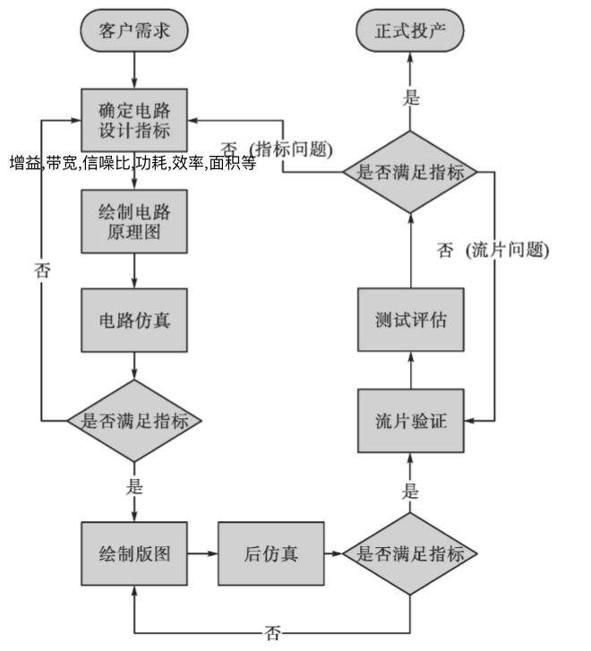
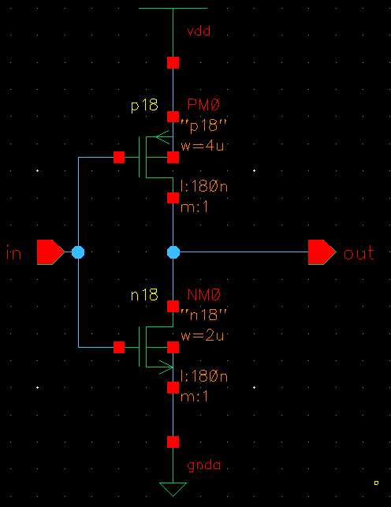
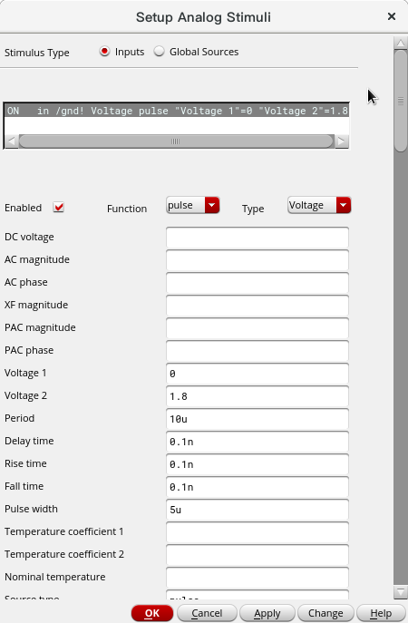
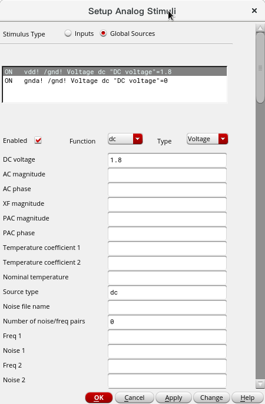
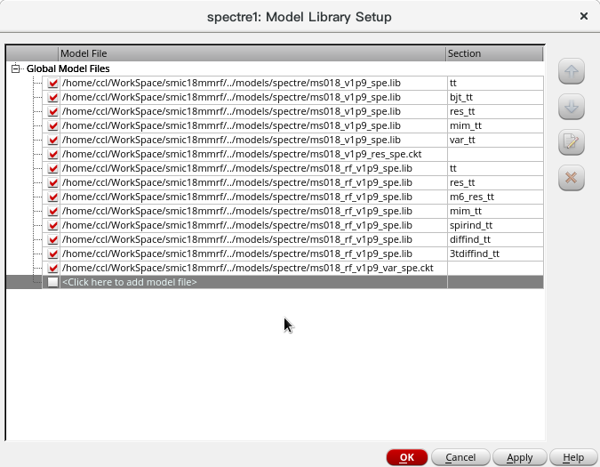
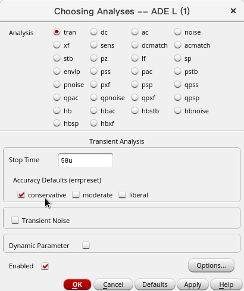
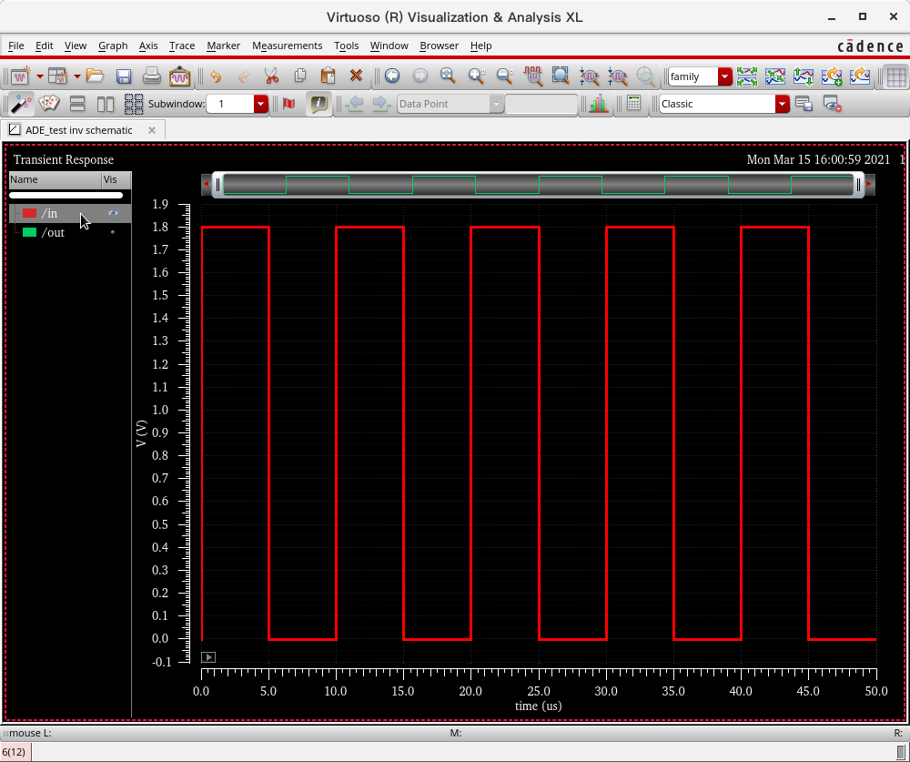
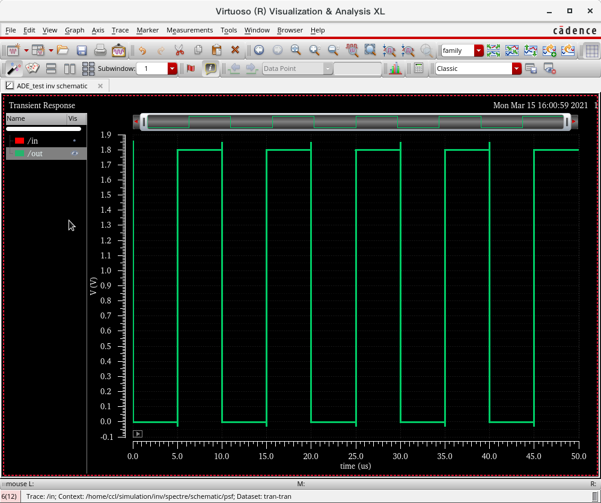

# 实例1_入门实验_反相器的设计与仿真

在学习本节之前,建议先学习电阻、电容等无源器件和半导体器件的相关知识.

<div align="center"></div>

## 准备工作

1. 准备工艺库安装包
   **安装工艺库是面向工程的,你每新建一个工程目录,就需要重新安装工艺库.**
    复制`SMIC 0.18um`工艺库到Linux机器.

    ```bash
    # 在/opt/eda/ 下新建目录`smic18_pack`
    cd [安装包目录]
    mkdir /opt/eda/smic18_pack/
    cp ./SMIC0.18库/* /opt/eda/smic18_pack/
    # 其中smic18d是数字工艺库,smic18mmrf是模拟和射频工艺库
    tar xvf smic18d.tar
    rm -rf smic18d.tar
    tar xvf smic18mmrf.tar
    rm -rf smic18mmrf.tar
    ```
2. 启动软件: **首先在终端中创建工作目录**,`mkdir -p ~/WorkSpace/smic18mmrf`,然后进入工作目录`cd ~/WorkSpace`, 输入 `virtuoso&`打开Cadence ADE, 其中`&`表示创建一个新的进程用于执行`virtuoso`而与当前终端的进程无父子关系. 否则关闭终端窗口时, virtuoso也会关闭. 会打开 `Log: /home/[username]/CDS.log`的命令窗口,叫做CIW(Command interpreter window).

3. 安装工艺库: 在CIW窗口输入`pwd`查看当前工作目录,点击`Tools`>`Conversion Toolbox`>点`CDB to OpenAccess Translator`> 设置包括`cds.lib`文件的目录`/opt/eda/smic18/smic18mmrf`,然后点`Apply`,等待一段时间,会自动弹出`Library Manager`框,里面已经有了`smic18mmrf`库,可以查看里面的`Cell`电路单元。如果没有弹出，可以在CIW窗口点`Tools`>`Library Manager`查看. 如果失败,在CIW的Log窗口查看日志. 然后把`/opt/eda/smic18_pack/`中的`models`文件夹拷贝到`WorkSpace`目录,此文件夹中包括了工艺库模型信息,在后面仿真要用到.

   > 注意, 这里的`Cell`是指电路,电路可以用很多种形式描述,例如原理图(Schematic),版图(Layout),Spice代码(Spice)等,每一种形式有着自己的一个视图(view) ,因此对于一个`Cell`,可以有很多`View`.

   > 注意: CDB to OpenAccess将工艺库转换成`smic18mmrf`文件夹,会放在**当前工作目录**下.
4. 在`Library Manager`>`Edit`>`Library Path`,可以看到当前工作目录下的`cds.lib`文件的内容:
    ```
    cdsDefTechLib $CDSHOME/tools/dfII/etc/cdsDefTechLib
    smic18mmrf      ./smic18mmrf
    ```
    再添加以下两行:
    ```
    basic         $CDSHOME/tools/dfII/etc/cdslib/basic
    analogLib     $CDSHOME/tools/dfII/etc/cdslib/artist/analogLib
    ```
    然后`File`>`Exit`退出`Library Path`窗口.

## 实例-反相器

1. 新建库： 首先使用终端打开工作目录`~/WorkSpace`, 输入`virtuoso&`打开Cadence ADE, CIW中`File` > `New` >`Library`. Name填写`ADE_test`,目录选择自己的工作空间`/home/[你的用户名]/WorkSpace`. 右侧`Technology File`选择`Attach to an existing technology library`, 点击`Apply`，在弹出的`Attach to an existing technology library`对话框中,选择`smic18mmrf`.然后回到`New Library`窗口点击`OK`,直接关闭该`New Library`窗口,在CIW的log中可以看到已经生成.
   > 每次新开始一个项目,需要在工艺库的基础上,建立自己的电路元件库,例如这里我新建一个`ADE_test`库,用于设计模拟前端芯片中的电路单元. 

2. 开始画原理图:CIW窗口中 `File` > `New` > `CellView`, 选择库为`ADE_test`表示在其中新建电路, `Cell`是电路名,填写`inv`,`View`是视图的名称,填写`Schematic`，`Type`是视图类型,选择`Schematic`. 工具使用默认的`Schematic Editor L`即可. OK. 弹出电路图对话框.

* 在工作区右键,或使用快捷键`I`，插入电路实例。这里选择`smic18mmrf`中的 `p18` 和 `n18`，`n18`的`Total Width`设置为`2u M`,`p18`的`Total Width`设置为`4u M`,长度保持`180n M`不变,放置进去,按`Shift`+`x`键`check and save`.

* 继续使用`I`,选择`analogLib`库,插入`vdd`和`gnda`,然后使用快捷键`p`，插入输入和输出引脚。按`Shift`+`x`键`check and save`.
   >  选择库一般只需选择工艺库`smic18mmrf`(实际库,可以在工艺库的安装包目录中找到`./docs/PDK_ReferenceManual_018MMRF_1833.pdf`查看详细信息)或`analogLib`库(包括理想元器件、电源、激励源、输入输出端口、接地符号等)。

得到下面电路图,注意要将pmos和nmos的基极也连上。
<div align="center"></div>

4. 仿真电路图: 

* 在Schematic Editor界面选择`Launch`>`ADE L`,启动`ADE`.
* `Setup`>`Stimuli`设置激励.然后按下图设置.
<div align="center"></div>
<div align="center"></div>

* `Setup`>`Model library`设置工艺库模型和工艺角.然后按下图设置.

<div align="center"></div>

   > 工艺库模型用于插入工艺上的模型信息,因为实际使用时,芯片四角和中心的温度不同,器件的性能也不一样. 因此要设置 **工艺角** , FF表示 Fast NMOS, Fast PMOS,速度较快, TT表示Typical NMOS和Typical PMOS,速度一般.而SS表示Slow NMOS和SLOW PMOS,速度较慢.

* `Analyses`>`Choose`设置仿真类型,选择`trans`进行瞬态仿真.按下图设置.
<div align="center"></div>

* 选择`Output`>`To be Plotted`>`Select On Schematic`命令,在电路图中单击反相器的输入和输出的连线,添加到Output的栏中.

* `Stimulation`>`Netlist and Run`,开始仿真.

仿真完成后直接弹出仿真波形图.
<div align="center"></div>
<div align="center"></div>

## 附 analogLib中的常用元件和电源

|类型|Cell名称|类型|Cell名称|
|:-:|:-:|:-:|:-:|
|电阻|res|电源|vdd|
|电容|cap|地|gnd|
|电感|ind|直流电流源|idc|
|二极管|diode|脉冲电流源|ipulse|
|肖特基二极管|schottky|正弦电流源|isin|
|npn三极管|npn|线性电流源|ipwl|
|pnp三极管|pnp|直流电压源|vdc|
|四端口nmos|nmos4|脉冲电压源|vpulse|
|四端口pmos|pmos4|正弦电压源|vsin|
|理想开关|switch|任意波形信号源|vpwl|

## 附 原理图设计中的快捷键
|键|功能|键|功能|
|:-:|:-:|:-:|:-:|
|Shift+LeftClick|加选实例|C|拷贝|
|Ctrl+LeftClick|减选实例|M|移动|
|X|保存|S|检查并保存|
|Ctrl+A|全选|U|撤销1次|
|Ctrl+D|取消选择|Shift+U|继续撤销|
|F|显示完整电路|Ctrl+Z,]|放大视图|
|I|添加实例|Shift+Z,[|缩小视图|
|W|添加连线|Esc|退出当前命令|
|P|添加引脚|L|Net Label|
|T|添加文本|B|添加Block|
|Q|编辑属性|Del|删除器件|


