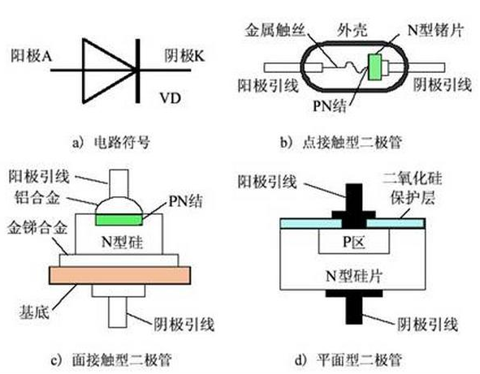
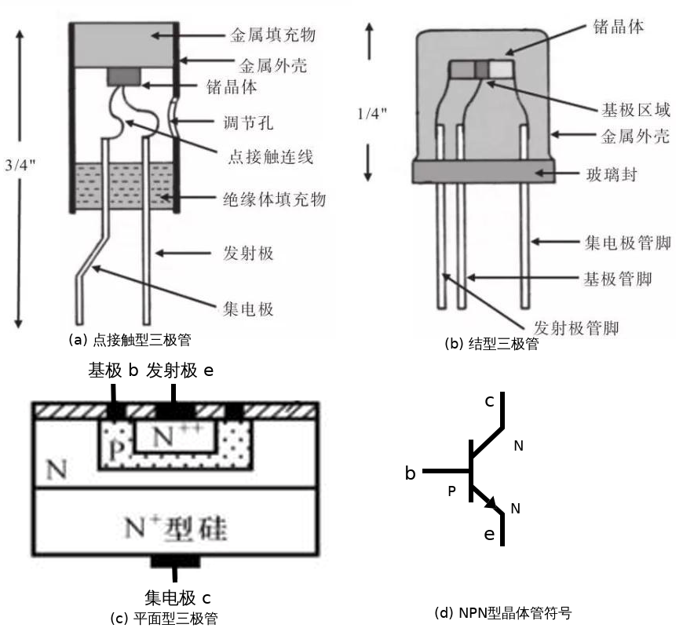
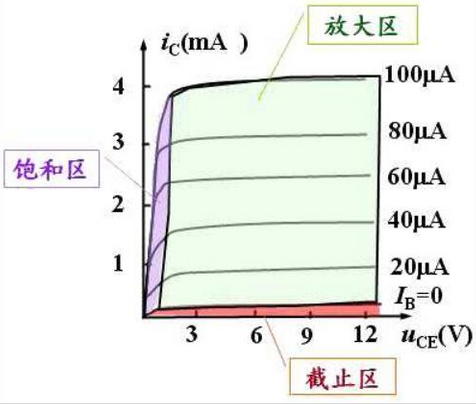
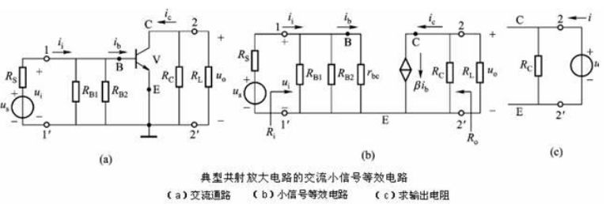

# 半导体器件1-双极型晶体管(BJT)

## 半导体器件的基础: PN结
学半导体记住一句话, 只有所有区域的多子均为电子或均为空穴时,才可以导电.

硅原子的最外层有4个价电子, 两两硅原子形成共价键,因此结构稳定,常温下不能导电.

* 向超级超级纯(据说99.9999999%,简称9个9)的硅晶体中均匀地掺入少量B硼原子(最外层3个价电子),B硼原子与硅原子形成三对共价键之后,结构已经较为稳定,但仍有一个空位,如果这时有其他Si原子的外层电子过来,则该电子又会形成空位。这种情况下,相当于一个**正电子**在移动,这种**正电子**叫做**空穴**.而B原子周围多出1个电子,形成不能自由移动的B-离子。这种材料由于有可以自由移动的空穴, 空穴携带着正电荷形成电流。这种载流子为空穴的半导体叫做**P型半导体**材料.
* 向9个9的硅晶体中均匀地掺入少量P磷原子(最外层5个价电子), P磷原子核与硅原子核形成共价键之后,多出来一个外层价电子,同时多出来不能自由移动的P+磷离子。这种载流子为电子的半导体叫做**N型半导体**材料.
* 注意,P型材料和N型材料都是**电中性**的,都**可以导电**.那么既然P型材料和N型材料都可以导电,把二者放在一起呢?
*  经过实验,在界面处,P区的多子空穴和N区的多子电子二者相见恨晚,分别跑向对方,并直接结合在一起,界面处没有自由电荷了,叫做**耗尽区**(无自由电荷的区域).交界面处P区只剩下孤单的B-硼负离子,N区只剩下寂寞的正离子P+磷正离子,离子们形成了平板电容,这个平板电容的电场叫做**内电场**,内电场的两端有电势差,叫做**势垒**,它阻止了两边的电子和空穴继续干柴烈,...咳咳,阻止了继续扩散.但是自由奔向爱情的空穴和电子表示不干了: "我们是真爱",不听劝阻继续向对方狂奔.而内电场随之变强,力量更大了,将来自P区的空穴和来自N区的电子隔开,表示无比的郁闷, 二者之间无电流产生.
   > **无外加电场时，极少数的多子才能够突破强大势垒会向对面扩散,同时也有少子在内电场作用下向对方漂移,二者达到平衡时,电流为0**.
* 这时,如果外加一个与内电场方向相反的电场($V_{p}>V_{n}$),它削弱了内电场的作用,使界面处的电场不足以阻碍真实的爱情,P区和N区之间会形成较小的电流(**亚阈值区**). 如果外加电场的强度足够大,大到什么程度呢? 那就是内电场完全消失,真爱行动没有任何障碍,此时P型材料和N型材料之间完全导通(**正向导通**),此时PN结电阻很小,该外加电压叫做**阈值电压**.因此外加电压稍微增大,都会导致电流增大很多.PN结的正向导通电流为
$$i_{D}=I_{S}\left(e^{v_{D}/V_{T}}-1\right) \tag{1}$$

* 科学家们表示,这还挺好玩,那我反着来呢?外加一个与内电场方向相同的电场 $V_{p} < V_{n}$),与内电场叠加,更阻碍了真爱,将来自P区的空穴和来自N区的电子隔开,表示无比的郁闷, 二者之间无电流产生(**反向截止**).然而,随着外加电压的增大,内部电场变得十分强,它表示我要摧毁一切,既然自由电子和空穴都已经结合了,那我就用超强的拉力破坏掉一部分共价键,硬生生地把所有爱情都拆开,然后在我的作用下反向运动.此时自由电子和空穴突然增多,在外加电场下被迫运动,形成很大的反向电流(**反向击穿**). 利用击穿现象可以制造**稳压二极管**.但由于超大的反向电流和超大的外加电压,会输出大量的热量,如果元件热稳定性不好(散热条件不好,结温升高),导致共价键遭到彻底破坏,进一步增大反向电流,形成热电击穿,这种热稳定性不好造成的热电击穿即使冷却掉之后,PN结也不能自动恢复.因此,**稳压二极管的热稳定性很棒**.但一般的二极管**严禁**反向使用,因为一定会发生**热电击穿**.与反向击穿一致,普通二极管(PN结)的外加的正向电压也不能太大,因为同样会发生**正向击穿**.

其中$i_{D}$是通过PN结的电流,$v_{D}$是PN结的外接电压,$V_{t}=kT/e$是温度电压当量,常温时为0.026V.$I_{S}$是反向饱和电流,其典型值是$10^{-8}\sim 10^{-14}$A. 硅管的阈值电压为0.6V ~ 0.7V,锗晶体管的阈值电压为0.2 ~ 0.3V.

* 在外加的电压信号既正向不太大,反向也不太大时,普通二极管能正常工作,其**单向导电**的特性使其可以整流.

* 把P型半导体换成贵金属,贵金属与N型半导体之间形成的金-半结,同样有着内电场的存在,但肖特基的势垒低于PN结,因此**阈值电压低于PN结**; 此外, PN结的导通电阻大,恢复速度低,因此只能用于低频整流,如果信号频率高,PN结来不及恢复,会发生反向漏电,烧毁普通二极管.肖特基二极管的恢复速度快,因此可以**用于开关电源进行整流**，但尽管如此,开关电源还是很烫啊.

二极管

> 发光二极管的正负极判断:一般接触处面积较大的是负极.

**小结**: 当外加电压很暴力时,大量空穴和电子的爱情都会被暴力拆散,外加电压表示你们的爱情不堪一击,形成很大的击穿电流. 当外加电压力度一般, 但也足以抑制内电场时,爱情会驱使他们走向对方,形成爱流,..啊呸,正向电流.当外加电压过于柔和,内电场表示,嘿嘿,你们这些小娃子,都给我乖乖立定,好好念书吧~

<mark>二极管导通时，电阻通过$\partial V_{D}/\partial I_{D}$计算得到,很小的数值; 截止时,电阻很大,接近于开路.</mark>

## 双极结型晶体管(Bipolar Junction Transistor)

科学家表示,上面既然PN结这么可爱,这么有搞头,还能和金属搞成肖特基二极管,那就再开发开发这个半导体材料吧~

BJT

1. 当$V_{c}>V_{b}=V_{e}=0$时, b、e之间PN结和b、c之间的pn结均截止.
2. 当$V_{c}>V_{b}>V_{e}+V_{T}$时,基极电压高于发射极，电路正偏，有大量电子从发射极发射，形成$I_{e}$，电子原本要通过基极回到电源正极，但是发射极电子进入基极后，由于集电极电压比基极还要高，于是电子被集电极强烈的电场吸引，从而电子不走基极回到电源正极，而进入集电极到达电源正极形成集电极电流$I_c$，但是基极中还是有空穴的，发射极电子被集电极电场吸引进入集电极过程中，一小部分电子与基极空穴复合形成基极电流I{b}。这就是三级管电流走向。而基极空穴较少，所以发射极电子被集电极电场吸引进入集电极过程与基极空穴复合概率较小，当基极的电流增大（空穴增多）时，因为电子与基极空穴复合概率较小，所以，基极电流稍微增大一点，就需要很多的电子才能与基极增多一点的空穴复合，因此，基极电流变化一点，而引起发射极电流发生较大的变动，从而实现了放大作用。 **BJT放大信号的本质是发射极电子只有小部分到达基极,因此是流控电流源(ICCS)**

3. 当$V_{b}$继续增大,达到$V_{b}>V_{c}>V_{e}$,两个PN结均正偏.当基极电流$I_{b}$增大时,基极空穴增多, 更多的电子从发射极发出,因此通过基极向集电极的电流增大,但同时集电极也向基极发出更多的电子,电流也增大.二者的差值保持稳定.也就是电流达到饱和.

那么实际使用时,如果我有一个比较小的交流小信号,只想让三极管放大它怎么办? 也就是说,要时刻保证BJT的$V_{c}>V_{b}>V_{e}+V_{T}$.

把加在b极的电压$V_{b}$分为直流信号$V_{B}$和交流小信号$v_{b}$:$V_{b}=V_{B}+v_{b}$
* 直流信号$V_{B}$使用偏置电阻$R_{B1}$和$R_{B2}$进行分压获得,通过调节电阻阻值,可以设置三极管的$V_{B}$大小,也就设置了三极管的工作状态,叫做 **直流工作点**.
* 把需要放大的信号$u_{i}$作为交流小信号$v_{b}$,通过电容$C_{1}$耦合进来(电容**通交流阻直流**),其容抗($R_{C}=1/j\omega C$)对信号来说越小越好,因此,在低频放大电路中,常使用电解电容器(低频时铝电解电容容抗很小,高频时则不如钽电容).

* 设计偏置电路时,直流信号把电容视为开路,把当前的直流工作点记为Q点.

其中$V_{BQ}=\frac{R_{B2}}{R_{B1}+R_{B2}}V_{CC}$,$I_\text{EQ}=\frac{V_{BQ}-V_{BEQ}}{R_{E}}$,$I_{CQ}\approx I_{EQ}$,$I_{BQ}=\frac{I_{EQ}}{\beta}$,$V_{CEQ}=V_{CC}-I_{CQ}(R_{C}+R_{E})$.

* 进行交流信号分析时,则需要把直流电源设置为0.(电压源V=0短路,电流源V=0开路)

$$A_{v}=\frac{v_{o}}{v_{i}}=\frac{-\beta i_{b} R'_{L}}{i_{b}r_{be}}=\frac{-\beta R'_{L}}{r_{be}}$$
其中$R'_{L}=R_{C}||R_{L}$,$r_{be}$是晶体管的交流输入电阻,是基极的体积电阻$r_{bb}$和be之间的结电阻之和(基极的掺杂浓度最低,体积电阻一般为几十到二三百欧姆;发射极掺杂很高,体积电阻很小; pn结电阻通过公式(1)求得;).
$$r_{be}=r_{bb}+\frac{\partial V_{BE}}{\partial I_{BE}}\approx r_{bb}+\frac{V_{T}}{I_{BE}}\approx 200+\beta \frac{26mV}{I_{E}(\text{mA})}$$
源电压放大倍数
$$A_{vs}=\frac{v_o}{v_s}=\frac{v_{o}v_{i}}{v_{i}v_{s}}=A_{v}\frac{R_{i}}{R_{i}+R_{s}}$$
其中 $R_{i}=R_{B1}||R_{B2}||r_{be}$(求输入电阻需要设置网络内所有独立电源为0).

求输出电阻需要设置网络内所有独立电源为0,则得到输出电阻为$R_{o}=R_{C}$.

通过这几个式子,配合仿真软件Multisim或者HSPICE或Spectre等,可以计算出几个电阻的值.

