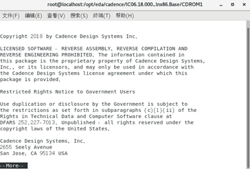

# Cadence工具安装I-模拟部分

本环境包括 `IC617`, `MMSIM151`和 `Calibre2019`.

本教程的所有操作均在 root 权限下进行。

可参考[CentOS安装IC618和calibre2019](./res/CentOS安装IC618和calibre2019.pdf).

## 安装前的准备
新建安装目录, 建议把这种大型软件装在 `/usr` 目录下。 

 ```
 mkdir -p /opt/eda/cadence/patch
 mkdir -p /opt/eda/cadence/iscape
 mkdir -p /opt/eda/mentor/calibre2019
 ```
 > `-p`选项是直接建立父目录。 

## 安装

```bash
cd [安装包路径]
su
# 将IC618、SPECTRE18、和patch工具复制到`cadence`目录,文件较大，请耐心待。
cp ./IC06.18.000/* /opt/eda/cadence/
cp ./patch/* /opt/eda/cadence/patch
cp ./SPECTRE18.10.077/* /opt/eda/cadence/

# 解压IC618的安装包
cd /opt/eda/cadence/
tar xvf /opt/eda/cadence/Base_IC06.18.000_lnx86_1of3.tar
tar xvf /opt/eda/cadence/Base_IC06.18.000_lnx86_2of3.tar
tar xvf /opt/eda/cadence/Base_IC06.18.000_lnx86_3of3.tar

# 删除IC618的安装包
rm /opt/eda/cadence/Base_IC06.18.000_lnx86_1of3.tar 
rm /opt/eda/cadence/Base_IC06.18.000_lnx86_2of3.tar
rm /opt/eda/cadence/Base_IC06.18.000_lnx86_3of3.tar


# 解压SPECTRE的安装包
tar xvf /opt/eda/cadence/Base_SPECTRE18.10.077_lnx86_1of2.tar
tar xvf /opt/eda/cadence/Base_SPECTRE18.10.077_lnx86_2of2.tar

# 删除SPECTRE的安装包
rm /opt/eda/cadence/Base_SPECTRE18.10.077_lnx86_1of2.tar -f
rm /opt/eda/cadence/Base_SPECTRE18.10.077_lnx86_2of2.tar -f


mkdir -p /opt/eda/cadence/IC618
mkdir -p /opt/eda/cadence/SPECTRE181
# 运行安装脚本
/opt/eda/cadence/IC06.18.000_lnx86.Base/CDROM1/SETUP.SH
```

会弹出一个界面，直接按Enter,然后按提示输入IC618安装目录`/opt/eda/cadence/IC618`.

<div align="center"></div>

由于没有事先安装InstallScape，这里按提示依次输入n, y.

<div align="center"></div>

然后输入iscape安装目录`/opt/eda/cadence/iscape`

弹出InstallScape界面，选择Local directory/Media install，点Browse，选择安装包的路径, `/opt/eda/cadence/IC06.18.000_lnx86.Base/CDROM1`

<div align="center"></div>

点击Continue。 弹出来的界面中，勾选IC_06.18.000后，点击Next。

弹出来的界面中，选择好IC618的安装路径`/opt/eda/cadence/IC618`后，点击Start开始安装。

完成后，提示配置失败.

另外开一个终端,执行`su`,`yum install xterm -y`以安装xterm库,安装完成后关闭该终端即可.

在installScape界面,点击 菜单View> Configurable releases>勾选IC618> 点击右下角 Configure,开始配置

大部分的配置可以直接按Enter，有两个需要注意一下：一个是提示要不要安装库文件，可以选择安装；另外一个是提示要不要使用默认的OpenAcess路径，建议选择默认的(输入n)就行。 

配置完成后，完成了IC618的安装，不要关掉iscape界面，继续进行SPECTRE18的安装。

与上面一样，不再赘述。等待安装完成。 然后删除安装包文件。

```bash
rm -rf /opt/eda/cadence/IC06.18.000_lnx86.Base/
rm -rf /opt/eda/cadence/SPECTRE18.10.077_lnx86.Base/

# 开始安装Calibre
# 复制安装包文件到目录中
cd [安装包路径]
cp ./calibre/* /opt/eda/mentor/
cd /opt/eda/mentor/
# 解压安装包
# 合并分卷文件
cat aoj_cal_2019.3_15.11_mib.* > all.zip
# 正常解压
unzip all.zip
# 增加可执行权限
chmod +x  ./aoj_cal_2019.3_15.11_mib.exe
mv ./aoj_cal_2019.3_15.11_mib.exe ./calibre2019/aoj_cal_2019.3_15.11_mib.exe
rm -f aoj_cal_2019.3_15.11_mib.z01
rm -f aoj_cal_2019.3_15.11_mib.zip
rm -f all.zip

cd calibre2019
# 执行安装程序
./aoj_cal_2019.3_15.11_mib.exe
# 提示缺少ld-linux.so.2，需要先安装32位的glibc库,
yum -y install glibc.i686   www.cit.cn
# 重新执行安装程序
./aoj_cal_2019.3_15.11_mib.exe
# What would you like to do? >
# 输入d, 按Enter
# 输入yes，按Enter
# 等待,安装完成
rm -f aoj_cal_2019.3_15.11_mib.exe

# 开始破解
cd /opt/eda/cadence/patch
./1patch.sh /opt/eda/cadence/IC618/
# 提示缺少libstdc++.so.6
yum -y install libstdc++.i686
# 重新运行破解IC618
./1patch.sh /opt/eda/cadence/IC618/
# 破解SPECTRE181
./1patch.sh /opt/eda/cadence/SPECTRE181/
# 破解calibre2019
./1patch.sh /opt/eda/mentor/calibre2019/
# 生成Cadence的所有工具套装license
python cdslicgen.py
mkdir /opt/eda/cadence/license
mv ./license.dat /opt/eda/cadence/license/license.dat
# 查看mac地址
ifconfig
# ether后面的就是mac地址,copy一下,产生Calibre的license
python mgclicgen.py 80:fa:5b:39:ac:12
mkdir /opt/eda/mentor/license
mv license.dat /opt/eda/mentor/license/license.dat
# 修改主机名为eda
vim /etc/hosts
#在末尾行添加
127.0.0.1   eda
# 在hostname文件
vim /etc/hostname
#修改主机名为”eda”
eda
#在 network 文件
vim /etc/sysconfig/network
#在末尾添加
HOSTNAME=eda
```

## 测试

首次使用需要配置:
```bash
# 切换到个人账户
su [你的账户名]
cd [安装包的目录]
cp ./patch/.cshrc ~/.cshrc
vim ~/.cshrc

#将第三行的
setenv LANG C
# 改成
setenv LANG zh_CN.UTF-8

#如果你用fcitx或搜狗输入法,需要在本文件头部增加
setenv GTK_IM_MODULE fcitx
setenv QT_IM_MODULE fcitx
setenv XMODIFIERS @im=fcitx

# 然后切换到个人账户的home目录
cd ~
su root
# 将个人用户的shell改为csh
usermod -s /bin/csh [你的账户名]
```


测试一下:
```bash
# 切换到个人账户
su [你的账户名]
cd ~
# 加载环境变量
source .cshrc
# 启动IC618，输入virtuoso
virtuoso &
# 提醒 bash: /opt/eda/cadence/IC618/bin/virtuoso: /bin/ksh: 坏的解释器: 没有那个文件或目录
yum install ksh
# 启动IC618，输入virtuoso
virtuoso &
# 提示 没有libGLU.so.1
yum install mesa-libGLU.i686
# 启动IC618，输入virtuoso
virtuoso &
# 提示 sh: lsb_release: command not found
yum install -y redhat-lsb
# 输入exit退出软件
exit
```


以后每次使用只需:

* 启动virtuoso

```bash
# 切换到个人账户
su [你的账户名]
# 启动IC618，输入virtuoso
virtuoso &
```

* 启动calibre

```bash
# 切换到个人账户
su [你的账户名]
# 启动calibre
calibre -gui
```