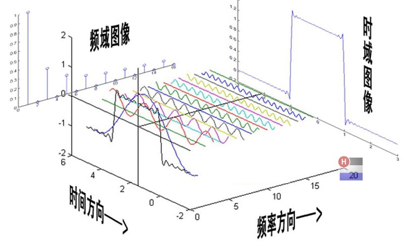
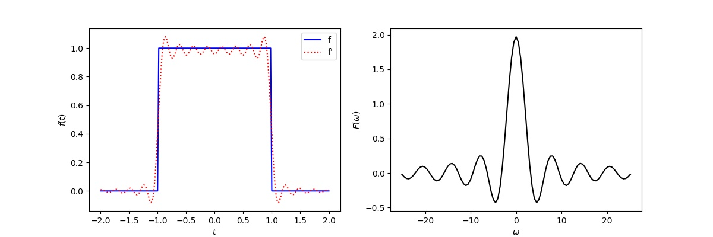

# 傅里叶级数与傅里叶变换(Fourier Transform)


频谱分析是一种对于周期性波动信号做数值分析的方法，将随时间做周期性变化的振动信号分解为不同频率的振动分量，形成频谱。

## 概要
1. 连续的周期信号用$E=\{e^{ikωt}\},k\in N$作为基函数，进行傅里叶级数分析；
2. 连续的非周期信号(自然信号)用傅里叶变换，进行频域分析；
3. 离散的非周期信号(采样的自然信号)用离散傅里叶变换，进行频域分析。

## 正余弦级数展开
设<mark>周期信号</mark> $f(t)$ 的周期为 $T$ ，相应的 $\omega = \frac{2\pi}{T}$ 。现在以 $E=\{1,cos⁡kωt,sin⁡kωt\},k\in N^{+}$ 作为一组正交基函数，进行傅里叶级数展开：

$$
\begin{aligned}
f(t)&=\sum_{g_{k}(t)\in E}c_{k}g_{k}(t) \\
&=a_{0}+\sum^{\infty}_{k=1}\{a_{k}\cos k\omega t + b_{k}\sin k\omega t\} \\
&=\sum^{\infty}_{k=0}\{a_{k}\cos k\omega t + b_{k} \sin k\omega t\}
\end{aligned}\tag{1}
$$


其中，系数$a_k$和$b_k$是函数$f(t)$在基函数$g_{k}(t)$上分量的振幅大小。由于正交函数之间的内积$\langle g_i (t),g_j (t)\rangle=0$，其中$i≠j$。于是

$$
\langle f(t),g_n (t)\rangle =\sum_{g_k (t)\in E}c_k \langle g_k (t),g_n (t)\rangle =c_n \langle g_n (t),g_n (t)\rangle \tag{2}
$$

因此分量振幅的大小$c_n$可以通过函数的内积计算，

$$
c_n=\frac{\langle f(t),g_n (t)\rangle}{\langle g_n (t),g_n (t)\rangle}  =\frac{\int_{-∞}^{+∞}f(t)\bullet g_n (t)dt}{\int_{-∞}^{+∞}g_n (t)∙g_n (t)dt}\tag{3}
$$

对于周期为$T$的信号$f(t)$，可计算得到

$$
\begin{aligned}
a_0&=\frac{1}{T} \int_{t_0}^{t_0+T}f(t)dt\\
a_n&=\frac{2}{T} \int_{t_0}^{t_0+T}f(t)  \cos ⁡n\omega t dt \\
b_n&=\frac{2}{T} \int_{t_0}^{t_0+T}f(t)  \sin⁡ n\omega t dt
\end{aligned}\tag{4}
$$

根据公式(1)和公式(4)，可以把任意周期函数$f(t)$展开为正弦和余弦函数的级数。

## 傅里叶级数

与正余弦级数展开完全类似，只不过把$E=\{e^{ikωt}\},k\in N$作为一组新的正交基函数，于是对<mark>周期信号</mark>$f(t)$进行傅里叶级数展开：

$$
f(t)=\sum_{k=-\infty}^{\infty}A_{k}\bullet e^{ikωt}\tag{5}
$$

由于$\int_{-\infty}^{\infty}e^{in \omega t}dt=\int_{-\infty}^{\infty}(\cos ⁡n\omega t+i \sin⁡ n\omega t)dt=0$，于是

$$
\langle f(t),e^{-in\omega t} \rangle =\sum_{k=-\infty}^{\infty}A_k \int_{-\infty}^{\infty}e^{ik\omega t}\bullet e^{-in\omega t} dt=A_n \int_{-\infty}^{\infty}1dt\tag{6}
$$

对于周期为$T$的信号$f(t)$，可以计算分量的振幅为

$$
A_k=\frac{1}{T} \int_{-\frac{T}{2}}^{\frac{T}{2}}f(t) e^{-ik\omega t} dt\tag{7}
$$

## 傅里叶变换
但当信号$f(t)$为<mark>非周期信号</mark>，即$T\rightarrow \infty$，则信号的频率$\omega\rightarrow 0$，
记$W=k\omega$，则与相邻基函数的频率相差为$\Delta W=(k+1)\omega - k\omega=\omega \rightarrow 0$。

公式(7)可以写成


$$
A_k=\frac{1}{T} \int_{-\frac{T}{2}}^{\frac{T}{2}}f(t) e^{-iW t} dt\tag{8}
$$

则对于任意非周期信号，

$$
\begin{aligned}
f(t)&=\lim_{T\rightarrow \infty}\sum^{\infty}_{k=-\infty}(\frac{1}{T}\int_{-\frac{T}{2}}^{\frac{T}{2}}f(t) e^{-ik\omega t} dt)e^{ik\omega t} \\
&=\lim_{T\rightarrow \infty}\sum^{\infty}_{W=-\infty}(\frac{1}{T}\int_{-\frac{T}{2}}^{\frac{T}{2}}f(t) e^{-iW t} dt)e^{iW t} \\
&=\lim_{\Delta W\rightarrow 0}\sum^{\infty}_{W=-\infty}(\frac{1}{2\pi}\int_{-\infty}^{\infty}f(t) e^{-iW t} dt)e^{iW t}\Delta W\\
&=\frac{1}{2\pi}\int^{\infty}_{-\infty}(\int_{-\infty}^{\infty}f(t) e^{-iW t} dt)e^{iW t}dW
\end{aligned}\tag{9}
$$


令
$$
F(W)=\int_{-\infty}^{\infty}f(t) e^{-iW t} dt\tag{10}
$$

则

$$
f(t)=\frac{1}{2\pi}\int^{\infty}_{-\infty}F(W)e^{iW t}dW\tag{11}
$$

公式(10)与公式(11)就是大名鼎鼎的傅里叶变换与傅里叶反变换。


## 常用的离散傅里叶变换(DFT,Descrete Fourier Transform)
自然界中的信号大部分都是<mark>连续非周期信号</mark>。因此**傅里叶变换的应用远远多于傅里叶级数**。

通常，我们会收集一段信号，该信号是由ADC采样得到，因此是时间离散的信号，<mark>该离散的非周期信号</mark>是从连续的非周期信号中采样产生的，采样的时间区间为$T=[t_{1},t_{2}]$，采样的时间间隔为$\Delta t=\frac{T}{N}$，于是采样得到的信号

$$f_{s}(t)=f(t)\delta(t_{1}+n\Delta t)$$

则该采样信号的傅里叶变换：

$$
\begin{aligned}
F_{s}(\omega)&=\int_{t_{1}}^{t_{2}}f(t) e^{-i\omega t} \delta(t_{1}+n\Delta t)dt \\
&=\frac{T}{N}\sum_{n=0}^{N-1}f(t_{1}+n\Delta t) e^{-i\omega (t_{1}+n\Delta t)}
\end{aligned}\tag{12}
$$

如果$F_{s}(\omega)$的频率取值区间为$[\omega_{1},\omega_{2}]$，则有

$$
F_{s}(\omega_{1}+k\Delta\omega)=\frac{T}{N}\sum_{n=0}^{N-1}f(t_{1}+n\Delta t) e^{-i(\omega_{1}+k\Delta\omega) (t_{1}+n\Delta t)} \tag{13}
$$

其中, $\Delta\omega = \frac{\Omega}{K}$表示频域抽样间隔，$\Omega=\omega_{2}-\omega_{1}$表示带宽。

同样的，对于傅里叶逆变换，由于$f(t)$的频带主要位于$[\omega_{1},\omega_{2}]$，因此

$$
f(t)=\frac{1}{2\pi}\int^{\infty}_{-\infty}F(\omega)e^{i\omega t}d\omega=\frac{\Omega}{2\pi K}\sum^{K-1}_{k=0}{F(\omega_{1}+k\Delta\omega)e^{i(\omega_{1}+k\Delta\omega)t}}\tag{14}
$$

在时域的抽样点处，有

$$
f(t_{1}+n\Delta t)=\frac{\Omega}{2\pi K}\sum^{K-1}_{k=0}{F(\omega_{1}+k\Delta\omega)e^{i(\omega_{1}+k\Delta\omega)(t_{1}+n\Delta t)}}\tag{15}
$$

<mark>公式(12)和(14)体现了离散非周期信号的变换与逆变换，被广泛用于信号分析。</mark>


## 傅里叶变换实例

现在以$$f(t)=\begin{cases}1 &\lvert{t}\rvert\leq{1}\\0 &\text{Others}\end{cases}$$为例，画出其频谱及恢复后的波形。

根据式(10)
$$
F(w)=\int_{-1}^{1}e^{-i\omega t}dt=\frac{1}{w}[\sin wt+i\cos wt]\vert_{-1}^{1}=\frac{2}{w}\sin w \tag{16}
$$

也就是说，其频谱为$F(w)=\frac{2}{w}\sin w$，幅度为$\left\vert F(w)\right\vert =\left\vert\frac{2}{w}\sin w\right\vert$。

意思就是如下图，原图源自[韩昊](https://zhuanlan.zhihu.com/p/19763358)：
<div align="center"></div>


Python代码如下：

```python
# -*- using: utf-8 -*-
import numpy as np
import matplotlib.pyplot as plt


def fourierTrans(f_t, t, omg):
    """
    return signal in the frequency domain
    Paras:
    f_t: input signal
    t: a list of sample points in time domain
    omg: a list of sample points in frequency domain, omg = 2 * pi * f
    """
    T = t[-1] - t[0]
    N = len(t)
    # OMG = omg[-1] - omg[0]
    K = len(omg)
    F_omg = np.zeros_like(omg, dtype=complex)  # 初始化频谱
    for k in range(K):
        for n in range(N):
            F_omg[k] = F_omg[k] + T / N * f_t[n] * np.exp(
                complex(0, -1) * omg[k] * t[n])
    return F_omg


def ifourierTrans(F_omg, t, omg):
    """
    return signal in the time domain
    Paras:
    F_omg: input, the amplitude in frequency domain
    t: a list of sample points in time domain
    omg: a list of sample points in frequency domain
    """
    # T = t[-1] - t[0]
    N = len(t)
    OMG = omg[-1] - omg[0]
    K = len(omg)
    fs = np.zeros_like(t, dtype=complex)
    for n in range(N):
        for k in range(K):
            fs[n] = fs[n] + OMG / 2 / np.pi / K * F_omg[k] * np.exp(
                complex(0, 1) * omg[k] * t[n])
    return fs


def main():
    T = 4  # 时域区间长度
    N = 201  # 时域抽样点数
    t = np.linspace(-T / 2, T / 2, N)  # 时域抽样点
    OMG = 16 * np.pi  # 频域区间长度
    K = 101  # 频域抽样点数
    omg = np.linspace(-OMG / 2, OMG / 2, K)  # 频域抽样点
    f_t = np.zeros_like(t)  # 初始化f
    mlist = [i for i in range(len(t)) if (t[i] < 1 and t[i] > -1)]
    f_t[mlist] = 1  # 设置好f

    F_omg = fourierTrans(f_t, t, omg)
    fs = ifourierTrans(F_omg, t, omg)

    plt.figure(figsize=(12, 4))
    ax1 = plt.subplot(1, 2, 1)
    plt.plot(t, f_t, color='blue', linestyle='-', label='f')
    plt.plot(t, fs.real, color='red', linestyle=':', label="f'")
    ax1.set_xlabel('$t$')
    ax1.set_ylabel('$f(t)$')
    ax1.legend(loc='upper right')

    ax2 = plt.subplot(1, 2, 2)
    plt.plot(omg, F_omg.real, 'k-')
    ax2.set_xlabel('$\omega$')
    ax2.set_ylabel('$F(\omega)$')
    plt.show()


if __name__ == "__main__":
    main()
```

做出的图为

<div align="center"></div>

## 快速傅里叶变换

傅里叶变换中，包含了大量的乘方运算，导致计算时间较长。在实际应用中，很难实时地处理问题。于是要加速傅里叶变换，涌现了一批能够执行快速傅里叶变换的算法，统称为快速傅里叶变换(Fast Fourier Transform,FFT)。

$$
F_{s}(\omega_{1}+k\Delta\omega)=\frac{T}{N}\sum_{n=0}^{N-1}f(t_{1}+n\Delta t) e^{-i(\omega_{1}+k\Delta\omega) (t_{1}+n\Delta t)} \tag{12}
$$

直接按这个定义求值需要 O(KN) 次运算：F 共有 K 个输出，每个输出需要 N 项求和。直接使用DFT运算需使用N个复数乘法(4N 个实数乘法)与N-1个复数加法(2N-2个实数加法)，因此，如果认为N与K相当，则计算使用DFT所有K点的值需要K * N =N * N复数乘法与N * N - N 个复数加法。FFT则是能够用更少次操作计算出相同结果的任何方法。更准确的说，所有已知的FFT算法都需要 O(N log N) 次运算（技术上O只标记上界），虽然还没有已知的证据证明更低的复杂度是不可能的。

要说明FFT节省时间的方式，就得考虑复数相乘和相加的次数。直接计算DFT的值涉及到 N2 次复数相乘和 N(N−1) 次复数相加（可以通过削去琐碎运算（如乘以1）来节省 O(N) 次运算）。众所周知的基2库利-图基算法，N 为2的幂，可以只用 (N/2)log2(N) 次复数乘法（再次忽略乘以1的简化）和 Nlog2(N) 次加法就可以得到相同结果。在实际中，现代计算机通常的实际性能通常不受算术运算的速度和对复杂主体的分析主导，但是从 O(N2) 到 O(N log N) 的总体改进仍然能够体现出来。

FFT算法很多，根据实现运算过程是否有指数因子K,N可分为有、无指数因子的两类算法。
### 有指数因子的算法
经典库利-图基算法 当输入序列的长度N不是素数(素数只能被1而它本身整除）而是可以高度分解的复合数，即N=N1N2N3…Nr时，若N1=N2=…=Nr=2，N=2则N点DFT的计算可分解为N=2×N/2，即两个N/2点DFT计算的组合，而N/2点DFT的计算又可分解为N/2=2×N/4，即两个N/4点DFT计算的组合。依此类推，使DFT的计算形成有规则的模式，故称之为以2为基底的FFT算法。同理，当N=4时，则称之为以4为基底的FFT算法。当N=N1·N2时，称为以N1和N2为基底的混合基算法。
在这些算法中，基2算法用得最普遍。通常按序列在时域或在频域分解过程的不同，又可分为两种：一种是时间抽取FFT算法（DIT），将N点DFT输入序列x(n)、在时域分解成2个N/2点序列而x1(n)和x2(n)。前者是从原序列中按偶数序号抽取而成，而后者则按奇数序号抽取而成。DIT就是这样有规律地按奇、偶次序逐次进行分解所构成的一种快速算法。
分裂基算法(RSFFT) 1984年由P．杜哈美尔和H．赫尔曼等导出的一种比库利图基算法更加有效的改进算法，其基本思想是在变换式的偶部采用基2算法，在变换式的奇部采用基4算法。优点是具有相对简单的结构，非常适用于实对称数据，对长度N=2能获得最少的运算量(乘法和加法），所以是选用固定基算法中的一种最佳折衷算法。