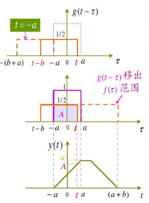

# 理解卷积

## 一维卷积
还是先是公式：
$$(f*h)(t)=\int^{t}_{-\infty}f(\tau)h(t-\tau)d\tau \tag{1}$$

什么意思呢？其中$h(t)$是系统对单位冲激函数$\delta(t=0)$的响应，该响应将持续对系统的输出做出贡献。如图。

在$t=0$时刻，冲激函数的幅值为$f(0)$，那么系统对它的响应就是$f(0)h(t)$，该响应在时刻$t$的值为：
$$s(t)=f(0)h(t)$$
事实上，在$t$时刻之前的任一时刻$\tau$，系统中均有输入$f(\tau)$，对应的冲激响应为$f(\tau)h(t-\tau)$，那么对$t$时刻之前的所有时刻$\tau$进行积分，得到式(1)。

### 图解法求卷积

对函数$g$依次做反褶，平移t，计算在不同$t$下，两个函数曲线所围的面积(下图中如果f(0)=2呢，是否还是面积?所以有系数的哈，这个只能确认积分区间)。

### 卷积的计算机算法
计算卷积的算法是"不进位乘法"，如下图所示(计算机编程的算法，与上述图解法一样的)：

## 二维卷积
与一维卷积的滑窗类似，二维卷积也用滑窗进行计算。广泛用在图像处理领域。

以下内容转自[CSDN博客](https://blog.csdn.net/appleyuchi/article/details/78597516)

算法：对矩阵A,B进行卷积：`conv2(A,B)`，其中A为图像矩阵，B为卷积核。
1. 对矩阵A补零。如图。

2. 将卷积核B分别沿行方向和列方向进行反褶(相当于沿中心旋转180°)。如图。

3. 滑动滑窗，将卷积核的中心位于图像矩阵的每个元素，求滑窗内两矩阵**点积(按元素乘)**之和。如图。

在图像处理中，卷积常用于对图像模糊处理，边缘检测，产生轧花效果等。

在深度学习中，卷积在卷积网络中发挥作用。