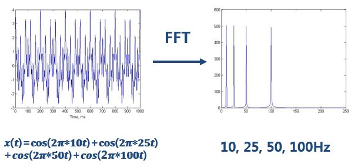
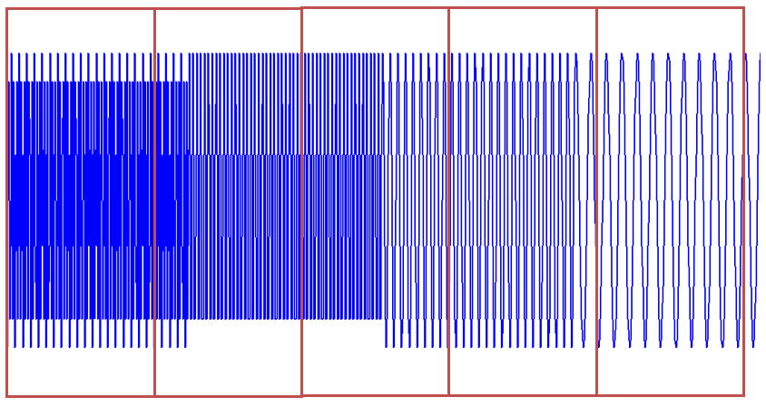
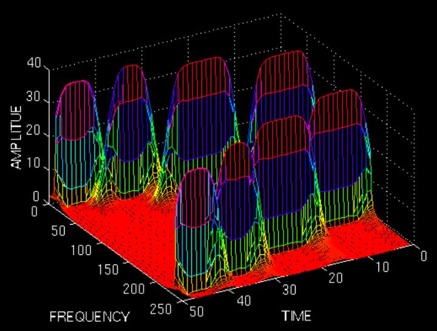
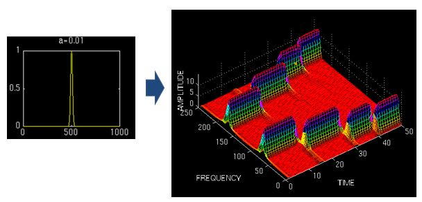

# 小波变换(一): 为什么需要小波?

## 系列文章列表

本文是《小波变换》系列的第1篇，主要介绍为什么需要小波.

1. [小波变换(一): 为什么需要小波?](wavelet1.html)
2. [小波变换(二): 小波基函数,母小波和父小波](wavelet2.html)
3. [小波变换(三): 从实例代码看Haar小波分解和重构](wavelet3.html)
4. [小波变换(四): 常用小波特点及二维小波变换](wavelet4.html)
5. [小波变换(五): 小波，傅里叶与卷积的关系](wavelet5.html)

## 从傅里叶变换的不足之处开始说起

理解本文需要先[理解傅里叶变换](FourierTransform.html)，默认正处在理解了傅里叶但还没理解小波的道路上。

我们知道傅里叶变化可以分析信号的频谱，那么为什么还要提出小波变换？答案就是方沁园所说的，“<mark>对非平稳过程，傅里叶变换有局限性</mark>”。

看如下的该信号:

做完FFT（快速傅里叶变换）后，可以在频谱上看到清晰的四条线，信号包含四个频率成分。

一切没有问题。但是，**如果是频率随着时间变化的非平稳信号呢？**

[代码点我可查看](https://github.com/charleechan/MyWiki/mds/KnowWorld/SigASys/SigProc/res/sigSpectrum.py)

最上边的是频率始终不变的平稳信号。而下边两个则是频率随着时间改变的非平稳信号，它们同样包含和最上信号相同频率的四个成分。做FFT后，**我们发现这三个时域上有巨大差异的信号，频谱（幅值谱）却非常一致**。

我们从频谱上无法区分下边两个非平稳信号，因为它们包含的四个频率的信号的成分确实是一样的，只是出现的先后顺序不同。

对于这样的非平稳信号，只知道包含哪些频率成分是不够的，我们还想知道各个成分出现的时间。知道信号频率随时间变化的情况，各个时刻的瞬时频率及其幅值——这也就是时频分析。

## 短时傅里叶变换(Short-Time Fourier Transform, STFT)

一个简单可行的方法就是——加窗。我又要套用方沁园同学的描述了，“<mark>把整个时域过程分解成无数个等长的小过程，每个小过程近似平稳，再傅里叶变换，就知道在哪个时间点上出现了什么频率了。</mark>”这就是短时傅里叶变换。

看图：

时域上分成一段一段做FFT，不就知道频率成分随着时间的变化情况了吗！用这样的方法，可以得到一个信号的时频图了：

图上既能看到10Hz, 25 Hz, 50 Hz, 100 Hz四个频域成分，还能看到出现的时间。两排峰是对称的，所以大家只用看一排就行了。

是不是棒棒的？时频分析结果到手。但是STFT依然有缺陷。

使用STFT存在一个问题，我们应该用多宽的窗函数？

* 窗口太窄：窗内的信号太短，会导致频率分析不够精准，频率分辨率差。
* 窗口太宽：时域上又不够精细，时间分辨率低。

这里使用窗口为一个高斯函数的形式$w(t)=e^{-a*t^2/2}$,$a$为窗口的长度，t为时间。

窄窗口

中窗口

宽窗口

用窄窗，时频图在时间轴上分辨率很高，几个峰基本成矩形，而用宽窗则变成了绵延的矮山。但是频率轴上，窄窗明显不如下边两个宽窗精确。

对于时变的非稳态信号，高频适合小窗口，低频适合大窗口。然而STFT的窗口是固定的，在一次STFT中宽度不会变化，所以STFT还是无法满足非稳态信号变化的频率的需求。

## 小波级数展开与小波变换

**STFT是给信号加窗，分段做FFT；而<mark>小波直接把傅里叶变换的基给换了——将无限长的三角函数基换成了有限长的会衰减的小波基</mark>。这样不仅能够获取频率，还可以定位到时间了**。

**小波是指能量有限，在时域中是有限长的，会衰减的，较为集中的波函数**。**小波级数展开就是使用一组小波函数作为基函数进行的级数展开**。

再复习一下傅里叶级数和傅里叶变换。

* 对于连续性周期信号，使用基函数 $E=\{e^{ikωt}\},k\in N$进行傅里叶级数展开。

$$
f(t)=\sum_{k=-\infty}^{\infty}A_{k}\bullet e^{ikωt},\quad A_k=\frac{1}{T} \int_{-\frac{T}{2}}^{\frac{T}{2}}f(t) e^{-ik\omega t} dt\tag{1}
$$

* 对于连续性非周期信号(自然信号)，使用傅里叶变换进行频域分析。

$$
F(\omega)=\int_{-\infty}^{\infty}f(t) e^{-i \omega t} dt,\quad f(t)=\frac{1}{2\pi}\int^{\infty}_{-\infty}F(\omega)e^{i \omega t}d\omega\tag{2}
$$

* 对于离散性非周期信号(采样的自然信号)，使用离散傅里叶变换进行频域分析。

$$
\begin{aligned}
F_{s}(\omega_{1}+k\Delta\omega)=\frac{T}{N}\sum_{n=0}^{N-1}f(t_{1}+n\Delta t) e^{-i(\omega_{1}+k\Delta\omega) (t_{1}+n\Delta t)}\\
f(t_{1}+n\Delta t)=\frac{\Omega}{2\pi K}\sum^{K-1}_{k=0}{F(\omega_{1}+k\Delta\omega)e^{i(\omega_{1}+k\Delta\omega)(t_{1}+n\Delta t)}}\tag{3}
\end{aligned}
$$

对于连续的信号，以$\varphi(\frac{t-\tau}{a})$为基函数的小波变换公式为：
$$
WT(a,\tau)=\frac{1}{\sqrt{a}}\int^{\infty}_{-\infty}{f(t)*\varphi(\frac{t-\color{red}{\tau}}{\color{red}{a}})dt}\tag{4}
$$

对于离散的信号，以$\varphi(2^{j}t-k)$为基函数，进行小波级数展开：
$$
f(t) = \sum_{j\in N}\left\lbrace\sum_{k\in Z} c_{k}\varphi(2^{j}t-k)\right\rbrace,\text{here}\;c_{k}\in R\tag{5}
$$

注意二者的小波基函数$\varphi(2^{j}t-k)$或者$\varphi(\frac{t-\tau}{a})$，本质是一样的。

* $a=2^{-j}$，以及$j$都起到缩放函数的作用，因此都是尺度因子，对应于傅里叶变换中的$\omega$的倒数(周期$T$)。
* $\tau=2^{-j}k$，以及$k$是平移因子。

事实上，给了我们公式(5)，并不能用于信号处理的实践应用，你需要看[小波变换(二): 小波基函数,母小波和父小波](wavelet2.html)。

接下来你可能想看：
[小波变换(二): 小波基函数,母小波和父小波](wavelet2.html)

---
## 参考内容
1. [形象易懂讲解算法I-小波变换](https://zhuanlan.zhihu.com/p/22450818)
2. [《The Wavelet Tutorial》小波教程 中文翻译（上）](https://zhuanlan.zhihu.com/p/250511382)
3. [python实现小波变换的一个简单例子](https://my.oschina.net/propagator/blog/3060377)
4. [小波变换和motion信号处理（一）](http://www.eepw.com.cn/article/201612/327996.htm)
4. [小波变换和motion信号处理：第二篇](http://www.eepw.com.cn/article/247254.htm)

