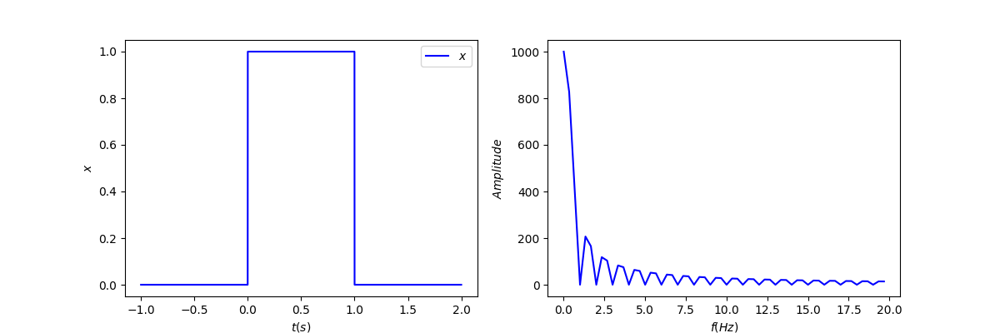
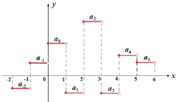
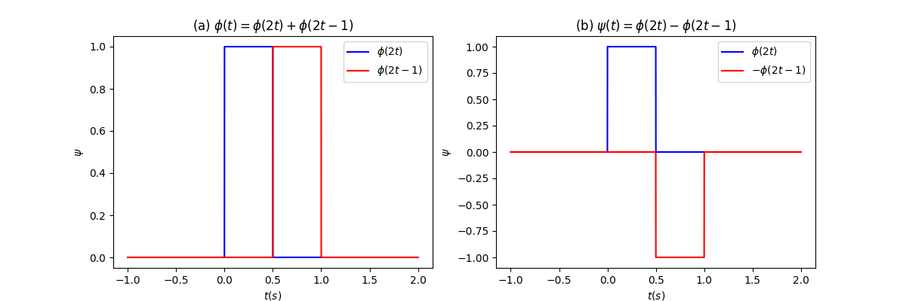

# 小波变换(二): 小波基函数,母小波和父小波

## 系列文章列表

本文是《小波变换》系列的第2篇，主要介绍为什么需要小波.

1. [小波变换(一): 为什么需要小波?](wavelet1.html)
2. [小波变换(二): 小波基函数,母小波和父小波](wavelet2.html)
3. [小波变换(三): 从实例代码看Haar小波分解和重构](wavelet3.html)
4. [小波变换(四): 常用小波特点及二维小波变换](wavelet4.html)
5. [小波变换(五): 小波，傅里叶与卷积的关系](wavelet5.html)

## 小波级数展开与小波变换
上节我们给出了为啥需要小波变换，并给出了小波基函数，小波变换和小波级数的一般形式：

对于连续的信号，以$\varphi(\frac{t-\tau}{a})$为基函数的小波变换公式为：
$$
WT(a,\tau)=\frac{1}{\sqrt{a}}\int^{\infty}_{-\infty}{f(t)\varphi(\frac{t-\color{red}{\tau}}{\color{red}{a}})dt}\tag{1}
$$

对于离散的信号，以$\varphi(2^{j}t-k)$为基函数，进行小波级数展开：
$$
f(t) = \sum_{k\in Z} c_{k}\varphi(2^{j}t-k),\text{here}\;c_{k}\in R\tag{2}
$$

注意二者的小波基函数$\varphi(2^{j}t-k)$或者$\varphi(\frac{t-\tau}{a})$，本质是一样的。

* $a=2^{-j}$，以及$j$都起到缩放函数的作用，因此都是尺度因子，对应于傅里叶变换中的$\omega$的倒数(周期$T$)。
* $\tau=2^{-j}k$，以及$k$是平移因子。

已经了解了小波基函数的一般形式，那么其他各种网站，资料，论坛里说的<mark>母小波和父小波都是什么东西?</mark>

## 母小波的理解

下面以Haar小波为例，详细理解一下小波级数展开的过程，并介绍一下什么是母小波，什么是父小波。

以下是被好多好多人选择的小波：**Haar小波**。Haar函数(先记一下，其实Haar小波级数展开的母小波)为：

$$
\varphi(t)=
\begin{cases}
1 &0 \leq t < 1\\
0 &\text{otherwise}
\end{cases}\tag{3}
$$

Haar的时域和频域信号

Haar函数**在时域上不连续，性能一般，但胜在计算简单**。

如果对其向右平移任意$k$个单位($k\in Z$)，构成一组函数$E=\{\varphi(t-k)\}$, 该组函数两两相互正交，易证明

$$
\begin{aligned}
\langle\varphi(t-k),\varphi(t-k)\rangle &=\int^{\infty}_{-\infty}\varphi^{2}(t-k)dt=1\\
\langle\varphi(t-k),\varphi(t-k')\rangle &\xlongequal[k,k'\in Z]{k\ne k'}\int^{\infty}_{-\infty}\varphi(t-k\varphi(t-k')dt=0
\end{aligned}
$$

因此构成一组正交基，这组正交基的线性组合形成函数空间$V_0$。

此时如果将$\{\varphi(t-k)\}$的宽度缩小一半，同时保持缩放前后函数的总能量不变，则形成一组基函数$E=\{\sqrt{2}\varphi(2t-k)\}$，同样易证明这是另一组正交基,这组正交基的线性组合形成函数空间$V_1$。

不断缩小尺度，可形成一组基函数$E=\{\sqrt{2^{j}}\varphi(2^{j}t-k)\},s.t.\,j\in Z$,这组正交基的线性组合形成函数空间$V_j$。

在Haar小波变换中，**所使用的基函数是$V_j$空间中的基函数(去除了$2^j$的系数)**：

$$
\varphi(2^{j}t-k)\tag{4}
$$

$V_j$空间中的任意函数可以写作($c_j$中已经包含了$2^{j}$，此式等同于式(2))：

$$
f_{j}(t) = \sum_{k} c_{k}\varphi(2^{j}t-k), \text{here}\;c_{k}\in R\tag{5}
$$

现在，我们可以用这个**阶梯状的函数**去近似任意的原始的时域信号啦，不信你看！

注意，我们现在从式(3)的$\varphi(t)$，经过一步步的缩放，平移形成了很多组基函数，这些基函数可以表达函数空间$V_{j}$的任意函数。再形象一些，空间$V_{j}$的任意函数都可以用变形过的$\varphi(t)$组合得到，因此，<mark>$\varphi(t)$就被定义为母小波。</mark>

<mark>把母小波进行缩放，平移，可以构造出小波基函数。</mark>

好了，到这儿应该都没什么问题，那既然母小波已经完全可以表示$V_{j}$空间中的任意函数$f_{j}$，为啥还要搞出来一个父小波来pullze me? 接着往下看！

## 父小波的理解

在实际的信号处理实践中，使用公式(2)是比较难以操作的。例如，以下图的信号为例，高频的毛刺是我们不需要的，要滤除的。

原始信号中的噪声

haar小波基函数的$j$越大，信号宽度越小，越接近噪声成分。因此，为了滤除噪声，需要很高的时间分辨率。但在低频部分，需要不太高的时间分辨率，$j$要小一些。

因此我们需要<mark>**一种属于$V_j$但不属于$V_{j-1}$的尖峰函数**</mark>，以匹配原始时域信号中的毛刺。

通过观察得到，函数空间$V_0$的任意<mark>**基**</mark>函数$\varphi(t-k)$可以被空间$V_1$中的**基**函数线性组合得到(如下图(a))，因此$V_0$是$V_1$的子空间。以此类推，容易得到

$$
\varphi(2^{j}t)+\varphi(2^{j}t-1)=\varphi(2^{j-1}t)\tag{6}
$$

于是$V_{j-1}$也是$V_{j}$的子空间。那么就有$V_0\subseteq V_1\subseteq\cdots\subseteq V_j$。

如果定义如上图(b)所示的$\psi(t)$，则$\psi(t)$是$V_{1}$空间中的一个函数：

$$\psi(t)=\varphi(2t)-\varphi(2t-1)\tag{7}$$

容易发现，对于$V_{0}$空间的任意的<mark>**基**</mark>函数$\varphi(t-k)$，都有$\langle \varphi(t-k),\psi(t)\rangle=0$。事实上，对$\psi(t)$平移$k$个单位后得到的函数$\psi(t-k)=\varphi[2(t-k)]-\varphi[2(t-k)-1]$，都与$V_{0}$空间正交。<mark>函数$\psi(t-k)$的线性组合</mark>也都与$V_{0}$空间正交。

进一步地，$V_{j}$空间中的函数

$$\psi[2^{j-1}(t-k)] = \varphi[2^{j}(t-k)]-\varphi[2^{j}(t-k)-1]\tag{8}$$

与$V_{j-1}$空间的所有函数均正交。以公式(8)中函数的线性组合，形成的空间$W_{j}$，是$V_{j}$的子集。

当$j$很大时，空间$W_{j}$表示的尖峰就与信号中的噪声十分相似了，为了滤掉噪声，可以把$W_{j}$中的项设为0。

接下来证明<mark>$V_{j}$空间是$V_{j-1}$空间与$W_{j-1}$空间的直和(如果$V_{j}$中的元素不属于$V_{j-1}$，就一定属于$W_{j-1}$)</mark>。

令式(8)中$k=0$，并联立式(6)，容易得到

$$
\begin{aligned}
\varphi(2^{j}t)&=\frac{1}{2}\left( \psi(2^{j-1}t)+ \varphi(2^{j-1}t) \right)\\
\varphi(2^{j}t-1)&=\frac{1}{2}\left( \psi(2^{j-1}t)- \varphi(2^{j-1}t) \right)
\end{aligned}
$$

因此有

$$
\begin{aligned}
f_{j}(t)&=\sum_{k \in Z} c_{k}\varphi(2^{j}t-k)\\
&=\begin{matrix}\underbrace{\sum_{k \in Z}c_{2k}\varphi[2^{j}(t-k)]}\\\text{even}\end{matrix}+\begin{matrix}\underbrace{\sum_{k \in Z}c_{2k+1}\varphi[2^{j}(t-k)-1]}\\\text{odd}\end{matrix}\\
&=\frac{1}{2}\left\lbrace\sum_{k \in Z}c_{2k} \left[ \psi(2^{j-1}(t-k))+ \varphi(2^{j-1}(t-k)) \right] \right.\\
&\quad\quad +\left.\sum_{k \in Z}c_{2k+1}\left[ \psi(2^{j-1}(t-k))- \varphi(2^{j-1}(t-k)) \right]\right\rbrace\\
&=\left\lbrace\sum_{k \in Z}\frac{c_{2k}+c_{2k+1}}{2} \left[ \psi(2^{j-1}(t-k))\right] \right.\\
&\quad +\left.\sum_{k \in Z}\frac{c_{2k}-c_{2k+1}}{2}\left[  \varphi(2^{j-1}(t-k)) \right]\right\rbrace\\
&=w_{j-1}+f_{j-1}
\end{aligned}
$$

因此，容易得到

$$
f_{j}(t)=w_{j-1}+f_{j-1}=w_{j-1}+w_{j-2}+w_{j-3}+\cdots+w_{0}+f_{0}\tag{9}
$$

这表示$V_{j}$中的任意函数，可以写作$W_{j}$中的函数和$V_{j-1}$中函数的线性组合。因此$W_{j-1}$是$V_{j-1}$的正交补：$W_{j-1}$与$V_{j-1}$相互正交，且互为补集。

$$
\begin{aligned}
V_{j}&=W_{j-1}\bigoplus V_{j-1}\\
&=W_{j-1} \bigoplus W_{j-2} \bigoplus V_{j-2}\\
&=W_{j-1} \bigoplus W_{j-2} \bigoplus \cdots \bigoplus W_{0} \bigoplus V_{0}
\end{aligned}\tag{10}
$$

公式(10)意思就是：如果使用公式(2)进行信号近似，本质上是使用$\varphi(t)$和不同尺度的$\psi(t)$进行近似，也就是使用阶梯和毛刺近似了任意信号$f(t)$。根据公式(9)，有

$$
\begin{aligned}
f(t) &\approx f_{j}(t)\\
&=\left\lbrace w_{j-1}+w_{j-2}+\cdots+w_{0}+f_{0}\right\rbrace\\
&=\sum_{j=1}^{\infty}\sum_{k\in Z}c_{j,k}\psi[2^{j-1}(t-k)] + \sum_{k\in Z}d_{k}\varphi(t-k)
\end{aligned}\tag{11}
$$

看到了吗，任意一个函数$f(t)$，可以用<mark>$\psi$经过一系列缩放、平移形成的函数，和$\varphi(t)$经过平移形成的函数</mark>的线性组合来表达。

也就是说，这里我们<mark>只把母小波进行平移，把父小波进行缩放、平移，组合可以得到任意函数</mark>。

**相信你已经理解父小波为什么还叫做尺度函数(scaling function)了吧！**

为了强化记忆，我们把公式(11)抄写一遍：

$$
f(t) =\sum_{j\in N}\sum_{k\in Z}c_{j,k}\psi[2^{j}(t-k)] + \sum_{k\in Z}d_{k}\varphi(t-k)\tag{12}
$$

事实上，<mark>在实践过程中，我们用的更多的是公式(12)而不是公式(2)。</mark>首先将信号转换为小波分量，要滤除$j$对应的毛刺信号，需要将$j$对应的分量置为0.然后进行小波反变换，转换为时域信号。

## 小结

小波分解：

$$
f(t) =\sum_{j\in N}\left\lbrace\sum_{i=1}^{j}\psi[2^{i-1}(t-k)]\right\rbrace+\sum_{j\in N}\varphi(t-k)
$$

母小波$\varphi(t)$一般具有以下性质：
* 平移正交性：函数自身与平移后的函数相互正交，$\langle \varphi(t),\varphi(t-kT)\rangle =0$；
* 归一化：能量为1，$\langle \varphi(t),\varphi(t) \rangle =\int^{\infty}_{-\infty}\varphi^{2}(t)dt= 1$。

父小波$\psi(t)$一般具有以下性质：
* 平移正交性：函数自身与平移后的函数相互正交，$\langle \psi(t),\psi(t-kT)\rangle =0$；
* 归一化：能量为1，$\langle \psi(t),\psi(t) \rangle =\int^{\infty}_{-\infty}\psi^{2}(t)dt= 1$。
* <mark>与母小波$\varphi(t)$正交</mark>。

留个问题：父小波是不是可以和母小波互换呢?

接下来你可能想看：
[小波变换(三): 从实例代码看Haar小波分解和重构](wavelet3.html)

---
## 参考内容
1. [形象易懂讲解算法I-小波变换](https://zhuanlan.zhihu.com/p/22450818)
2. [《The Wavelet Tutorial》小波教程 中文翻译（上）](https://zhuanlan.zhihu.com/p/250511382)
3. [python实现小波变换的一个简单例子](https://my.oschina.net/propagator/blog/3060377)
4. [小波变换和motion信号处理（一）](http://www.eepw.com.cn/article/201612/327996.htm)
4. [小波变换和motion信号处理：第二篇](http://www.eepw.com.cn/article/247254.htm)

