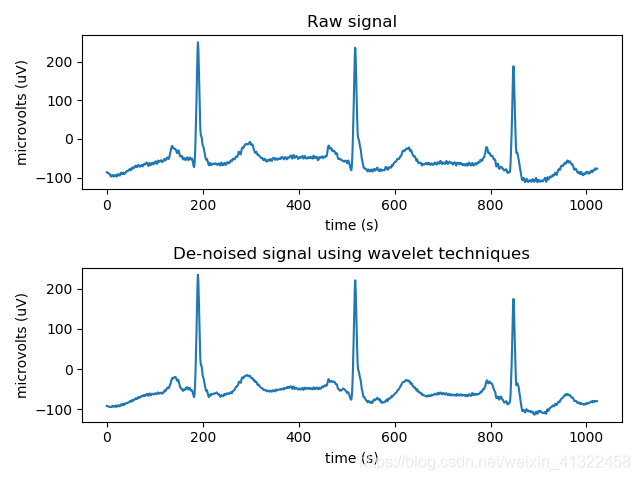

# 小波变换彩蛋: Python中的小波变换库

## 系列文章列表

1. [小波变换(一): 为什么需要小波?](wavelet1.html)
2. [小波变换(二): 小波基函数,母小波和父小波](wavelet2.html)
3. [小波变换(三): 从实例代码看Haar小波分解和重构](wavelet3.html)
4. [小波变换(四): 常用小波特点及二维小波变换](wavelet4.html)
5. [小波变换(五): 小波，傅里叶与卷积的关系](wavelet5.html)

[小波变换彩蛋: Python中的小波变换库](wavelet6.html)。

## pywt：Python

### 小波去噪
在python中使用小波分析进行阈值去噪声,使用pywt.threshold函数。

```python
#coding=utf-8
#使用小波分析进行阈值去噪声,使用pywt.threshold
 
import pywt
import numpy as np
import pandas as pd 
import matplotlib.pyplot as plt 
import math 
 
data = np.linspace(1, 10, 10)
print(data)
# [ 1.  2.  3.  4.  5.  6.  7.  8.  9. 10.]
# pywt.threshold(data, value, mode, substitute) mode 模式有4种，soft, hard, greater, less; substitute是替换值
 
data_soft = pywt.threshold(data=data, value=6, mode='soft', substitute=12)
print(data_soft)
# [12. 12. 12. 12. 12.  0.  1.  2.  3.  4.] 将小于6 的值设置为12， 大于等于6 的值全部减去6
 
data_hard = pywt.threshold(data=data, value=6, mode='hard', substitute=12)
print(data_hard)
# [12. 12. 12. 12. 12.  6.  7.  8.  9. 10.] 将小于6 的值设置为12， 其余的值不变
 
data_greater = pywt.threshold(data, 6, 'greater', 12)
print(data_greater)
# [12. 12. 12. 12. 12.  6.  7.  8.  9. 10.] 将小于6 的值设置为12，大于等于阈值的值不变化
 
data_less = pywt.threshold(data, 6, 'less', 12)
print(data_less)
# [ 1.  2.  3.  4.  5.  6. 12. 12. 12. 12.] 将大于6 的值设置为12， 小于等于阈值的值不变

```

### ECG小波去噪

```python
import matplotlib.pyplot as plt
import pywt

# Get data:
ecg = pywt.data.ecg()  # 生成心电信号
index = []
data = []
for i in range(len(ecg)-1):
    X = float(i)
    Y = float(ecg[i])
    index.append(X)
    data.append(Y)

# Create wavelet object and define parameters
w = pywt.Wavelet('db8')  # 选用Daubechies8小波
maxlev = pywt.dwt_max_level(len(data), w.dec_len)
print("maximum level is " + str(maxlev))
threshold = 0.04  # Threshold for filtering

# Decompose into wavelet components, to the level selected:
coeffs = pywt.wavedec(data, 'db8', level=maxlev)  # 将信号进行小波分解

plt.figure()
for i in range(1, len(coeffs)):
    coeffs[i] = pywt.threshold(coeffs[i], threshold*max(coeffs[i]))  # 将噪声滤波

datarec = pywt.waverec(coeffs, 'db8')  # 将信号进行小波重构

mintime = 0
maxtime = mintime + len(data) + 1

plt.figure()
plt.subplot(2, 1, 1)
plt.plot(index[mintime:maxtime], data[mintime:maxtime])
plt.xlabel('time (s)')
plt.ylabel('microvolts (uV)')
plt.title("Raw signal")
plt.subplot(2, 1, 2)
plt.plot(index[mintime:maxtime], datarec[mintime:maxtime-1])
plt.xlabel('time (s)')
plt.ylabel('microvolts (uV)')
plt.title("De-noised signal using wavelet techniques")

plt.tight_layout()
plt.show()
```

运行结果如下：

<div align="center"></div>

---
## 参考内容
1. [python小波变换去噪](https://blog.csdn.net/weixin_41322458/article/details/91385984)
