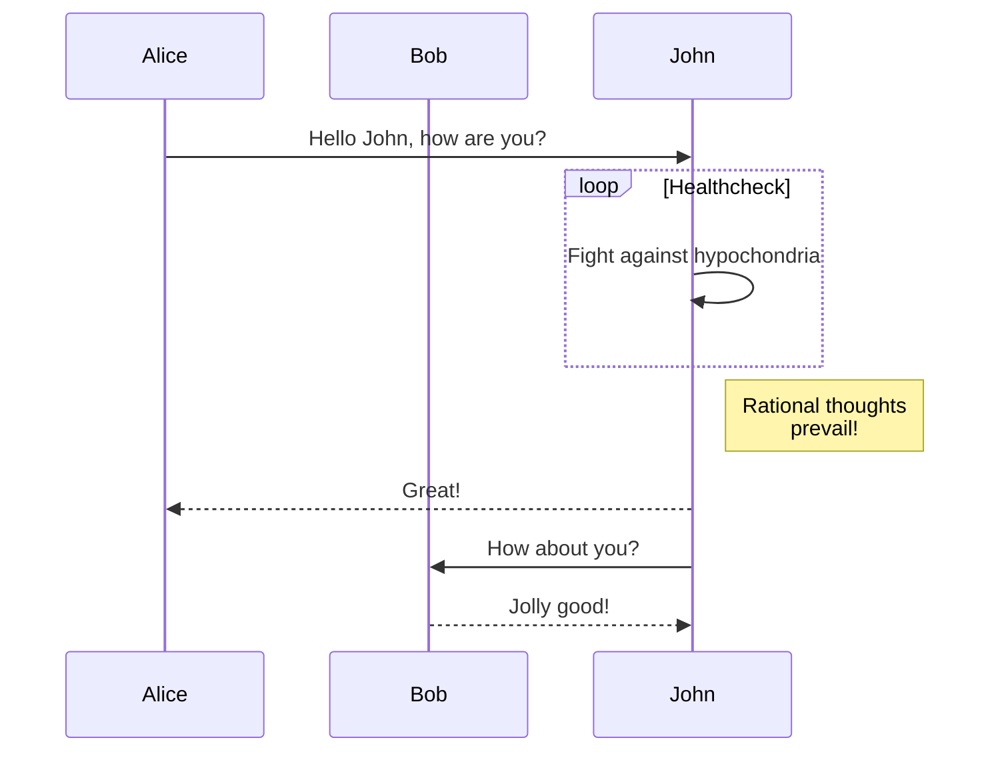
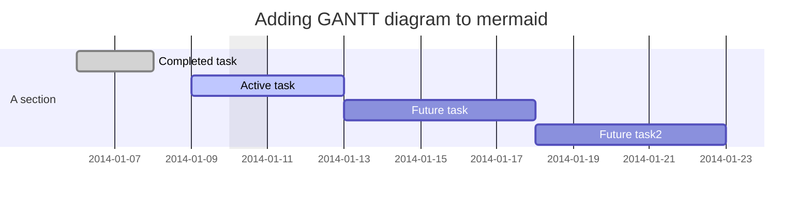
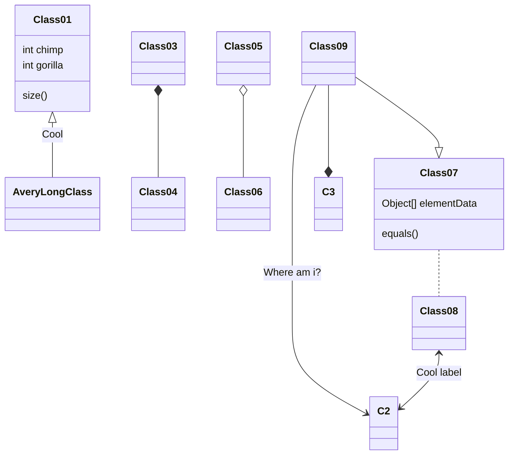
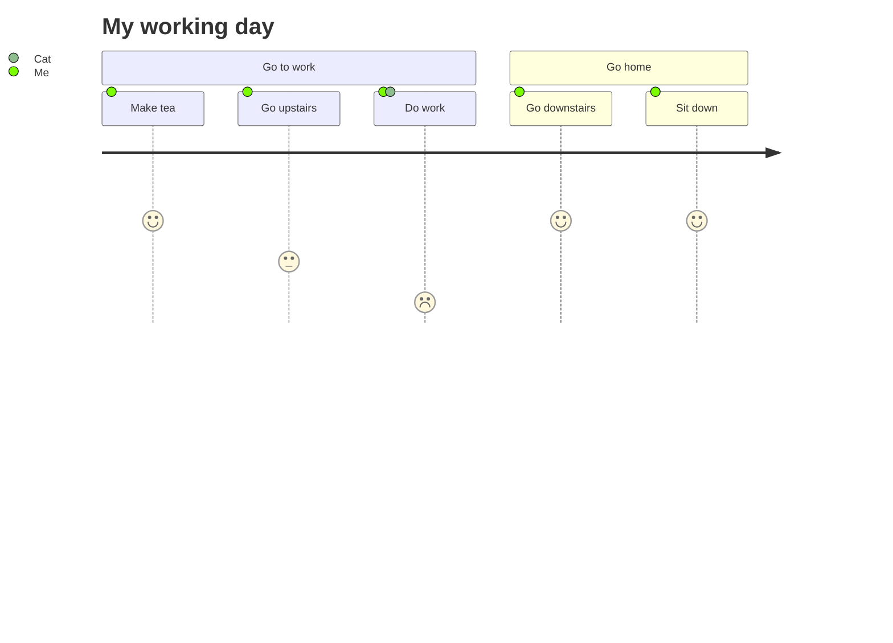
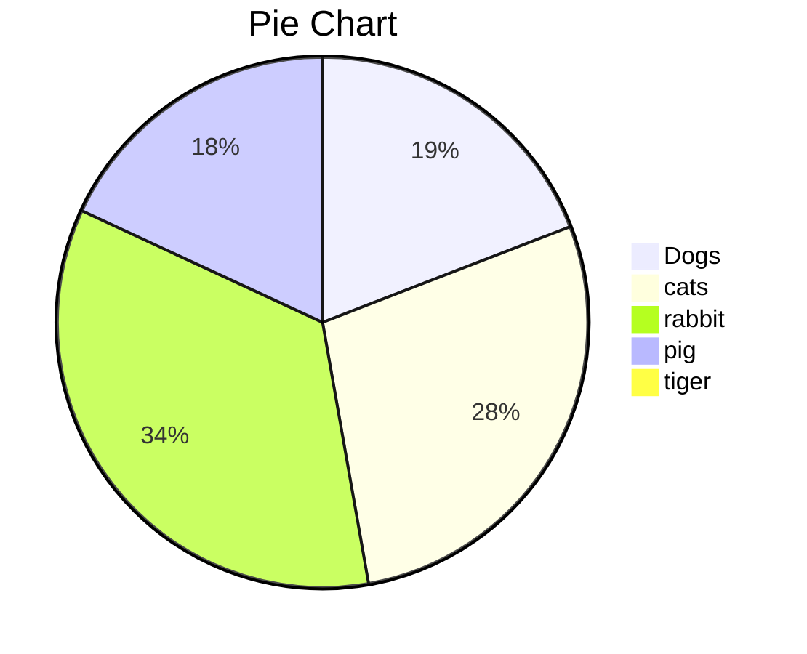

## 使用`FlowCharts.js`画流程图

注意,`VS Code`的 `Markdown Preview Enhanced`支持`FlowCharts.js`得不完整,不显示颜色.

[官方教程](http://flowchart.js.org/)
代码块标识: ` ```flow`

* 先定义节点: `id=>type: content|state:>url`,其中
  * `id`:  自定义标签，用于定义流程图中对应的名字,类似于``
  * `type`: 元素的类型,值可以是 
    * `start`: 起始框(圆角)
    * `end`: 结束(圆角)
    * `condition`: 判断(菱形)
    * `operation`: 操作(矩形)
    * `inputoutput`: 输入输出框(平行四边形)
    * `subroutine`: 子任务(嵌套矩形)
  * `content` :  流程图中的自定义显示文本内容
  * `state`: 定义该元素的状态,以渲染不同的样式,值可以是
    * `past`: 背景为亮灰色(VS Code中的Markdown Preview Enhanced不能支持)
    * `current`: 背景为高亮黄色,字体为粗体红色(同上不支持)
    * `invalid`: 背景为深灰色,字体为黑色(同上不支持)
    * `future`: 背景为黄色
    * `rejected`: 背景为红色(此状态仅用于condition元素)
    * `approved`: 背景为绿色(此状态仅用于condition元素)
  * `url`: 超链接的URL
* 再定义连线: `id1->id2(pos)->id3`,其中`pos`：
  * 当元素id2的类型为operation时,可以是`left`,`right`,`bottom`,;
  * 当元素id2的类型为condition时,可以是(`yes/no`,`right/bottom`);
  * 示例`cond(no)->op2(yes,right)->opx`
* 注意: 一定要有`start`和`end`;

代码
```
st=>start: Start|past:>http://www.google.com[blank]
e=>end: End|future:>http://www.google.com
op1=>operation: My Operation|past
op2=>operation: Stuff|current
sub1=>subroutine: My Subroutine|invalid
cond=>condition: Yes
or No?|approved:>http://www.google.com
c2=>condition: Good idea|rejected
io=>inputoutput: catch something...|future

st->op1(right)->cond
cond(yes, right)->c2
cond(no)->sub1(left)->op1
c2(yes)->io->e
c2(no)->op2->e
```
对应的流程图为:
```flow
st=>start: Start|past:>http://www.google.com[blank]
e=>end: End|future:>http://www.google.com
op1=>operation: My Operation|past
op2=>operation: Stuff|current
sub1=>subroutine: My Subroutine|invalid
cond=>condition: Yes
or No?|approved:>http://www.google.com
c2=>condition: Good idea|rejected
io=>inputoutput: catch something...|future

st->op1(right)->cond
cond(yes, right)->c2
cond(no)->sub1(left)->op1
c2(yes)->io->e
c2(no)->op2->e
```

## 使用[`mermaid.js`](https://github.com/mermaid-js/mermaid)绘制流程图

注意,`VS Code`的 `Markdown Preview Enhanced`支持`mermaid.js`,其他待测试.

代码块标识: ` ```mermaid`

代码:
```
graph TD;
    A-->B;
    A-->C;
    B-->D;
    C-->D;
```
对应的图为:


## 使用[`mermaid.js`](https://github.com/mermaid-js/mermaid)绘制序列图

代码
```
sequenceDiagram
    participant Alice
    participant Bob
    Alice->>John: Hello John, how are you?
    loop Healthcheck
        John->>John: Fight against hypochondria
    end
    Note right of John: Rational thoughts <br/>prevail!
    John-->>Alice: Great!
    John->>Bob: How about you?
    Bob-->>John: Jolly good!
```
对应的序列图为


## 使用[`mermaid.js`](https://github.com/mermaid-js/mermaid)画甘特图
代码:
```
gantt
dateFormat  YYYY-MM-DD
title Adding GANTT diagram to mermaid
excludes weekdays 2014-01-10

section A section
Completed task            :done,    des1, 2014-01-06,2014-01-08
Active task               :active,  des2, 2014-01-09, 3d
Future task               :         des3, after des2, 5d
Future task2               :         des4, after des3, 5d
```
对应的甘特图为:



## 使用[`mermaid.js`](https://github.com/mermaid-js/mermaid)画类图
```
classDiagram
Class01 <|-- AveryLongClass : Cool
Class03 *-- Class04
Class05 o-- Class06
Class07 .. Class08
Class09 --> C2 : Where am i?
Class09 --* C3
Class09 --|> Class07
Class07 : equals()
Class07 : Object[] elementData
Class01 : size()
Class01 : int chimp
Class01 : int gorilla
Class08 <--> C2: Cool label
```
对应的图


## 使用[`mermaid.js`](https://github.com/mermaid-js/mermaid)画日程图
```
journey
  title My working day
  section Go to work
    Make tea: 5: Me
    Go upstairs: 3: Me
    Do work: 1: Me, Cat
  section Go home
    Go downstairs: 5: Me
    Sit down: 5: Me
```
对应的图


## 使用[`mermaid.js`](https://github.com/mermaid-js/mermaid)画饼图
代码
```
pie
title Pie Chart
"Dogs" : 386
"cats" : 567
"rabbit" : 700
"pig":365
"tiger" : 15
```
对应的饼图:

## 使用`MindMap`画思维导图

`Markmap`可以把`Markdown`文件渲染成思维导图.`Markdown Preview Enhanced`插件尚不支持页面内渲染.而`Markdown Preview Markmap Support`可以支持VS code内置渲染器渲染以下代码.

这里用的是gitbook-plugin-mind-maps

代码块标识：`mind:height=300,title=a mind map of something,color`

```
* a
  * bb
  * cc
```
对应的思维导图是
```mind:height=300,title=a mind map of something,color
* a
  * bb
  * cc
```

