# 我的Wiki

<mark>**按分类导航**</mark> |  [按平台导航](./nav1.html) | [软件教程导航](./nav2.html)

[更新我的Wiki](SoftTuto/Manage/Git/UpdateThisSite.html)

```mermaid
graph LR;
classDef CSS3 fill:#20A162,stroke:#000000,color:#ffffff,stroke-width:0px;
classDef CSS2 fill:#4C1F24,stroke:#000000,color:#ffffff,stroke-width:0px;
classDef CSS1 fill:#1677B3,stroke:#000000,color:#ffffff,stroke-width:0px;
ROOT(按语言)
B1(Mark Language )
  C1(Markdown )
  C2(HTML )
  C3(QML )
  C13(XML )
B2(Scripts )
  C4("Javascript(QScript) ")
  C5(Python )
  C6(Matlab )
  C7(CMD )
  C8(TCL )
  C9(Bash )
  C10(PHP )
  C11(SQL )
B3(StyleSheet )
  C12("css(qss) ")
B4(ConfigFile )
  C14(Json )
  C15(Ini )
B5(GeneralCode )
  C16(C++ )
  C17(C )
  C18(Java )
B6(Hardware )
  C19(Verilog HDL )
  C20(VHDL )
  C21(System Verilog )
B7(OtherLibs )
  C22(Tensorflow )
  C23(Pytorch )
  C24(OpenCV )
ROOT --> B1
ROOT --> B2
ROOT --> B3
ROOT --> B4
ROOT --> B5
ROOT --> B6
ROOT --> B7
B1 --> C1 
B1 --> C2 
B1 --> C3 
B2 --> C4 
B2 --> C5    
B2 --> C6 
B2 --> C7 
B2 --> C8 
B2 --> C9 
B2 --> C10
B2 --> C11
B3 --> C12
B1 --> C13
B4 --> C14
B4 --> C15
B5 --> C16
B5 --> C17
B5 --> C18
B6 --> C19
B6 --> C20
B6 --> C21
B7 --> C22
B7 --> C23
B7 --> C24

click C1 "./Coding/LangsMark/MD/index.html" "点我打开"
click C2 "./Coding/LangsMark/HTML/index.html" "点我打开"
click C3 "./Coding/LangsMark/QML/index.html" "点我打开"
click C4 "./Coding/LangsScript/JS/index.html" "点我打开"
click C5 "./Coding/LangsScript/Python/index.html" "点我打开"
click C6 "./Coding/LangsScript/Matlab/index.html" "点我打开"
click C7 "./Coding/LangsScript/CMD/index.html" "点我打开"
click C8 "./Coding/LangsScript/TCL/index.html" "点我打开"
click C9 "./Coding/LangsScript/Bash/index.html" "点我打开"
click C10 "./Coding/LangsScript/PHP/index.html" "点我打开"
click C11 "./Coding/LangsScript/SQL/index.html" "点我打开"
click C12 "./Coding/LangsStyle/CSS/index.html" "点我打开"
click C13 "./Coding/LangsMark/XML/index.html" "点我打开"
click C14 "./Coding/LangsConf/Json/index.html" "点我打开"
click C15 "./Coding/LangsConf/Ini/index.html" "点我打开"
click C16 "./Coding/LangsGene/Cpp/index.html" "点我打开"
click C17 ".Coding/LangsGene/C/index.html" "点我打开"
click C18 "./Coding/LangsGene/Java/index.html" "点我打开"
click C19 "./Coding/LangsHard/Verilog/index.html" "点我打开"
click C20 "./Coding/LangsHard/VHDL/index.html" "点我打开"
click C21 "./Coding/LangsHard/SystemVerilog/index.html" "点我打开"
click C22 "./OtherLibs/Tensorflow/index.html" "点我打开"
click C23 "./OtherLibs/Pytorch/index.html" "点我打开"
click C24 "./OtherLibs/OpenCV/index.html" "点我打开"

class C1,C2,C3,C4,C5,,C6,C7,C8,C9,C10,C11,C12 CSS3
class C13,C14,C15,C16,C17,C18,C19,C20,C21,C22,C23,C24 CSS3
class B1,B2,B3,B4,B5,B6,B7 CSS1
class ROOT CSS2
```

<mark>                                           </mark>

<mark>                                           </mark>

