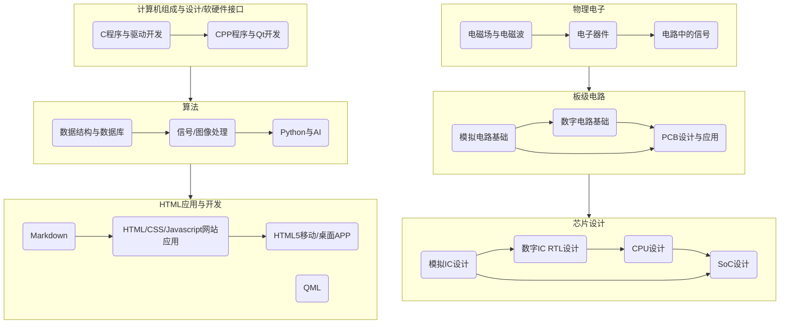

# 我的Wiki

[更新本站](./Tricks/Manage/Git/UpdateThisSite.html)

[办公类(Windows/Office)](./Tricks/Office/index.html) | [图像类](./Tricks/Image/index.html") | [管理类](./Tricks/Manage/index.html") | [插件类](./Tricks/Plugins/index.html") | [工程类](./Tricks/Project/index.html") |[视频类](./Tricks/Video/index.html") | [音频类](./Tricks/Music/index.html") | [游戏类](./Tricks/Game/index.html")

Q&A:
1. 两个图之间的关系是什么?
>* **CPU设计**与**C程序/驱动**之间通过**寄存器**联系起来.
这就是时至今日,为啥大家还非得学习C语言,也是为啥硬件语言描述的是RTL模型.
>* 在设计信号处理芯片DSP/图像信号处理芯片ISP时,工程中需要学习**信号/图像处理算法**和**数字IC RTL设计**结合起来.
2. Qt开发是Qt4还是Qt5?
>* 这里建议学习Qt4的同时学习C++,配合侯捷老师的视频课程,效果拔群.
>* **不建议学习Qt5**,因为其本质就是HTML/CSS/JS做前端页面([QML](./Coding/LangMark/QML/index.html)就是把它们融在一起了),后端使用C++处理数据模型.那我为啥还学习你,直接学习HTML开发,通过**JS调用C++的库**就可以了呀,还不用那么复杂的环境.

3. 学习嵌入式Linux系统开发需要哪些知识呢?
>* 学习完**计算机组成与设计/软硬件接口**,再学习完**物理电子**和**板级电路**即可立马去学习**嵌入式Linux系统开发**.
>* **嵌入式Linux系统开发**一般需要学习**C程序**实现**底层**外设硬件的驱动,学习**Linux系统**完成系统裁剪和移植,学习**C/Qt4**完成程序/驱动开发.
>* 本站**不涉及嵌入式Linux系统开发**.

4. 有专门讲TCL、Verilog HDL的吗?
>* 没有,单独学习一门语言而不实践,是学习不到知识的,因此把TCL和Verilog HDL等已经融入在**数字IC RTL设计**相关教程里了.
