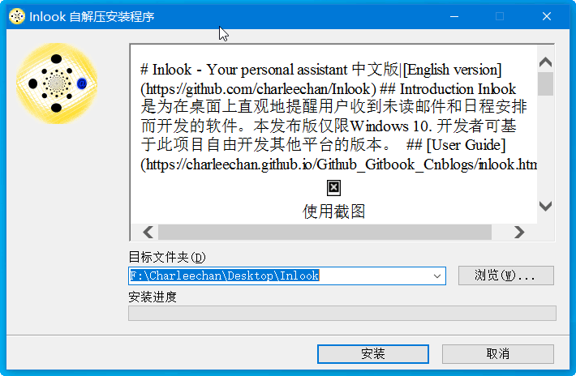
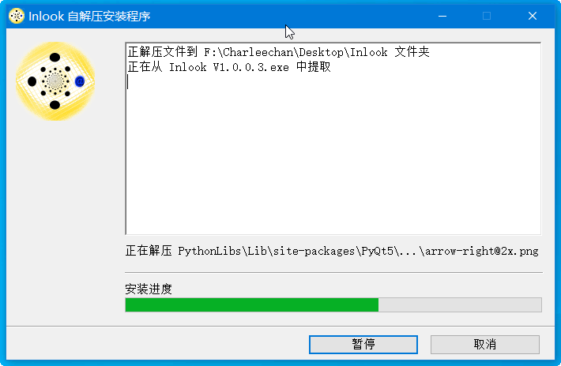
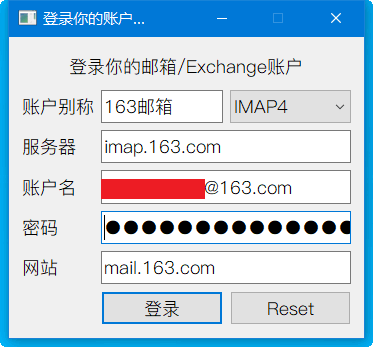
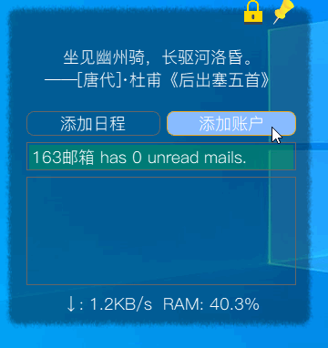
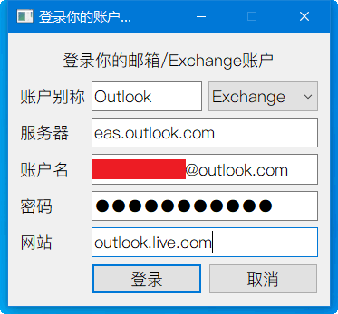
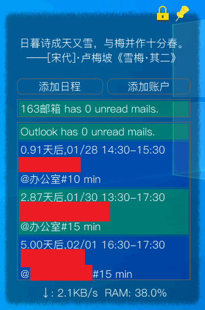
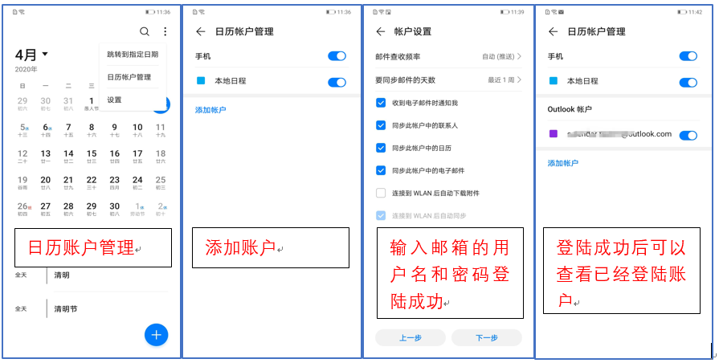
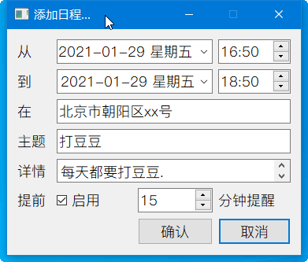
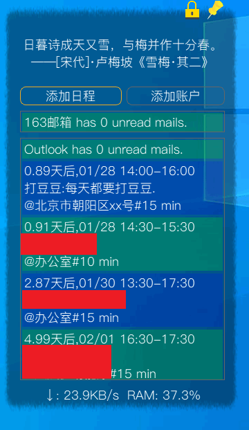
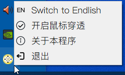

# Inlook用户指南

## 安装
* [点我下载](https://pan.baidu.com/s/1gzzFjWwLh1hMKob9biTz0g) (提取码 a1b2)
* 双击`Inlook V1.0.0.3.exe`,选择`目标文件夹`到你想安装的目录(`建议路径不要有中文`)

* 点击`安装`.

  > 安装过程会将**所有源码**解压到安装目录,写得不好请见谅,欢迎大佬指导.
* 完成安装,可以看到桌面已经生成快捷方式(链接到安装目录的`start.bat`).

## 添加邮箱账户
* 安装完成后, 会自动弹出登录窗口,在窗口中登录你的邮箱.

  * 账户别称: 你给这个邮箱账户起的名字,后面会显示在软件中.
  * 服务器: 去邮箱官网的`帮助中心`,查询邮箱的<mark>IMAP</mark>服务器.
    > QQ邮箱的IMAP服务器`imap.qq.com`;
    
    > 163邮箱的IMAP服务器`imap.163.com`; 
    
    > 其他服务器请在邮箱首页的**帮助中心**查看.

    > 你的邮箱需要**开启IMAP服务**, [QQ邮箱开启方法](https://service.mail.qq.com/cgi-bin/help?subtype=1&&id=14&&no=1000898), [163邮箱开启方法](https://help.mail.163.com/faqDetail.do?code=d7a5dc8471cd0c0e8b4b8f4f8e49998b374173cfe9171305fa1ce630d7f67ac2cda80145a1742516).
  * 账户名: 填写你的邮箱地址.
  * 密码: 填写你的邮箱密码.
    > 如果是163邮箱和QQ邮箱,需要填写<mark>授权码</mark>. 查看[163邮箱的授权码获取方法](https://help.mail.163.com/faqDetail.do?code=d7a5dc8471cd0c0e8b4b8f4f8e49998b374173cfe9171305fa1ce630d7f67ac2cda80145a1742516),[QQ邮箱的授权码获取方法](https://service.mail.qq.com/cgi-bin/help?subtype=1&&id=28&&no=1001256).
  * 网站: 填写邮箱的网页站点，如`mail.163.com`,`mail.qq.com`,`mail.cstnet.cn`等.
* 点击登录,弹出<mark>超大</mark>登录成功消息

* 可以看到已经在Windows桌面出现啦~~

* 如果需要继续添加`邮箱账户`,请点击`添加账户`按钮.

## 添加Exchange账户

这里以添加`outlook`账户为例.
* 点击主页面`添加账户`按钮,选择账户类型为`Exchange`.

* 填写账户信息

  * 账户别称: 你给这个账户起的名字,后面会显示在软件中.
  * 服务器: 去邮箱官网的`帮助中心`,查询邮箱的<mark>Exchange</mark>服务器.
    > Outlook账户的服务器`eas.outlook.com`
  * 账户名: 你的 Exchange 账户
  * 密码: 相应的账户密码
  * 网站: 填写Exchange的网页站点，如`outlook.live.com`等.
* 点击登录,弹出<mark>超大</mark>登录成功消息

* 可以看到已经在Windows桌面出现啦~~

  > 主页面已经可以看到日程和邮箱未读数.

## 手机添加Exchange账户
这里以<mark>菊厂的自带日历</mark>为例.其他手机应该没别的问题,有问题也别找我,不归我负责.

* 打开华为日历，点击右上角`三个点`-点`日历账户管理`-点`添加账户`；
* 填写登陆账户信息，地址填写邮箱地址，密码为邮箱登录密码。
* Exchange账户登陆成功就可以正常进行账户同步, 可以设置你的同步周期为15分钟。

## 添加日程
* 点击主页面`添加日程`按钮,弹出添加日程对话框.
* 填写添加日程的信息.

* 点击确认.
* <mark>一分钟后</mark>,可以看到主页面已经自动同步到了 `Inlook` 的窗口,窗口大小根据日程数目自适应伸缩.

* 查看手机,也可以看到了

  > 如果没有看到,是你的手机同步频率设置得低了,反正不是我的锅, 你需要在手机这边 **手动同步** 一下.
* 到时候后本软件自动<mark>强力提醒</mark>, 应该是 ***半分钟之内无法关闭的窗口*** , 同时伴随 ***魔力铃声*** . 

> 你在手机端删除日程,`Inlook`也会同步删除哦~

## 移动和缩放界面

## 切换语言及鼠标穿透

* 中文界面的每日一句功能有[jinrishici API](https://www.jinrishici.com/)提供,感谢！
* 英文界面的每日一句功能有[爱词霸](http://www.iciba.com/)提供,感谢！
* 鼠标穿透功能可以让`Inlook`停止捕获鼠标,安静地躺在桌面最下层,不影响你的正常办公~

## <mark>提醒</mark>

* 添加你的邮箱账户可以实现**新邮件提醒**, 你需要提前获取你的邮箱的IMAP的服务器信息，部分邮箱如**163，QQ邮箱登录时需要授权码而不是密码**。

* 在本软件和手机自带的日历中添加同一个`Exchange`账户(我自己测试的是Outlook),可以实现**日程多端自动同步, 日程提醒**。

* 任何时候可以直接在托盘修改语言,无需重启软件.

* 自1.0.0.1发布版之后,去除了快捷方式的**开机启动**,如有需要,请自行生成指向**start.bat**的快捷方式,并拖放到`C:\Users\[username]\AppData\Roaming\Microsoft\Windows\Start Menu\Programs\Startup`目录.

## 其他说明

1. 自己为了自己用写的软件，<mark>代码全部开源</mark>，你可以下载后直接修改作为自己喜欢的版本；

2. 因<mark>使用本软件产生的问题，后果自负</mark>；

3. 本软件中用到了`PyQt`,`exchangelib`,需自觉遵守开源协议，禁止商用；

4. 自己的Win10上用的很好,可能不自动适配你的电脑屏幕，请自行修改，也希望能帮我改，可以一块合作。

5. 支持请发热心和好评，欢迎一起Debug.

6. 为了使用方便，添加了**桌面快捷方式**,如果需要去除，请到系统文件夹内删除快捷方式即可。
