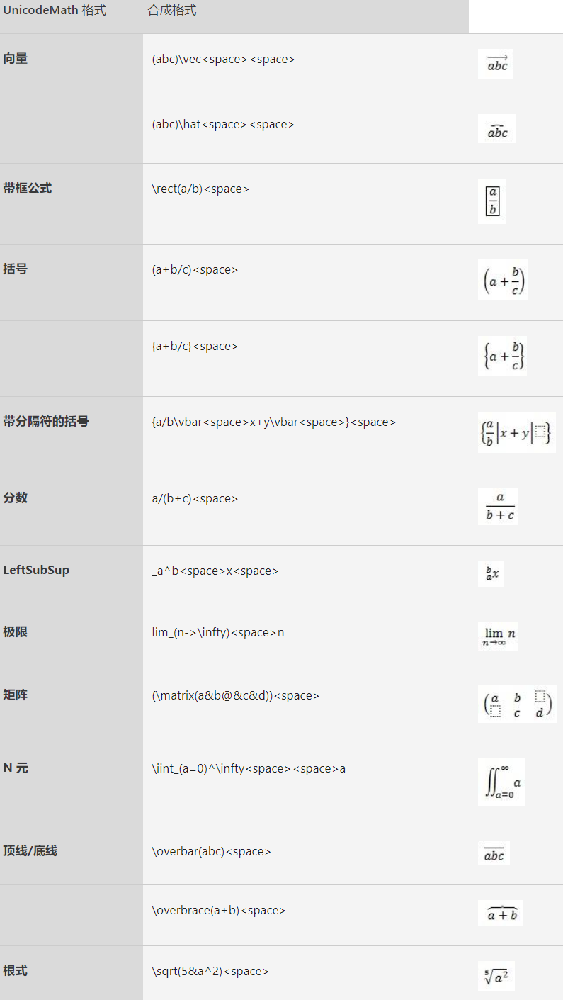
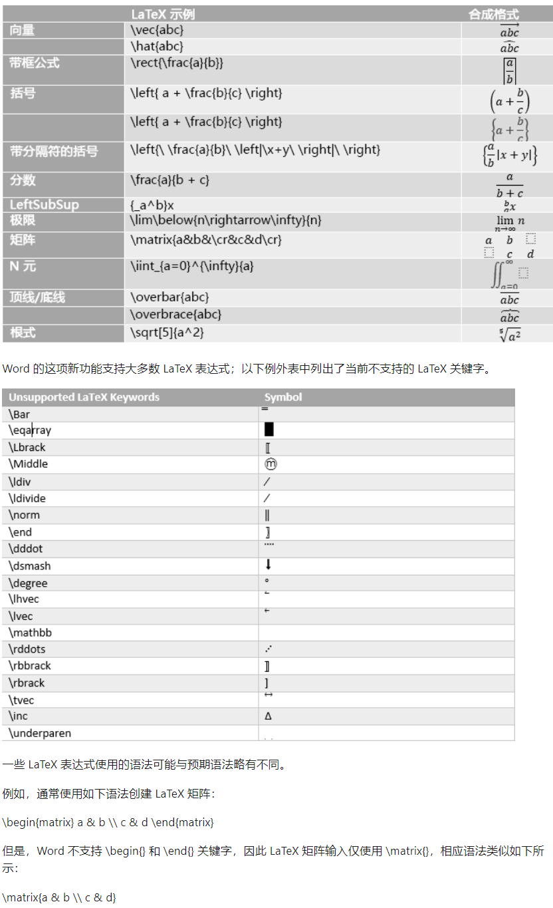

# 跨行对齐公式与公式代码

## 跨行对齐公式
1. 打开或新建一个Word文档，按`Alt`+`=`键，插入一个新的公式，公式菜单默认使用`Unicode`模式；
2. 输入`\eqarray<space>`, 出现一个黑色实心方块；
3. 输入`(a+b&=c@b+c+1&=d)`,然后按`<空格>`，可以看到公式已经完整出现.

> LaTeX公式代码为`A=\{\matrix{a&b&c\\d&e&f\\g&h&j}\}`。
## UnicodeMath公式代码

[查询官网](https://support.microsoft.com/zh-cn/office/word-%E4%B8%AD%E4%BD%BF%E7%94%A8-unicodemath-%E5%92%8C-latex-%E7%9A%84%E7%BA%BF%E6%80%A7%E6%A0%BC%E5%BC%8F%E5%85%AC%E5%BC%8F-2e00618d-b1fd-49d8-8cb4-8d17f25754f8)

## Latex公式代码

