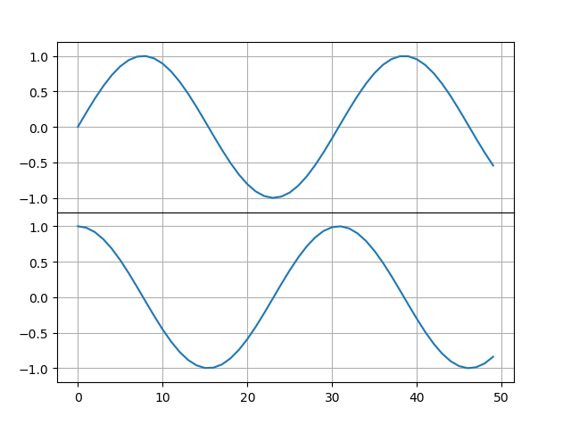

# pyplot在一个坐标系里画多个子图

代码

```
import numpy as np
import matplotlib.pyplot as plt
x = np.linspace(0, 10)
plt.axes([0.1, 0.5, 0.8, 0.4], ylim=(-1.2, 1.2))
plt.grid(True)
plt.plot(np.sin(x))

plt.axes([0.1, 0.1, 0.8, 0.4], ylim=(-1.2, 1.2))
plt.grid(True)
plt.plot(np.cos(x))
plt.show()
```

<div align="center"></div>