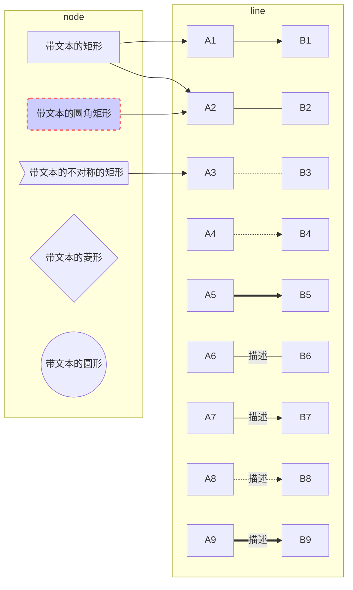
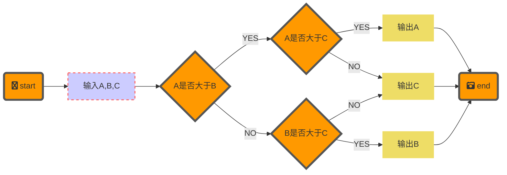
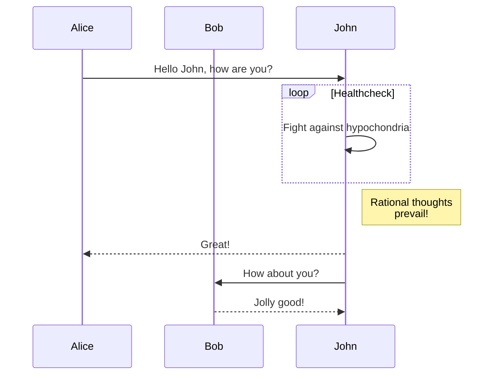
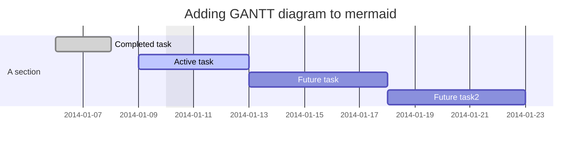
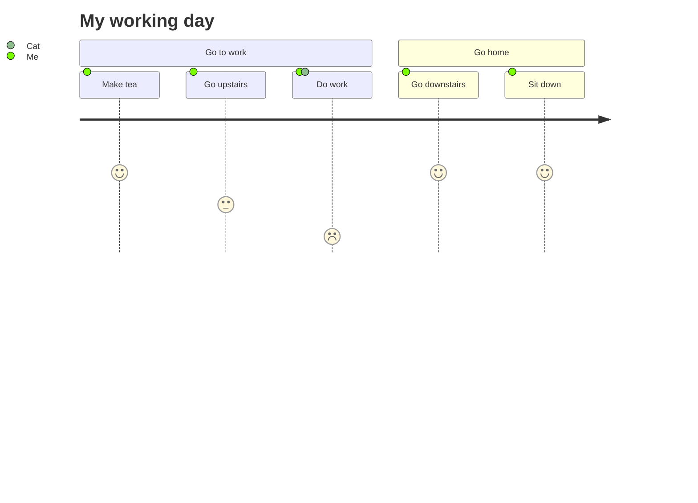
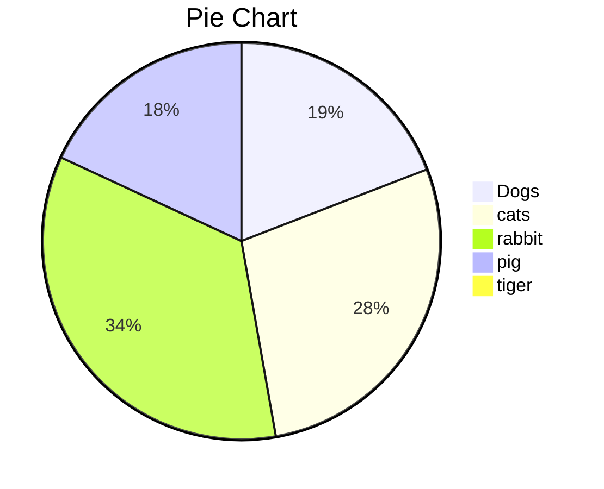

## 使用mermaid绘制流程图/脑图

[mermaid.js](https://github.com/mermaid-js/mermaid)是一个JS脚本.

代码块标识: `mermaid`

* mermaid流程图(flowchart)的折线变成贝塞尔曲线: `mermaid.min.js中的 flowchart:{... curve:"linear"}`变成`flowchart:{... curve:"basis"}`.

* 示例1:节点,连线,子图的样式控制
  代码
  
```
graph LR;
subgraph line
A1 --> B1
A2 --- B2
A3 -.- B3
A4 -.-> B4
A5 ==> B5
A6 -- 描述 --- B6
A7 -- 描述 --> B7
A8 -. 描述 .-> B8
A9 == 描述 ==> B9
end

subgraph node
C1[带文本的矩形]
C2(带文本的圆角矩形)
C3>带文本的不对称的矩形]
C4{带文本的菱形}
C5((带文本的圆形))
C1 --> A1
C1 --> A2
C2 --> A2
C3 --> A3
end
style C2 fill:#ccf,stroke:#f66,stroke-width:2px,stroke-dasharray: 5, 5;
```
  
  对应的流程图




* 示例2:统一样式控制
代码

```
graph LR
classDef default fill:#f90,stroke:#555,stroke-width:4px;
classDef Cssinput fill:#ccf,stroke:#f66,stroke-width:2px,stroke-dasharray:5,5;
classDef Cssprint fill:#ed6,stroke:#333,stroke-width:0px;

start("fa:fa-twitter start") --> input[输入A,B,C]
input --> conditionA{A是否大于B}
conditionA -- YES --> conditionC{A是否大于C}
conditionA -- NO --> conditionB{B是否大于C}
conditionC -- YES --> printA[输出A]
conditionC -- NO --> printC[输出C]
conditionB -- YES --> printB[输出B]
conditionB -- NO --> printC[输出C]
printA --> stop("fa:fa-camera-retro end")
printC --> stop
printB --> stop

class input Cssinput;
class printA,printB,printC Cssprint;
```

对应的图
  


## 使用[`mermaid.js`](https://github.com/mermaid-js/mermaid)绘制序列图

代码
```
sequenceDiagram
    participant Alice
    participant Bob
    Alice->>John: Hello John, how are you?
    loop Healthcheck
        John->>John: Fight against hypochondria
    end
    Note right of John: Rational thoughts <br/>prevail!
    John-->>Alice: Great!
    John->>Bob: How about you?
    Bob-->>John: Jolly good!
```
对应的序列图为


## 使用[`mermaid.js`](https://github.com/mermaid-js/mermaid)画甘特图
代码:
```
gantt
dateFormat  YYYY-MM-DD
title Adding GANTT diagram to mermaid
excludes weekdays 2014-01-10

section A section
Completed task            :done,    des1, 2014-01-06,2014-01-08
Active task               :active,  des2, 2014-01-09, 3d
Future task               :         des3, after des2, 5d
Future task2               :         des4, after des3, 5d
```
对应的甘特图为:


## 使用[`mermaid.js`](https://github.com/mermaid-js/mermaid)画日程图
```
journey
  title My working day
  section Go to work
    Make tea: 5: Me
    Go upstairs: 3: Me
    Do work: 1: Me, Cat
  section Go home
    Go downstairs: 5: Me
    Sit down: 5: Me
```
对应的图


## 使用[`mermaid.js`](https://github.com/mermaid-js/mermaid)画饼图
代码
```
pie
title Pie Chart
"Dogs" : 386
"cats" : 567
"rabbit" : 700
"pig":365
"tiger" : 15
```
对应的饼图:

