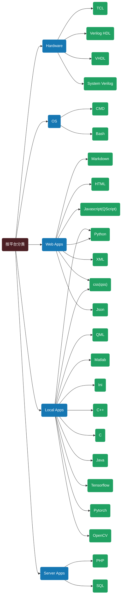

# 我的Wiki

[按分类导航](https://charleechan.github.io/MyWiki) |  <mark>**按平台导航**</mark> | [软件教程导航](./nav2.html)

```mermaid
graph LR;
classDef CSS3 fill:#20A162,stroke:#000000,color:#ffffff,stroke-width:0px;
classDef CSS2 fill:#4C1F24,stroke:#000000,color:#ffffff,stroke-width:0px;
classDef CSS1 fill:#1677B3,stroke:#000000,color:#ffffff,stroke-width:0px;
ROOT(按平台分类)
D1(Hardware )
D2(OS )
D3(Web Apps )
D4(Local Apps )
D5(Server Apps )
C1(Markdown )
C2(HTML )
C3(QML )
C13(XML )
C4("Javascript(QScript) ")
C5(Python )
C6(Matlab )
C7(CMD )
C8(TCL )
C9(Bash )
C10(PHP )
C11(SQL )
C12("css(qss) ")
C14(Json )
C15(Ini )
C16(C++ )
C17(C )
C18(Java )
C19(Verilog HDL )
C20(VHDL )
C21(System Verilog )
C22(Tensorflow )
C23(Pytorch )
C24(OpenCV )
D3 --> C5
D4 --> C12
D3 --> C1 
D3 --> C2 
D4 --> C3 
D3 --> C4 
D4 --> C5 
D4 --> C6 
D2 --> C7 
D1 --> C8 
D2 --> C9 
D5 --> C10
D5 --> C11
D3 --> C12
D3 --> C13
D3 --> C14
D4 --> C15
D4 --> C16
D4 --> C17
D4 --> C18
D1 --> C19
D1 --> C20
D1 --> C21
D4 --> C22
D4 --> C23
D4 --> C24
ROOT --> D1
ROOT --> D2
ROOT --> D3
ROOT --> D4
ROOT --> D5

click C1 "http://charleechan.github.io/MyWiki/Coding/LangsMark/MarkDown/" "点我打开"
click C2 "http://charleechan.github.io/MyWiki/Coding/LangsMark/HTML/" "点我打开"
click C3 "http://charleechan.github.io/MyWiki/Coding/LangsMark/QM/L" "点我打开"
click C4 "http://charleechan.github.io/MyWiki/Coding/LangsScript/JS/" "点我打开"
click C5 "http://charleechan.github.io/MyWiki/Coding/LangsScript/Python/" "点我打开"
click C6 "http://charleechan.github.io/MyWiki/Coding/LangsScript/Matlab/" "点我打开"
click C7 "http://charleechan.github.io/MyWiki/Coding/LangsScript/CMD/" "点我打开"
click C8 "http://charleechan.github.io/MyWiki/Coding/LangsScript/TCL/" "点我打开"
click C9 "http://charleechan.github.io/MyWiki/Coding/LangsScript/Bash/" "点我打开"
click C10 "http://charleechan.github.io/MyWiki/Coding/LangsScript/PHP/" "点我打开"
click C11 "http://charleechan.github.io/MyWiki/Coding/LangsScript/SQL/" "点我打开"
click C12 "http://charleechan.github.io/MyWiki/Coding/LangsStyle/CSS_QSS/" "点我打开"
click C13 "http://charleechan.github.io/MyWiki/Coding/LangsMark/XML/" "点我打开"
click C14 "http://charleechan.github.io/MyWiki/Coding/LangsConf/Json/" "点我打开"
click C15 "http://charleechan.github.io/MyWiki/Coding/LangsConf/Ini/" "点我打开"
click C16 "http://charleechan.github.io/MyWiki/Coding/LangsGene/Cpp/" "点我打开"
click C17 "http://charleechan.github.io/MyWikiCoding/LangsGene/C/" "点我打开"
click C18 "http://charleechan.github.io/MyWiki/Coding/LangsGene/Java/" "点我打开"
click C19 "http://charleechan.github.io/MyWiki/Coding/LangsHard/Verilog/" "点我打开"
click C20 "http://charleechan.github.io/MyWiki/Coding/LangsHard/VHDL/" "点我打开"
click C21 "http://charleechan.github.io/MyWiki/Coding/LangsHard/SystemVerilog/" "点我打开"
click C22 "http://charleechan.github.io/MyWiki/OtherLibs/Tensorflow/" "点我打开"
click C23 "http://charleechan.github.io/MyWiki/OtherLibs/Pytorch/" "点我打开"
click C24 "http://charleechan.github.io/MyWiki/OtherLibs/OpenCV/" "点我打开"
class C1,C2,C3,C4,C5,,C6,C7,C8,C9,C10,C11,C12 CSS3
class C13,C14,C15,C16,C17,C18,C19,C20,C21,C22,C23,C24 CSS3
class D1,D2,D3,D4,D5 CSS1
class ROOT CSS2
```
