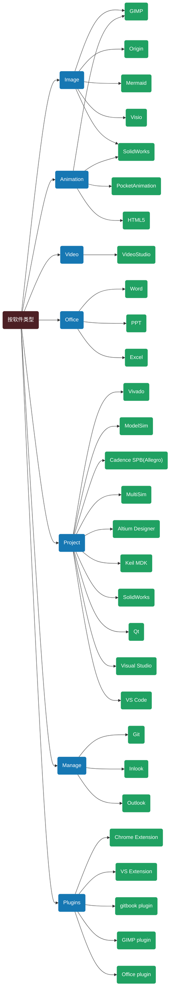

# 我的Wiki

[按分类导航](https://charleechan.github.io/MyWiki) |  [按平台导航](./nav1.html) | <mark>**软件教程导航**</mark>

```mermaid
graph LR;
classDef CSS3 fill:#20A162,stroke:#000000,color:#ffffff,stroke-width:0px;
classDef CSS2 fill:#4C1F24,stroke:#000000,color:#ffffff,stroke-width:0px;
classDef CSS1 fill:#1677B3,stroke:#000000,color:#ffffff,stroke-width:0px;
ROOT(按软件类型)
F2(Image )
  G2(GIMP )
  G3(Origin )
  G4(Mermaid )
  G5(Visio )
F3(Animation )
  G7(PocketAnimation )
  G10(SolidWorks )
  G11(HTML5 )
F4(Video )
  G12(VideoStudio )
F5(Office )
  G13(Word )
  G14(PPT )
  G15(Excel )
F6(Project )
  G16(Vivado )
  G17(ModelSim )
  G18("Cadence SPB(Allegro) ")
  G19(MultiSim )
  G20(Altium Designer )
  G21(Keil MDK )
  G22(SolidWorks )
  G23(Qt )
  G24(Visual Studio )
  G25(VS Code )
F7(Manage )
  G26(Git )
  G27(Inlook )
  G28(Outlook )
F8(Plugins )
  G29(Chrome Extension )
  G30(VS Extension )
  G31(gitbook plugin )
  G32(GIMP plugin )
  G33(Office plugin )
F4--> G12  
F2--> G2   
F2--> G3   
F2--> G4   
F2--> G5     
F2--> G10  
F3--> G7      
F3--> G2   
F3--> G10  
  
F3--> G11  
F5--> G13  
F5--> G14  
F5--> G15  
F6--> G16  
F6--> G17  
F6--> G18  
F6--> G19  
F6--> G20  
F6--> G21  
F6--> G22  
F6--> G23  
F6--> G24  
F6--> G25  
F7--> G26  
F7--> G27  
F7--> G28  
F8--> G29  
F8--> G30  
F8--> G31  
F8--> G32  
F8--> G33 
ROOT --> F2
ROOT --> F3
ROOT --> F4
ROOT --> F5
ROOT --> F6
ROOT --> F7
ROOT --> F8
click G2 "http://charleechan.github.io/MyWiki/SoftTuto/Image/GIMP/" "点我打开";
click G3 "http://charleechan.github.io/MyWiki/SoftTuto/Image/Origin/" "点我打开";
click G4 "http://charleechan.github.io/MyWiki/SoftTuto/Image/Mermaid/" "点我打开";
click G5 "http://charleechan.github.io/MyWiki/SoftTuto/Image/Visio/" "点我打开";
click G7 "http://charleechan.github.io/MyWiki/SoftTuto/Animation/PocketAnimation/" "点我打开";
click G10 "http://charleechan.github.io/MyWiki/SoftTuto/Animation/SolidWorks/" "点我打开";
click G11 "http://charleechan.github.io/MyWiki/SoftTuto/Animation/HTML5/" "点我打开";
click G12 "http://charleechan.github.io/MyWiki/SoftTuto/Video/VideoStudio/" "点我打开";
click G13 "http://charleechan.github.io/MyWiki/SoftTuto/Office/Word/" "点我打开";
click G14 "http://charleechan.github.io/MyWiki/SoftTuto/Office/PPT/" "点我打开";
click G15 "http://charleechan.github.io/MyWiki/SoftTuto/Office/Excel/" "点我打开";
click G16 "http://charleechan.github.io/MyWiki/SoftTuto/Project/Vivado/" "点我打开";
click G17 "http://charleechan.github.io/MyWiki/SoftTuto/Project/ModelSim/" "点我打开";
click G18 "http://charleechan.github.io/MyWiki/SoftTuto/Project/CadenceSPB/" "点我打开";
click G19 "http://charleechan.github.io/MyWiki/SoftTuto/Project/MultiSim/" "点我打开";
click G20 "http://charleechan.github.io/MyWiki/SoftTuto/Project/AltiumDesigner/" "点我打开";
click G21 "http://charleechan.github.io/MyWiki/SoftTuto/Project/KeilMDK/" "点我打开";
click G22 "http://charleechan.github.io/MyWiki/SoftTuto/Project/SolidWorks/" "点我打开";
click G23 "http://charleechan.github.io/MyWiki/SoftTuto/Project/Qt/" "点我打开";
click G24 "http://charleechan.github.io/MyWiki/SoftTuto/Project/VisualStudio/" "点我打开";
click G25 "http://charleechan.github.io/MyWiki/SoftTuto/Project/VSCode/" "点我打开"; 
click G26 "http://charleechan.github.io/MyWiki/SoftTuto/Manage/Git/" "点我打开"; 
click G27 "http://charleechan.github.io/MyWiki/SoftTuto/Manage/Inlook/" "点我打开"; 
click G28 "http://charleechan.github.io/MyWiki/SoftTuto/Manage/Outlook/" "点我打开"; 
click G29 "http://charleechan.github.io/MyWiki/SoftTuto/Plugins/ChromeExt/" "点我打开"; 
click G30 "http://charleechan.github.io/MyWiki/SoftTuto/Plugins/VSCodeExt/" "点我打开"; 
click G31 "http://charleechan.github.io/MyWiki/SoftTuto/Plugins/GitbookPlu/" "点我打开"; 
click G32 "http://charleechan.github.io/MyWiki/SoftTuto/Plugins/GIMPPlu/" "点我打开"; 
click G33 "http://charleechan.github.io/MyWiki/SoftTuto/Plugins/OfficePlu/" "点我打开";

class G2,G3,G4,G5,G7,G8,G9,G10,G11,G12 CSS3
class G13,G14,G15,G16,G17,G18,G19,G20,G21,G22,G23,G24 CSS3
class G25,G26,G27,G28,G29,G30,G31,G32,G33 CSS3
class F2,F3,F4,F5,F6,F7,F8 CSS1
class ROOT CSS2
```

